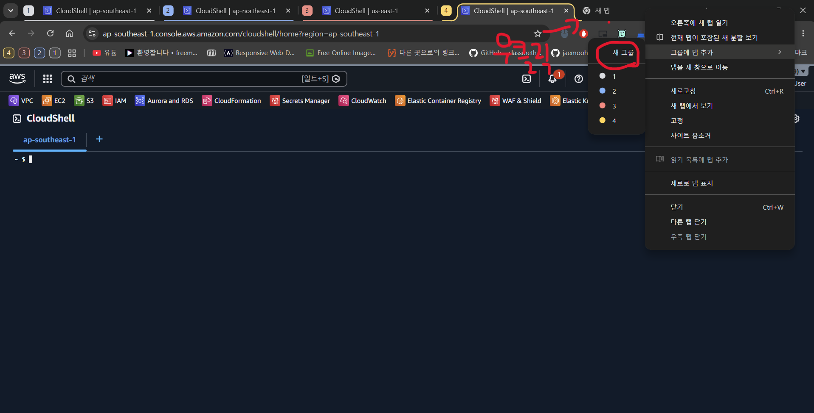
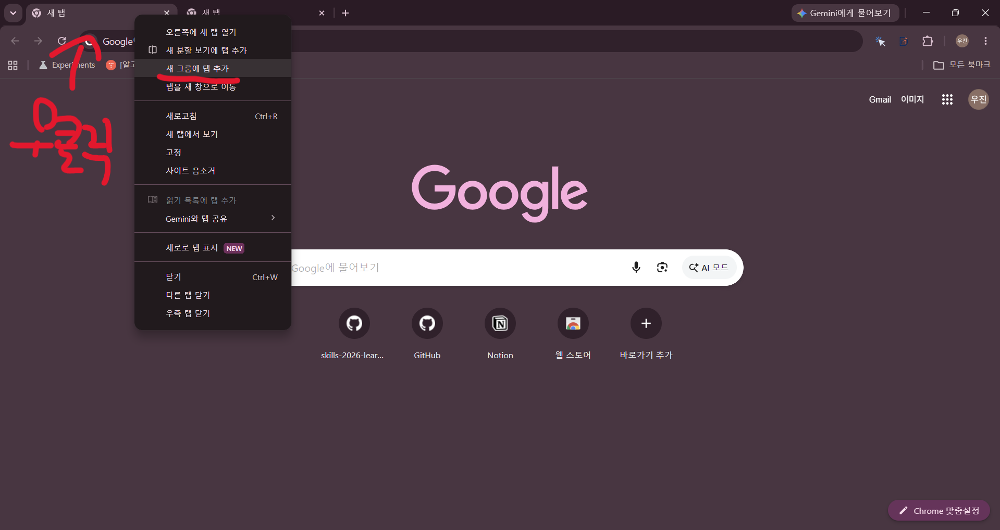

# DAY-OF — 대회장 실행 강령

과제지는 **종이로 배부된다.** 파일 대조(diff)는 불가능하고 눈으로 훑어야 한다.
재시동하면 파일이 초기화되고, AI 코딩 보조는 없으며(AWS 웹 Q 만 허용), 추가 시간도 없다.
이 문서는 그 상황에서 위에서 아래로 실행한다. 세트별 값은 [7절 **값 대조표**](#7-값-대조표)를 쓴다.

코드블록을 고치다 인자·필드에서 막히면 [DOC-LINKS](DOC-LINKS.md) 를 연다 —
리소스별 공식문서 주소, 저장소 안 구현 위치, 인터넷 없이 스키마를 뽑는 명령을 한 장에 모은 색인이다.

추가 문항의 KIT은 먼저 [QUICK-REFERENCE.md](QUICK-REFERENCE.md)에서 찾고, 없으면 [KIT-INDEX.md](KIT-INDEX.md)를 따른다. 각 KIT의 기능 확인(VERIFY) 뒤에는 해당 세트의 공식 `mark.md`·`mark*.sh`로 SCORE를 확인한다.

런북 코드블록은 붙여넣기 전에 **한 줄씩 칠지 블록째 칠지 먼저 판단**한다 — 앞 명령의 출력·성공 여부에 뒤가 걸리는 블록(로그인·apply·삭제·롤아웃)은 한 줄씩, 단순 설치·조회는 블록째. PowerShell 은 앞 줄이 실패해도 뒤 줄을 계속 실행한다.

## 목차

| 절 | 언제 | 끝 조건 |
| --- | --- | --- |
| [0. 도착 직후](#0-도착-직후) | 과제지 펼치기 전 | `aws sts get-caller-identity` 성공 · CloudShell 접속 확인 · 저장소 클론 |
| [1. 종이 과제지 대조](#1-종이-과제지-대조--형광펜-2색-15분-이내) | 과제지 받은 직후 15분 | 노랑(값 다름)·분홍(신규) 표시 끝, tfvars 교체 끝 |
| [2. 신규 문항 매핑](#2-신규-문항분홍은-출제가이드-카탈로그-안에서-나온다) | 분홍이 있을 때 | 분홍마다 복사 원본·부착 키트 결정 |
| [3. 모듈 5·6 추가](#3-모듈-56-추가) | 2과제 모듈이 늘었을 때 | 빈 스켈레톤 복사 끝 |
| [4. 바이너리·앱 교체](#4-당일-배부-바이너리앱-교체) | 배부물이 준비본과 다를 때 | 이미지 push · 롤아웃 끝 |
| [5. 미완성 코드 완성](#5-미완성-코드-완성--amazon-q-컨텍스트-템플릿) | TODO 채우기 문항 | 로컬 실행 확인 |
| [6. 채점 직전](#6-채점-직전) | 제출 30분 전 | 체크리스트 전부 ☑ |
| [7. 값 대조표](#7-값-대조표) | 1절·2절에서 참조 | — |
| [8. 공식 문서 빠른 링크](#8-공식-문서-빠른-링크) | 코드 블록 고칠 때 | — |

### 세트 바로가기

| 세트 | task-1 | task-2 | 추가 문항 대처 |
| --- | --- | --- | --- |
| set-02 | [대조표](#set-02-task-1) | [대조표](#set-02-task-2) | [task-1](#set-02-task-1--추가-가능-문항) · [task-2](#set-02-task-2--추가-가능-문항) |
| set-03 | [대조표](#set-03-task-1) | — | [task-1](#set-03-task-1--추가-가능-문항) |
| set-05 | [대조표](#set-05-task-1) | [대조표](#set-05-task-2) | [task-1](#set-05-task-1--추가-가능-문항) · [task-2](#set-05-task-2--추가-가능-문항) |
| set-07 | [대조표](#set-07-task-1) | [대조표](#set-07-task-2) | [task-1](#set-07-task-1--추가-가능-문항) · [task-2](#set-07-task-2--추가-가능-문항) |
| set-08 | [대조표](#set-08-task-1) | [대조표](#set-08-task-2) | [task-1](#set-08-task-1--추가-가능-문항) · [task-2](#set-08-task-2--추가-가능-문항) |
| set-09 | [대조표](#set-09-task-1) | — | [task-1](#set-09-task-1--추가-가능-문항) |
| task-3 | [대조표](#task-3) | | [대처](#task-3--추가-가능-문항) |

세트 번호를 모르면 [세트 식별표](#세트-식별표)로 먼저 판별한다.

## 0. 도착 직후

**끝 조건:** `aws sts get-caller-identity` 성공 · CloudShell 접속 확인 · 저장소 클론 · 모듈별 CloudShell 탭 그룹.

①~④ 는 직렬이 아니다. `bootstrap.ps1` 이 도는 동안 손이 비므로 **두 트랙으로 병행**한다.

| 터미널 트랙 | 브라우저 트랙 (bootstrap 도는 동안) |
| --- | --- |
| ① winget → `bootstrap.ps1` 실행 | ② 콘솔 로그인 → 액세스 키 발급 |
| ③ 저장소 클론 (Git 은 ① 초반에 이미 설치됨) | ④ CloudShell 탭 그룹 · 즐겨찾기 세팅 |

합류점: `aws configure` 는 ①(AWS CLI 설치)과 ②(키 발급)가 **둘 다 끝난 뒤** 새 터미널에서 한다.

### ① 도구 설치 — lab-bootstrap

[lab-bootstrap](https://github.com/ishs-cloud-computing/lab-bootstrap) 이 Git·AWS CLI·SSM 플러그인·Helm·eksctl·kubectl·Terraform·k9s 를 일괄 설치한다.

```powershell
# 요구 사항: PowerShell 7 + Git (기본 Windows PowerShell 에서 실행)
winget install --id Microsoft.PowerShell -e --source winget --accept-package-agreements --accept-source-agreements
winget install --id Git.Git -e --source winget --accept-package-agreements --accept-source-agreements

# 스크립트 차단 해제 (기본 Restricted 는 프로필 스크립트도 막음) + 새 탭이 자동으로 pwsh 로 넘어가도록 프로필 수정
Set-ExecutionPolicy Bypass -Scope CurrentUser -Force
New-Item -ItemType Directory -Force (Split-Path $PROFILE) | Out-Null
Add-Content $PROFILE 'if (Get-Command pwsh -ErrorAction SilentlyContinue) { pwsh -ExecutionPolicy Bypass; exit }'
```

```powershell
# 새 탭 열면 프로필이 pwsh 로 전환됨 — 그 탭에서 설치 실행
git clone https://github.com/ishs-cloud-computing/lab-bootstrap.git
cd lab-bootstrap
pwsh -ExecutionPolicy Bypass -File .\bootstrap.ps1
# GitHub 막히면 미러: git clone https://gitlab.com/ishs-cloud/lab-bootstrap.git
```

설치 후 **새 터미널을 연다** (PATH 반영). 재시동 시 파일이 초기화되므로 재부팅 때마다 다시 실행한다.

### ② IAM 키 셋업

SSO 대신 대회 당일 배부받는 IAM 사용자 액세스 키를 쓴다. 발급은 브라우저만 있으면 되므로 bootstrap 이 도는 동안 한다.

1. 배부받은 IAM 사용자로 콘솔 로그인 → 액세스 키 발급. 절차는 [IAM 액세스 키 발급 가이드](https://sungbin-park.tistory.com/142) 참고.
2. (① 완료 후) 본 PC에서 `aws configure` 로 발급받은 키를 등록한다 (Access Key ID / Secret / 리전 / 출력형식 `json`).
3. `aws sts get-caller-identity` 로 등록을 확인한다.

### ③ 저장소 클론

bootstrap 과 병행한다 — Git 은 ① 초반에 이미 설치됨.

```powershell
git clone https://github.com/ishs-cloud-computing/skills-2026.git; cd skills-2026
```

- 세트 번호를 확인한다. 종이 과제지 표지·모듈 구성으로 판별한다 — [세트 식별표](#세트-식별표).
- `.env.ps1`(본 PC)·`.env`(CloudShell) 를 재생성한다. 재부팅·CloudShell 세션 초기화 때마다 다시 만든다.
- CloudShell 접속을 **가장 먼저** 확인한다. 여기가 막히면 채점 경로 전체가 막힌다.

### ④ 브라우저 작업공간 — 모듈별 CloudShell 탭 그룹

② 에 이어 브라우저 트랙에서 한다. 2과제는 모듈마다 리전이 다르다. 리전을 착각한 탭에서 명령을 치는 사고를 탭 그룹 번호로 막는다.

1. 모듈별 리전의 CloudShell 을 각각 새 탭으로 연다 (`<리전>.console.aws.amazon.com/cloudshell/home?region=<리전>`).
2. 탭 우클릭 → **그룹에 탭 추가** → **새 그룹** → 그룹 이름을 모듈 번호(`1`~`4`)로 붙인다. 색은 모듈마다 다르게.

   

   같은 조작은 CloudShell 탭이 아닌 일반 탭에서도 동일하다.

   

3. 이후 그 모듈 작업·채점은 반드시 해당 번호 그룹의 탭에서만 한다. 탭을 새로 열면 같은 그룹에 넣는다.
   - 모듈 여러 개를 병렬로 돌리다 런북 어디까지 쳤는지 헷갈리면 **history 로 복원**한다: CloudShell 은 `history`, 본 PC PowerShell 은 `Get-History`(현재 세션) 또는 `Get-Content (Get-PSReadLineOption).HistorySavePath -Tail 30`(닫힌 세션 포함). 마지막 성공 명령을 런북에서 찾아 그 다음 줄부터 잇는다.
4. 콘솔 상단 즐겨찾기 바에 자주 쓰는 서비스(VPC·EC2·S3·IAM·RDS·CloudFormation·Secrets Manager·CloudWatch·ECR·WAF·EKS)를 별표로 고정한다. 검색 왕복을 줄인다. 문서 탭은 [8절 "과제 받고 5분 안에 열어 둘 탭"](#과제-받고-5분-안에-열어-둘-탭)을 같이 연다.
5. **1과제는 VPC apply 가 끝나는 대로 그 리전 CloudShell 에 VPC environment 를 무조건 만든다** — 프라이빗 리소스(RDS·EKS 프라이빗 엔드포인트) 접근용. bastion 대체라 불필요 EC2 감점을 피한다. 생성: CloudShell 좌측 **+** → **Create VPC environment** → VPC·프라이빗 서브넷·SG 선택. 프라이빗 서브넷이 NAT 를 못 타면 AWS API 호출도 안 나가니 라우팅을 먼저 확인한다.

위 IAM 등록까지 끝난 뒤에 종이 과제지를 펼치고 1절로 넘어간다.

## 1. 종이 과제지 대조 — 형광펜 2색 (15분 이내)

**끝 조건:** 종이에 노랑·분홍 표시 끝 · 노랑은 tfvars 교체 끝 · 분홍은 목록으로 뽑아 2절로.

**노랑 = 준비본과 값이 다름. 분홍 = 준비본에 없는 신규 문항.**

1. [세트 바로가기](#세트-바로가기)에서 해당 세트 대조표를 화면에 띄운다.
2. 종이 과제지를 위에서 아래로 읽으며 표와 1:1 대조한다.
3. 값이 다르면 종이에 **노랑**, 표에 없는 요구사항이면 **분홍**.
4. 채점지가 같이 배부되면 채점지도 같은 방식으로 훑는다. 안 주면 준비본 `mark.md` 기준으로 간다.

대조가 끝나면:

### 노랑 → 값 교체

- `terraform.tfvars` 값 교체. 대조표에서 ⚠ 가 붙은 축은 tfvars 한 줄로 끝나지 않는다 — 표의 "고칠 곳" 에 적힌 파일을 같이 고친다.
- 리전·prefix 처럼 여러 파일에 흩어진 값은 VS Code 전체 치환으로 잡는다: `code set-XX` 로 열고 **Ctrl+Shift+H**(치환) 또는 **Ctrl+Shift+F**(검색만) → 결과 목록에서 바꾸면 안 되는 라인은 hover 후 **X 로 제외**, 라인별 치환 아이콘으로 개별 적용도 가능 → 남은 것 일괄 치환.

**일괄 치환에서 반드시 빼야 하는 것** — 치환 전 결과 목록을 훑으며 제외(X)한다.

| 제외 대상 | 이유 · 방법 |
| --- | --- |
| `provided/`·`task.md`·`mark.md`·채점 스크립트(`mark*.sh`) | 대회 제공 원본이자 대조 기준. 바뀌면 "준비본과 뭐가 다른가" 판단이 무너진다. **files to exclude** 에 `**/provided/**, **/task.md, **/mark*` |
| `NOTES.md` 결정 로그·정정 로그 | 과거 기록. 값이 옛날 것이어도 그대로 둔다 |
| `*.tfstate`·`outputs.json` | 배포 산출물. 치환하면 실제 리소스와 어긋나기만 한다 |
| 짧은 접두어 (예: `wsc` 가 `wsc2026` 도 침) | **Match Whole Word(Alt+W)** 켜거나 결과 미리보기로 판별 |
| 리전처럼 AZ 접미(`ap-northeast-2a`)까지 같이 바뀌어야 하는 값 | 반대로 Whole Word 를 **끄고** 잡는다 |

### 분홍 → 2절로

별도 목록으로 빼서 2절로 넘긴다. **기존 문항·기존 모듈은 건드리지 않는다.**

당일 변동은 기존 문제 교체가 아니라 **문항 추가**다. 기존 4모듈을 재작성하려 들면 시간이 날아간다.

## 2. 신규 문항(분홍)은 출제가이드 카탈로그 안에서 나온다

**끝 조건:** 분홍 항목마다 카탈로그 번호 · 복사 원본(세트 디렉토리 또는 `shared/addons/` 키트) 결정.

출제자는 자유롭게 문제를 만들지 않는다. 2과제 출제지침은 **모듈 카탈로그 13개**를 고정하고
"제공된 모듈 중 4개를 골라 출제한다" 고 못박는다. 1과제는 **작업범위 12개** 중 선택이다.
따라서 분홍 항목을 카탈로그 번호에 매핑하면 어디서 코드를 가져올지가 바로 나온다.
추가 문항은 대부분 **기존 문항 뒤에 붙는 꼬리 지시문**이다(예: 기존 DynamoDB 문항에 "TTL 도 설정", 기존 ALB 에 "액세스 로그 S3 저장"). 새 모듈이 통째로 오는 건 2과제 모듈 5·6 뿐이다.
**세트·모듈별 구체 후보와 대처는 7절 각 세트의 "추가 가능 문항" 표**에 있다 — [세트 바로가기](#세트-바로가기).

### 추가 문항의 상한 (과제출제 체크리스트)

분홍 항목이 아래 상한을 넘으면 오독을 의심한다.

| 항목 | 상한 |
| --- | --- |
| 채점 문항 수 | 전체 ≤ 25개 · 한 항목 ≤ 1.5점 → 30%(9점)면 **최소 6문항** 추가 |
| 수동 채점 항목 | ≤ 2개 (나머지는 전부 명령 실행 채점) |
| 대기가 필요한 채점 항목 | ≤ 2개 · 대기 ≤ 3분 |
| 삭제·배포를 수반하는 채점 | 채점 **마지막 1개**만 |
| 선수당 예상 비용 | ≤ $50 / 과제 |
| 채점 주체 | 일반 CloudShell 의 IAM User 권한. 선수가 수동 지정한 access key 는 `unset` 후 채점 |
| 문제지 분량 | 표지 포함 ≤ 7장 · 채점지 ≤ 13장 |
| 범위 | AI·IoT·게임 문항 없음. AWS·Terraform·GitHub·직종설명서 범위만 |

### 2과제 모듈 카탈로그 13개

| #  | 모듈                     | 필수 서비스                          | 구현 있는 세트                  |
| -- | ------------------------ | ------------------------------------ | ------------------------------- |
| 1  | NoSQL                    | DynamoDB or DocumentDB               | set-07 m1, set-08 m1            |
| 2  | CDN                      | CloudFront                           | set-07 m2                       |
| 3  | EKS Scaling              | EKS                                  | set-05 m1, set-07 m3, set-08 m4 |
| 4  | Real-time data analytics | VPC, EC2, ELB, Managed Flink         | set-02 m2                       |
| 5  | VPC Lattice              | VPC                                  | set-05 m2, set-08 m2            |
| 6  | Workflow                 | S3, Lambda, DynamoDB, Step Functions | set-02 m1                       |
| 7  | Cloud event handling     | VPC, EC2                             | set-02 m3, set-08 m3            |
| 8  | RDS Connection           | RDS, VPC                             | **없음** — `shared/addons/rds-connection/` |
| 9  | VPN                      | Client VPN, VPC, EC2                 | **없음** — `shared/addons/client-vpn/` |
| 10 | Keycloak                 | VPC, EC2, IAM, Keycloak              | **없음** — `shared/addons/keycloak/` |
| 11 | Container logging        | VPC, Loki, Grafana, EKS, EC2         | set-05 m3, set-07 m4            |
| 12 | REST API Implement       | Lambda                               | set-05 m4                       |
| 13 | MSK                      | MSK, VPC                             | set-02 m4                       |

- 구현이 있는 모듈이면 **그 세트 디렉토리를 통째로 복사**하고 이름·리전만 교체한다. 처음부터 쓰지 않는다.
- 8·9·10 은 어느 세트에도 없다. 이게 걸리면 `shared/addons/` 의 해당 키트로 시작하되 **시간을 여기에 먼저 배분**한다.
  진입점(문서·가장 가까운 재료·시간 함정)은 [DOC-LINKS 6절](DOC-LINKS.md#6-구현이-없는-카탈로그--맨몸-진입점) 에 정리돼 있다.
  8(RDS Connection)은 `task-3/terraform/rds.tf`·`rds-proxy.tf` 가 사실상 완성된 재료다.

### 1과제 추가 문항

필수 7개(VPC·Container·Database·Static hosting·ECR·로드밸런서·Application)는 이미 다 들어가 있다.
추가분은 **아직 안 쓰인 옵션 5개**에서 나온다 — KMS / WAF / Security(IAM·Pod Identity·IRSA·OIDC) / Lambda GET API / Observability.
출제지침이 "모니터링 도구 설치" 류를 예시로 들므로 Observability 가 가장 유력하다.

옵션 5개는 전부 **[`shared/addons/`](shared/addons/README.md) 부착 키트**로 대응한다 —
부착 지점만 추린 요약은 [DOC-LINKS 5절](DOC-LINKS.md#5-덧붙이기-스니펫--기존-문항을-건드리지-않고-얹는-것) 에 있다.
스니펫 복사 → tfvars 값 주입 → plan 으로 기존 diff 없음 확인 → apply. 기존 문항은 건드리지 않는다.

| 옵션 | 부착 키트 | 비고 |
| --- | --- | --- |
| KMS | `shared/addons/kms/` | RDS·EBS·ECR·EKS 는 생성 후 암호화 변경 불가 — 대상 판별 먼저 |
| WAF | `shared/addons/waf/` | ALB 는 regional, CloudFront 는 us-east-1 alias 필수 |
| Security | `shared/addons/irsa/` | 채점이 role-arn annotation 읽으면 IRSA, 아니면 Pod Identity |
| Lambda GET API | set-07 task-1 `lambda.tf` 복사 | set-05 task-2 module-4 (REST API) 도 참고 |
| Observability | `shared/addons/observability/` | Container Insights 는 addon 한 줄, 도구형은 set-07 monitoring 복사 |

금지선을 넘는 요구는 오독이다. 1과제에는 **인프라 스케일링 문제가 출제되지 않고**, 3rd-party Addon(Istio·Cilium·Calico·Crossplane·Nginx)은 불가하며, Helm 은 채점요소가 될 수 없다.

## 3. 모듈 5·6 추가

**끝 조건:** `module-5-<name>/`·`provided/module-5/` 생성, 리전 겹침 없음 확인.

```powershell
Copy-Item -Recurse _template/task-2/module-4 set-XX/task-2/module-5-<name>
New-Item -ItemType Directory set-XX/task-2/provided/module-5
```

- `_template/task-2/module-1~4` 는 내용이 같은 빈 스켈레톤이다. 어느 걸 복사해도 결과는 같다.
- **세트의 구현된 module-4 를 복사하지 않는다.** 지워야 할 잔재가 딸려와 더 느리다.
- 모듈 간 **리전이 겹치면 안 된다**. 리소스도 공유하면 안 된다.
- 6모듈이면 배점이 모듈당 7.5 → **5.0** 으로 재조정된다. 채점 항목 우선순위를 다시 잡는다.

## 4. 당일 배부 바이너리·앱 교체

**끝 조건:** 새 태그 이미지 push · 롤아웃 완료 · 앱 문자열 의존 구성(로그 필터·WAF regex·헬스체크) 재확인.

배부물은 `provided/` 규칙과 같이 **원본 그대로** 둔다. 구현 코드가 그걸 참조하게 만든다.

```powershell
# 1. 배부물을 원본 위치에 둔다 (수정 금지)
Copy-Item -Recurse <배부경로>/* shared/provided/task-1/     # task-1
Copy-Item -Recurse <배부경로>/* set-XX/task-2/provided/module-N/   # task-2

# 2. 빌드 컨텍스트가 그 경로를 가리키는지 확인한다
Select-String -Path set-XX/task-1/README.md -Pattern "docker build"

# 3. 이미지 재빌드·푸시 (x86_64 고정)
$ECR = terraform -chdir=set-XX/task-1/terraform output -raw ecr_repository_url
aws ecr get-login-password --region <리전> | docker login --username AWS --password-stdin ($ECR -split '/')[0]
docker build --platform linux/amd64 -f app/Dockerfile -t "${ECR}:v2" <빌드컨텍스트>
docker push "${ECR}:v2"
```

- 로컬에 Docker 가 없으면 build/push 는 **CloudShell 필수 경로**다. 0단계에서 확인해 둔 접속을 쓴다.
- 롤아웃: ECS 는 `aws ecs update-service --force-new-deployment`, EKS 는 `kubectl rollout restart deployment/<이름>`.
- 롤백: 이전 태그로 `kubectl set image` 또는 태스크 정의 이전 리비전으로 되돌린다. **이전 태그를 지우지 않는다.**
- 앱이 바뀌면 앱 문자열에 의존하는 구성도 같이 바뀐다 — 로그 쿼리 필터, WAF 경로 regex, 헬스체크 경로.

## 5. 미완성 코드 완성 — Amazon Q 컨텍스트 템플릿

**끝 조건:** 환경변수 키·핸들러 경로·응답 필드명 명세 대조 완료 · 로컬 1회 실행 성공.

출제지침이 1·2과제 양쪽에 명시한다: **Kiro·Q-CLI·MCP 전부 불가. AWS 웹에서 사용 가능한 Q 만 허용.**
따라서 컨텍스트를 손으로 붙여넣어야 한다. 코드 전문을 넣지 말고 아래 4블록만 넣는다.

````text
아래 Python 파일의 TODO 를 채워라. 함수 시그니처와 기존 코드는 바꾸지 마라.
완성된 함수 본문만 출력하고 설명은 붙이지 마라.

# 1) 파일 상단 — import 와 상수 (그대로)
<import 문과 전역 상수 전문을 붙여넣는다. 환경변수 키 이름이 여기 있다>

# 2) 완성할 함수 스켈레톤
<def 시그니처와 docstring, # TODO 주석을 그대로 붙여넣는다>

# 3) 요구사항 명세
<과제지의 해당 문항 전문. 입력·출력 형식, 상태 코드, 에러 처리 규칙을 빠뜨리지 않는다>

# 4) 제약
- 표준 라이브러리와 boto3 만 사용
- 상수는 위 1)에 선언된 것만 사용하고 새 전역을 만들지 않는다
- 예외는 <명세에 적힌 형식> 으로 반환
````

- 요구사항 명세 블록이 가장 중요하다. 여기가 부실하면 그럴듯하지만 채점에 안 걸리는 코드가 나온다.
- 나온 코드는 **환경변수 키 이름·핸들러 경로·응답 필드명**을 배부 명세와 직접 대조한다. 이 셋이 틀리면 동작해도 0점이다.
- 로컬에서 한 번 실행해 확인한 뒤 배포한다.

## 6. 채점 직전

- [ ] EKS: **일반 CloudShell** 에서 `aws eks update-kubeconfig --name <클러스터> --region <리전>` **한 줄 뒤** `kubectl get nodes` 가 된다. 채점 중 허용되는 명령은 그 한 줄뿐이다.
- [ ] 채점 스크립트는 CloudShell 업로드 후 CRLF 를 제거했다: `sed -i 's/\r$//' <파일>`
- [ ] CloudShell 에 수동 지정한 access key 가 없다 (`unset AWS_ACCESS_KEY_ID AWS_SECRET_ACCESS_KEY AWS_SESSION_TOKEN`). 채점은 CloudShell 을 연 IAM User 권한으로 돈다.
- [ ] 과제지가 요구하지 않은 리소스를 지웠다. 특히 **작업용 bastion** — 불필요 리소스는 감점이고, 3과제는 EC2 수가 적을수록 고득점이다.
- [ ] bastion 을 지우기 **전에** CloudShell 경로를 먼저 검증했다. 지운 뒤에 권한이 없다는 걸 알면 손쓸 방법이 없다.
- [ ] 채점 때 쓸 리소스가 전부 running 이다. 채점 중에는 새로 만들거나 시작할 수 없다.
- [ ] 이름 정확 일치 항목(IAM Role·클러스터·버킷·테이블)을 종이 과제지와 한 번 더 대조했다.

## 7. 값 대조표

1절 종이 대조와 2절 신규 문항 매핑에서 쓰는 표. 각 세트 README 에는 여기로 오는 링크만 남겼다.
필요한 세트에는 **대조표**(축 / 준비본 값 / 다르면 고칠 곳)를 두고, 각 세트에는 **추가 가능 문항**(기존 문항 뒤에 붙을 수 있는 꼬리 지시문 / 근거 / 대처)을 둔다.
**set-05(task-1·2)·set-08 task-1·set-09 task-1 은 대조표 미작성** — 해당 세트가 걸리면 그 README 의 변수 목록(`variables.tf`)으로 직접 대조한다.

- ⚠ 가 붙은 축은 tfvars 한 줄로 끝나지 않는다 — "고칠 곳" 의 파일을 같이 고친다.
- 추가 가능 문항의 "근거" 는 같은 카탈로그 번호의 다른 세트 채점 항목이거나 흔한 채점 항목이다. "(추정)" 표기는 근거가 약한 후보다.
- "대처" 의 `shared/addons/<키트>/` 는 [부착 키트](shared/addons/README.md). 세트 경로는 그 파일을 복사해 이름·참조만 바꾼다.
- ⚠ 가 붙은 대처는 기존 리소스 재생성(노드그룹·MSK·ECR 등)을 유발한다 — 배점 대비 시간을 먼저 판단한다.

### 세트 식별표

종이 과제지 표지·본문 키워드로 세트 번호를 판별한다. 같은 과제명("Solution Architecture" 등)이 여러 세트에 있으니 **접두어·리전 조합**으로 본다.

| 세트 | task-1 특징 | task-2 특징 |
| --- | --- | --- |
| set-02 | 접두어 `wskorea26`, "Korea Skills Concert", VPC `172.16.0.0/16`, AZ **c/d**, EKS + Grafana(`skills-<비번호>-admin`), 채점 SG `wskorea26-vpc-environment-sg` | 접두어 `wsc2026`, **Workflow(성적 CSV) / Real-time analytics(Flink Studio) / Event handling / MSK(센서)**, 리전 `ap-southeast-1 / ap-northeast-2 / eu-west-1 / ap-northeast-1`, VPC `analytics-vpc`·`event-vpc`·`msk-vpc` |
| set-03 | 회사 **skills.inc**, 접두어 `wsc2026`, VPC `wsc2026-skills-vpc` `192.168.0.0/16` + `hub`/`app` 서브넷, CMK 5개, CloudFront `/booking`, Lambda Function URL, Grafana 비번 `Skills$#$@!` | 없음 |
| set-05 | 접두어 `wsc`, **MSA + ZTNA**, NodeGroup 3종(`app/addon/monitoring`), bastion `wsc-bastion`, 비번 `Skill53##`, CMK 5개 `alias/wsc-*` | 접두어 `wsc-`, **EKS Scaling(서울) / VPC Lattice(싱가포르, Hub/Spoke·`version1.py`) / Container Logging(도쿄, Grafana `wsc2026-admin-{비번호}`) / REST API(버지니아, `wsc-rest-*`)** |
| set-07 | **Unicorn Tickets**, 접두어 `unicorn-`, VPC `10.97.0.0/16` 3AZ, KMS `unicorn-kms-{app,data,platform}`, WAF `Request blocked by Unicorn WAF`, 채점 VPC env `unicorn-mark` | "Small Challenge", **NoSQL(BigBae Trains) / CDN Function(SkillsPhone) / EKS Scaling(SkillsMarket) / EKS O11y**, 리전 `ap-southeast-1 / us-east-1 / ap-northeast-2 / ap-northeast-1`, 접두 `bigbae-nosql-`·`skillsphone-cdn-ab-`·`skm-`·`o11y-`, EC2 `t3.small` |
| set-08 | 접두어 `skills-book`, **ECS Fargate**(EKS 아님) + CloudFront, `X-Origin-Verify`, S3 `skills-book-static-2026-<비번호>`, 4xx/5xx Metric Filter 네임스페이스 `Skills/CloudComputing/Task1`, Private Subnet + NAT, PK `booking_id` | "Small Challenges", 접두어 `skills-nosql / skills-lattice / skills-ceh / skills-sqs`, 리전 **서울·도쿄·싱가포르·오레곤**, DocumentDB `retail_dataset.json`, `skills-ceh-protected-sg`, EKS **Fargate 컨트롤러** + KEDA + Karpenter |
| set-09 | "Solution Architecture", **ECS Fargate**, 접두어 **`<선수ID>-`**, 로그 그룹 `/skillskorea/ecs/app`, **Public Subnet 만**(Task Public IP), PK `client_id`, KMS·알람 없음, 스택에 Route53·WAF·API Gateway | 없음 |
| task-3 | "System operation" 3시간, Go 바이너리 `user`·`product`·`stress`, `load_user.dump`, `apdev-rds-instance`, `/images/<path>`, `t3.medium` 단일, "Fargate·Lambda 사용 불가" | — |

set-08 과 set-09 는 둘 다 ECS Fargate + book 앱이다 — 접두어(`skills-book` vs `<선수ID>-`)와 서브넷 배치(Private+NAT vs Public)로 가른다.

### set-02

#### set-02 task-1

| 축 | 준비본 값 | 다르면 고칠 곳 |
|---|---|---|
| 리전 | `ap-northeast-2` (AZ `c`/`d`) | `terraform/terraform.tfvars: region` ⚠ `variables.tf: subnets` 의 `az`, `eksctl/cluster.yaml` `metadata.region`·subnets `az`, `k8s/monitoring/fluent-bit.yaml:37` `region`, `k8s/app/configmap.yaml` `AWS_REGION` 리터럴 |
| 비번호 | `<비번호>` (버킷 접미·Grafana 계정) | `terraform.tfvars: player_number` (`outputs.tf grafana_admin_user` 가 `skills-<비번호>-admin` 조립) |
| VPC 이름·CIDR | `wskorea26-vpc` · `172.16.0.0/16` | `variables.tf: vpc_name` / `terraform.tfvars: vpc_cidr` |
| 서브넷 4개 | `wskorea26-pub-subnet-c` `172.16.1.0/24` / `-pub-subnet-d` `172.16.2.0/24` / `-priv-subnet-c` `172.16.201.0/24` / `-priv-subnet-d` `172.16.202.0/24` | `variables.tf: subnets` (맵 키가 이름 리터럴) ⚠ `eksctl/cluster.yaml` `vpc.subnets.private` 키도 `wskorea26-priv-subnet-c/d` 리터럴 |
| IGW / NAT | `book-igw` / `book-ngw-c`·`book-ngw-d` | `variables.tf: igw_name` / `nat_name_prefix`(AZ 접미 자동) |
| 라우트 테이블 | `wskorea26-public-rtb` / `wskorea26-private-rtb-c`·`-d` | `variables.tf: public_rtb_name` / `private_rtb_name_prefix` |
| 채점용 SG | `wskorea26-vpc-environment-sg` | `variables.tf: environment_sg_name` |
| KMS CMK alias | `wskorea26-s3-key` / `wskorea26-dynamodb-key` / `wskorea26-eks-key` | `variables.tf: kms_aliases{s3,dynamodb,eks}` |
| S3 버킷·경로 | `wskorea26-concert-bucket-<비번호>` · `/web/main/` | `variables.tf: bucket_name_prefix` · `object_prefix`(`web/main`) |
| ECR | `wskorea26-book-repo` · 태그 `stable` · scanOnPush · KMS | `variables.tf: ecr_repo_name` ⚠ 태그 `stable` 은 `README.md` 빌드 명령 + `k8s/app/deployment.yaml` `image: ${ECR}:stable` 리터럴 |
| DynamoDB | `wskorea26-data-table` · PK `client_id(S)` · 삭제방지 · GSI `concert_name-created_at-index`(`concert_name`/`created_at`) | `terraform.tfvars: table_name` ⚠ PK·GSI 는 `terraform/dynamodb.tf` 리터럴, GSI 이름은 `lambda.tf` `INDEX_NAME` + `lambda/index.py` 기본값, 테이블명은 `k8s/app/configmap.yaml:9` `TABLE_NAME` 리터럴 |
| EKS 클러스터 | `wskorea26-cluster` · `1.35` · priv-subnet-c/d · 모든 CP 로그 · Secret KMS | `terraform.tfvars: cluster_name` ⚠ `eksctl/cluster.yaml` `metadata.name`·`version`·`cloudWatch`·`secretsEncryption` 전부 리터럴 |
| 네임스페이스 | 앱 `wskorea26` / 모니터링 `monitoring` | `variables.tf: app_namespace` ⚠ `k8s/00-namespaces.yaml`·`k8s/**` `namespace:`·`eksctl/cluster.yaml` SA namespace 리터럴 |
| 노드그룹 | `wskorea26-addon-ng`·`wskorea26-app-ng` · `t3.medium` · Name 태그 `wskorea26-addon-node`·`wskorea26-app-node` · 라벨 `node-type: addon/app` · min 2 | ⚠ 변수 없음 — `eksctl/cluster.yaml` `managedNodeGroups` 리터럴. 라벨값은 `k8s/app/deployment.yaml:25` `nodeSelector`, `k8s/monitoring/kube-prometheus-stack-values.yaml` nodeSelector 6곳, `cluster.yaml` coredns `configurationValues` |
| IRSA SA | `wskorea26-book-sa` (ns `wskorea26`) | ⚠ `eksctl/cluster.yaml` `iam.serviceAccounts` + `k8s/app/deployment.yaml:23` 리터럴 |
| Lambda | `wskorea26-book-lambda` · `python3.14` · env `TABLE_NAME` · GET `concert_name` 없으면 400 | `variables.tf: lambda_function_name`·`lambda_runtime` (env 키·400 은 `lambda.tf`/`lambda/index.py` 리터럴) |
| ALB(book) | `wskorea26-book-alb` · internet-facing · HTTP 80 · `/book` → 앱/Lambda · 비CF 요청 403 | `variables.tf: book_alb_name` (포트 80·403 default·`/health` 는 `alb.tf` 리터럴) |
| Origin 검증 헤더 | `X-Origin-Verify: wskorea26-cf` | `variables.tf: origin_verify_header` / `terraform.tfvars: origin_verify_value` |
| CloudFront | `wskorea26-concert-cf` · Origin ID `wskorea26-alb-origin`·`wskorea26-s3-origin` · S3 헤더 `wskorea26-s3-access: true` · HTTP→HTTPS · `/book` → ALB · PriceClass_All | `variables.tf: cloudfront_name`·`alb_origin_id`·`s3_origin_id`·`s3_access_header{name,value}` ⚠ 경로 `/book*` 는 `cloudfront.tf:90` + `cloudfront/book-rewrite.js`(`/book`→`/v1/book`) 리터럴 |
| 앱 포트 / 경로 | `8080` · `/v1/book` POST · `/health` | `variables.tf: container_port` (경로는 `book-rewrite.js`·`alb.tf` 리터럴) |
| Grafana | ALB `wskorea26-grafana-alb` · 포트 `3000` · 대시보드 `wskorea26-monitoring` · 계정 `skills-<비번호>-admin` / `$korea26!!` · 패널 5개(CPU·Mem·Pod수·재시작·네트워크 수신) | `variables.tf: grafana_alb_name`·`grafana_port`·`grafana_admin_password` ⚠ 대시보드명은 `k8s/monitoring/dashboard.json` `title`(uid `wskorea26`) + helm release `wskorea26-monitoring`(README §6, `grafana-targetgroupbinding.yaml` 서비스명 `wskorea26-monitoring-grafana`) 리터럴 |
| Pod 로그 그룹 | `/wskorea26/eks/pod-logs` | `variables.tf: pod_log_group_name` ⚠ `k8s/monitoring/fluent-bit.yaml:38` `log_group_name` 리터럴 |

⚠ **이름 접두어 `wskorea26` 는 tfvars 로 안 끝난다.** `eksctl/cluster.yaml`(12곳)·`k8s/**`(40여 곳)·`cloudfront/book-rewrite.js`·README 런북에 리터럴. 접두어가 바뀌면 `set-02/task-1` 전체 치환(`task.md`·`mark*`·`NOTES.md` 제외).
⚠ 리전이 바뀌면 tfvars 한 줄 외에 `variables.tf: subnets` AZ, `eksctl/cluster.yaml`, `fluent-bit.yaml`, `configmap.yaml` 4곳을 같이 친다.

#### set-02 task-1 — 추가 가능 문항

| 후보 | 근거 | 대처 |
|---|---|---|
| WAF (CloudFront 또는 ALB 앞단, rate-limit/매니지드 룰/SQLi) | 옵션 5개 중 **미사용**. set-07 task-1 `waf.tf`, task-3 9절 | `shared/addons/waf/waf-cloudfront.tf` + `variables.tf` 복사, `cloudfront.tf` 배포에 `web_acl_id` 한 줄. ⚠ `terraform/versions.tf` 에 `aws.use1` alias **없음** — 먼저 추가. ALB 대상이면 `waf-regional.tf` + `addon_waf_target_arn = aws_lb.book.arn` |
| Container Insights (CloudWatch 계열 "클러스터 모니터링") | Observability 옵션 확장. 출제지침 예시 "모니터링 도구 설치" | `shared/addons/observability/README.md` 경로 A — `eksctl create addon --name amazon-cloudwatch-observability` + `task-3/eksctl/cloudwatch-tuned.yaml` addon 블록. ⚠ DaemonSet 이 app 노드에도 뜨지만 mark 5-4 는 kube-system/wskorea26 만 검사 |
| Grafana 알림 룰 / PrometheusRule (예: HighLatency, Pod restart) | set-03 task-1 mark 11-4 "Alert Firing" (같은 kube-prometheus-stack 구성) | `set-03/task-1/k8s/monitoring/prometheus-rules.yaml` 복사, 라벨·ns 를 `wskorea26`/`monitoring` 으로, `kube-prometheus-stack-values.yaml` 에 alertmanager 활성화(현재 비활성, nodeSelector addon 추가) |
| VPC Flow Logs → CloudWatch Logs | set-07 task-1 요구사항 3 / mark 1-x, VPC 흔한 추가 항목 | `set-07/task-1/terraform/flowlog.tf` 복사, 로그 그룹명 변수화·KMS 는 `aws_kms_key.s3` 재사용 또는 제거. 키트: `shared/addons/vpc-flow-log/` |
| VPC Endpoint (S3 gateway, ecr.api/ecr.dkr/logs interface) | set-07 task-1 mark 1-3-A "이미지/로그가 인터넷 미경유" | `set-07/task-1/terraform/endpoints.tf` 복사, 서브넷·RTB·SG 참조를 `aws_subnet.this[...]`/`aws_route_table.private` 로 치환. 키트: `shared/addons/vpc-endpoints/` |
| ECR 태그 불변성 / 라이프사이클 | ECR 흔한 항목. set-07 task-1 `ecr.tf` `IMMUTABLE_WITH_EXCLUSION` | `set-07/task-1/terraform/ecr.tf` 의 `image_tag_mutability` 한 줄(in-place). 라이프사이클: `shared/addons/ecr-hardening/` |
| CloudWatch Alarm (ALB 5xx·Lambda Errors·DynamoDB throttle) + SNS | 관측성 흔한 항목 | `shared/addons/cw-alarms/` |
| 로그 그룹 KMS·보존기간 (EKS CP 로그 그룹 선생성, Lambda 로그 그룹 CMK) | set-07 task-1 `cloudwatch.tf`·`lambda.tf` (Platform CMK) | `set-07/task-1/terraform/cloudwatch.tf` `eks_cluster` 블록 복사(⚠ **eksctl 생성 전** 선생성해야 CMK 적용), `lambda.tf` 로그 그룹에 `kms_key_id` + key policy `AllowCloudWatchLogs`(`shared/addons/kms/README.md`) |
| DynamoDB TTL / Stream (+ 감사 Lambda) | 카탈로그 1번 확장; set-07 m1 `dynamodb.tf` stream+Lambda | stream 은 `set-07/task-2/module-1-nosql/terraform/dynamodb.tf`·`lambda.tf` 패턴; TTL: `shared/addons/dynamodb-hardening/` |
| S3 버전관리·액세스 로그 / CloudFront 표준 로깅·지역 제한 | Static hosting·CDN 흔한 항목 | `shared/addons/s3-hardening/`, `shared/addons/cloudfront-hardening/` |
| 노드 EBS CMK / Lambda env CMK | KMS 옵션 확장 | `shared/addons/kms/README.md` 노드 EBS 블록 ⚠ **노드그룹 재생성**(mark 5-3 영향) — 배점 대비 판단. Lambda env 는 `set-07/task-1/terraform/lambda.tf` `kms_key_arn` 한 줄(in-place) |
| Security: Role 이름 지정 IRSA / Pod Identity 전환 | 옵션 Security; 현재 IRSA Role 은 eksctl 자동명 | `shared/addons/irsa/README.md` — `eksctl create iamserviceaccount --role-name <지정명> --override-existing-serviceaccounts` + `kubectl rollout restart`. Pod Identity 요구면 ⚠ agent DaemonSet 이 app 노드에 떠 mark 5-4 kube-system 검사에 걸린다 — `nodeSelector` 로 addon 고정 필요 |

[↑ 세트 바로가기](#세트-바로가기)

#### set-02 task-2

각 모듈 `terraform/terraform.tfvars` 의 `player_number` 를 본인 비번호로 바꾼다 — **현재 값이 모듈마다 다르다**(개인 실습값 잔재). 4곳 전부.

##### module-1-workflow (`ap-southeast-1`)

| 축 | 준비본 값 | 다르면 고칠 곳 |
|---|---|---|
| 리전 | `ap-southeast-1` | `terraform/terraform.tfvars: region` |
| 비번호 | `<비번호>` | `terraform.tfvars: player_number` |
| S3 버킷·폴더 | `wsc2026-student-score-bucket-<비번호>` · `input/`·`processed/`·`error/` | `variables.tf: bucket_name_prefix` ⚠ 폴더명은 `s3.tf`(input 마커·notification prefix `input/` suffix `.csv`)·`lambda/index.py`·`statemachine/workflow.asl.json` 리터럴 |
| DynamoDB | `wsc2026-student-score` · PK `studentId` SK `examDate` | `variables.tf: table_name` (키는 `dynamodb.tf` 리터럴 ⚠ + `lambda/index.py`) |
| Lambda 처리함수 | `wsc2026-student-score-function` · `python3.12` · `index.handler` · env `S3_BUCKET`·`DDB_TABLE` | `variables.tf: processor_function_name`·`lambda_runtime` (env 키는 `lambda.tf` 리터럴) |
| Lambda 트리거 | `wsc2026-student-score-trigger` (S3 `input/*.csv` ObjectCreated → StartExecution) | `variables.tf: trigger_function_name` (`lambda/trigger.py`) |
| State Machine | `wsc2026-student-score-workflow` · `STANDARD` · 상태 `CheckS3File→ProcessStudentData→CheckResult→MoveToProcessed/MoveToError` | `variables.tf: state_machine_name` ⚠ 타입·상태명은 `stepfunctions.tf`·`statemachine/workflow.asl.json` 리터럴 |
| IAM Role | `wsc2026-lambda-student-role` / `wsc2026-stepfunction-student-role` | `variables.tf: lambda_role_name` / `sfn_role_name` |
| 채점 데이터 | `test.csv` → `STU1020 96.6 A`, error 4건(`STU2001/2002/2004/unknown`) | `provided/module1/test.csv` (수정 금지) — 등급·검증 규칙은 `lambda/index.py` |

##### module-2-analytics (`ap-northeast-2`)

| 축 | 준비본 값 | 다르면 고칠 곳 |
|---|---|---|
| 리전 | `ap-northeast-2` (AZ `a`/`b`) | `terraform.tfvars: region` ⚠ `variables.tf: subnets` 의 `az` |
| 비번호 | (채점 이름에 미사용) | `terraform.tfvars: player_number` |
| VPC | `analytics-vpc` · `10.20.0.0/16` | `variables.tf: vpc_name`·`vpc_cidr` |
| 서브넷 4개 | `analytics-pub-a` `10.20.0.0/24` / `-pub-b` `10.20.1.0/24` / `-priv-a` `10.20.100.0/24` / `-priv-b` `10.20.101.0/24` | `variables.tf: subnets` |
| IGW / NAT / RTB | `analytics-igw` / `analytics-ngw`(단일, pub-a) / `analytics-pub-rtb`·`analytics-priv-a-rtb`·`analytics-priv-b-rtb` | `variables.tf: igw_name`·`nat_name`·`nat_subnet_name`·`pub_rtb_name`·`priv_rtb_names` |
| EC2 | `wsc2026-analytics-ec2` · `t3.small` · `analytics-priv-a` · SSM | `variables.tf: instance_name`·`instance_type`·`app_subnet_name` |
| 앱 | 포트 `5000` · systemd 유닛 `app` · `/opt/app` · env `STREAM_NAME`·`AWS_REGION` · gunicorn | `variables.tf: app_port` ⚠ 유닛명·경로·env 키는 `userdata.sh.tpl` 리터럴 |
| ALB / TG | `wsc2026-analytics-alb` · HTTP 80 · `wsc2026-analytics-tg`(5000) · 헬스 `/health` | `variables.tf: alb_name`·`tg_name` (80·`/health` 는 `alb.tf` 리터럴) |
| Kinesis | `wsc2026-order-stream` · ON_DEMAND | `variables.tf: stream_name` (모드는 `kinesis.tf` 리터럴) |
| Flink | `wsc2026-analytics-flink` · 과제지 "Flink 1.19" / 채점 `ZEPPELIN-FLINK-3_0` · INTERACTIVE · Glue DB `wsc2026_analytics_db` · SQL 테이블 `order_stream` | `variables.tf: flink_app_name`·`flink_runtime`·`glue_db_name` ⚠ `order_stream` DDL·쿼리는 `README.md` §5 Zeppelin 문단 리터럴 |
| IAM Role | `wsc2026-alaytics-ec2-role`(과제지 오타 그대로) / `wsc2026-analytics-flink-role` | `variables.tf: ec2_role_name` / `flink_role_name` |
| bastion | `t3.small` · `Skill53##` | `variables.tf: bastion_instance_type`·`ssh_password` |

##### module-3-event (`eu-west-1`)

| 축 | 준비본 값 | 다르면 고칠 곳 |
|---|---|---|
| 리전 | `eu-west-1` (AZ `a`/`b`) | `variables.tf: region` (tfvars 에 없음 — 바뀌면 tfvars 에 `region` 추가) ⚠ `variables.tf: subnets` 의 `az` |
| 비번호 | (로그 버킷 접미) | `terraform.tfvars: player_number` |
| VPC | `event-vpc` · `172.16.0.0/16` | `variables.tf: vpc_name`·`vpc_cidr` |
| 서브넷 / IGW / RTB | `event-pub-a` `172.16.0.0/24` · `event-pub-b` `172.16.1.0/24` / `event-igw` / `event-pub-rtb` | `variables.tf: subnets`·`igw_name`·`pub_rtb_name` |
| EC2 | `wsc2026-event-ec2` · `t3.micro` · `event-pub-a` · Role `wsc2026-event-ec2-role` | `variables.tf: instance_name`·`instance_type`·`instance_subnet_name`·`ec2_role_name` |
| SG | `wsc2026-event-sg` (인바운드 0) | `variables.tf: sg_name` |
| EventBridge Rule | `wsc2026-sg-change-rule`·`-role-change-rule`·`-ec2-terminate-rule`·`-ec2-type-change-rule` + 채점 전용 `wsc2026-ec2-stop-rule`·`wsc2026-tag-compliance-rule` | `variables.tf: rule_names` 맵 (이벤트 패턴은 `eventbridge.tf` 리터럴) |
| CloudTrail | `wsc2026-event-trail` · Management Read/Write · 로그 버킷 `wsc2026-event-logs-<비번호>` | `variables.tf: trail_name`·`logs_bucket_prefix` |
| Lambda | Role `wsc2026-event-lambda-role` · `python3.12` · `index.handler` · 함수 `wsc2026-sg-remediation`·`-role-remediation`·`-ec2-terminate-alert`·`-ec2-type-remediation`·`-ec2-stop-remediation`·`-tag-alert` · env `SNS_TOPIC_ARN`/`SECURITY_GROUP_ID`/`INSTANCE_ID`/`ROLE_NAME`/`INSTANCE_TYPE` | `variables.tf: lambda_role_name`·`lambda_runtime`·`function_names` 맵 ⚠ env 키·SNS 메시지 `event` 값은 `lambda.tf`·`lambda/*/index.py` 리터럴 |
| SNS | `wsc2026-event-alert` | `variables.tf: topic_name` |
| Config Rule | `wsc2026-sg-ssh-rule` · `wsc2026-required-tags-rule` · 필수 태그 키 `Project` | `variables.tf: config_rule_ssh_name`·`config_rule_tags_name`·`required_tag_key` ⚠ `versions.tf` default_tags `Project = "wsc2026"` 과 짝 |

##### module-4-msk (`ap-northeast-1`)

| 축 | 준비본 값 | 다르면 고칠 곳 |
|---|---|---|
| 리전 | `ap-northeast-1` (AZ `a`/`d`) | `variables.tf: region` (tfvars 에 없음) ⚠ `variables.tf: subnets`·`broker_subnet_names`·`producer_subnet_name` |
| 비번호 | `<비번호>` (alert 버킷 접미) | `terraform.tfvars: player_number` |
| VPC | `msk-vpc` · `192.168.0.0/16` | `variables.tf: vpc_name`·`vpc_cidr` |
| 서브넷 4개 | `msk-pub-a` `192.168.0.0/24` / `msk-pub-d` `192.168.1.0/24` / `msk-priv-a` `192.168.10.0/24` / `msk-priv-d` `192.168.11.0/24` | `variables.tf: subnets` |
| IGW / NAT / RTB | `msk-igw` / `msk-ngw`(단일, pub-a) / `msk-pub-rtb`·`msk-priv-a-rtb`·`msk-priv-d-rtb` | `variables.tf: igw_name`·`nat_name`·`nat_subnet_name`·`pub_rtb_name`·`priv_rtb_names` |
| MSK | `wsc2026-msk-cluster` · Kafka `3.6.0` · `kafka.t3.small` · 브로커 2(priv-a/d) · IAM 인증만 | `variables.tf: cluster_name`·`kafka_version`·`broker_instance_type`·`broker_subnet_names`·`broker_volume_size` (SASL/IAM 은 `msk.tf` 리터럴) |
| 토픽 | `wsc2026-sensor-raw` 3/2 · `wsc2026-sensor-alert` 1/2 · 키 `sensorId` | `variables.tf: topic_raw`·`topic_alert` (생성은 `userdata.sh.tpl`, 키는 producer/consumer 코드 리터럴) |
| Producer EC2 | `wsc2026-sensor-producer` · `t3.small` · `msk-priv-a` · Role `wsc2026-msk-ec2-role` · env `BOOTSTRAP_SERVERS`·`TOPIC_RAW` · systemd `app` | `variables.tf: producer_name`·`producer_type`·`producer_subnet_name`·`ec2_role_name` ⚠ env 키·유닛명은 `userdata.sh.tpl` 리터럴 |
| 인증 모드 | `iam`(기본) / `tls`(제공 바이너리 우회) | `terraform.tfvars: producer_auth_mode` ⚠ **당일 `select-auth-mode.ps1` 판정값을 따른다** — 제공 바이너리가 IAM 을 못 하면 `-var "producer_auth_mode=tls"` |
| Lambda | Role `wsc2026-msk-lambda-role` · `python3.14` · `wsc2026-sensor-consumer`(raw) · `wsc2026-sensor-alert-consumer`(alert) · env `DDB_TABLE`/`ALERT_TOPIC`/`BOOTSTRAP_SERVER`, `SNS_TOPIC_ARN`/`S3_BUCKET` | `variables.tf: lambda_role_name`·`lambda_runtime`·`consumer_fn_name`·`alert_fn_name` ⚠ 임계치(temp 80/10, hum 90/20)·`alert_reason` 문구·S3 경로 `alert/{sensorId}/{date}/{ts}.json` 은 `lambda/*/index.py` 리터럴 |
| DynamoDB | `wsc2026-sensor-data` · PK `sensorId` SK `timestamp` | `variables.tf: table_name` (키는 `dynamodb.tf` 리터럴) |
| S3 / SNS | `wsc2026-sensor-alert-bucket-<비번호>` / `wsc2026-sensor-alert-topic`(비채점) | `variables.tf: bucket_prefix` / `sns_topic_name` |
| bastion | `t3.micro` · `Skill53##` | `variables.tf: bastion_instance_type`·`ssh_password` |

참고: `mark.md` 4-0 의 `BUCKET_NAME="wsc2026-student-score-bucket-…"` 은 module-1 복붙 오류이고 `mark/mark2-4.sh:7` 은 `wsc2026-sensor-alert-bucket-${NUM}` 로 맞다. 과제지 module-4 DynamoDB 속성표(`studentId`…)도 module-1 복붙 오류 — 키 스키마가 채점 기준.

#### set-02 task-2 — 추가 가능 문항

##### module-1-workflow

| 후보 | 근거 | 대처 |
|---|---|---|
| Step Functions 실행 로그(CloudWatch Logs)·X-Ray 추적 | 카탈로그 6 필수 서비스 확장, SFN 흔한 채점 필드(`loggingConfiguration`) | `shared/addons/sfn-hardening/` (`logging_configuration` + 로그 그룹 + Role `logs:*Delivery*`) |
| 실패 시 SNS 알림 (MoveToError → Publish) | workflow.md Fail 경로 확장 | `set-02/task-2/module-3-event/terraform/sns.tf` 복사 + `statemachine/workflow.asl.json` 에 `arn:aws:states:::sns:publish` Task 추가, `iam.tf` sfn 정책에 `sns:Publish`. 예시: `shared/addons/sfn-hardening/` |
| S3 → EventBridge → Step Functions 직접 트리거(트리거 Lambda 대체) | 워크플로우 흔한 변형 | `shared/addons/sfn-hardening/` (`aws_s3_bucket_notification.eventbridge=true` + `aws_cloudwatch_event_rule`/`target` role) |
| DynamoDB PITR / TTL / Stream | 카탈로그 1번 항목 결합 | PITR·stream 은 `set-07/task-2/module-1-nosql/terraform/dynamodb.tf` 블록 복사(in-place); TTL: `shared/addons/dynamodb-hardening/` |
| S3 SSE-KMS / 버전관리 / `error/` 라이프사이클 | S3 흔한 항목 | KMS 는 `shared/addons/kms/` S3 블록(in-place); 버전관리·라이프사이클: `shared/addons/s3-hardening/` |
| Lambda DLQ / 예약 동시성 / 로그 보존 | Lambda 흔한 항목 | `shared/addons/lambda-hardening/` (`dead_letter_config`(SQS) · `reserved_concurrent_executions`) |
| Map 상태로 다건 파일 병렬 처리 / Choice 분기 추가 | workflow.md 변형 | `statemachine/workflow.asl.json` 직접 편집 — Map/Parallel 예시 `shared/addons/sfn-hardening/` |
| 트리거 Lambda 를 Python 3.14 로 / 함수 이름 변경 | 런타임 정확 일치 채점 | `variables.tf: lambda_runtime`·`trigger_function_name` |

##### module-2-analytics

| 후보 | 근거 | 대처 |
|---|---|---|
| Kinesis SSE(KMS)·보존기간·Provisioned 샤드 수 | 카탈로그 4 필수 서비스 확장, 스트림 흔한 채점 필드 | `kinesis.tf` 에 `encryption_type="KMS"`/`kms_key_id`, `retention_period`, `shard_count` 한 줄씩(in-place). KMS 키는 `shared/addons/kms/`. 예시: `shared/addons/kinesis-firehose/` |
| Kinesis Data Firehose → S3 아카이브 | 실시간 분석 흔한 확장 | `shared/addons/kinesis-firehose/` (`aws_kinesis_firehose_delivery_stream` kinesis source + S3 + Role) |
| Flink Studio 노트북 → 애플리케이션 배포(DeployAsApplication) / 추가 SQL(윈도우 집계) | 카탈로그 4 "Managed Flink" 확장 | 노트북 배포는 `flink.tf` CFN 템플릿에 `DeployAsApplicationConfiguration` + S3 버킷 (예시 `shared/addons/kinesis-firehose/README.md`); 추가 SQL 은 `README.md` §5 Zeppelin 문단에 추가 |
| EC2 → ASG + Launch Template (고가용성) | 과제지 "VPC 고가용성", ELB+EC2 흔한 변형 | `shared/addons/ec2-asg-alb/` (`aws_launch_template` + `aws_autoscaling_group` + TG attach, userdata 재사용) |
| ALB 액세스 로그 / 삭제 방지 / HTTPS | ELB 흔한 항목 | `shared/addons/alb-hardening/` |
| Kinesis 소비 Lambda → DynamoDB 적재 | 스트림 소비 패턴 | `set-02/task-2/module-4-msk/terraform/lambda.tf` consumer 패턴 + `aws_lambda_event_source_mapping`(kinesis) — ESM 소스만 교체 |
| VPC Flow Logs / S3·Kinesis VPC Endpoint | 네트워크 흔한 항목 | `shared/addons/vpc-flow-log/`·`shared/addons/vpc-endpoints/` |
| CloudWatch Agent·알람(EC2 CPU, ALB 5xx) | 관측성 | ALB 5xx 알람은 `shared/addons/cw-alarms/`; EC2 CloudWatch Agent는 전용 KIT가 없으므로 과제지·대상 세트의 설치 경로를 따르고 새 리소스·정책을 중복 생성하지 않는다. |

##### module-3-event

| 후보 | 근거 | 대처 |
|---|---|---|
| Lambda timeout ≥30·Handler 지정·로그 그룹 `/aws/lambda/<fn>` 존재·보존기간 | set-08 m3 task 5-3 / mark 3-3·3-5 (같은 카탈로그 7) | `set-08/task-2/module-3-event-handling/terraform/lambda.tf` 의 `aws_cloudwatch_log_group` 선생성 + `timeout` 변수 패턴 복사, `lambda.tf` `lambda_timeouts` 로컬에 값 |
| 복구 SLA "180초 이내" / Lambda 직접 invoke 검증 | set-08 유의사항 10, mark 3-5 | 이미 동작 — `README.md` §3 복구 테스트에 `aws lambda invoke` 경로 추가만 |
| CloudTrail 로그 파일 검증·멀티리전·CloudWatch Logs 전달·KMS | CloudTrail 흔한 항목 | `cloudtrail.tf` 에 `enable_log_file_validation=true`, `is_multi_region_trail=true`(현재 false) 한 줄; Logs 전달·KMS: `shared/addons/cloudtrail-hardening/` |
| SNS 이메일 구독 / SNS KMS | 과제지 "관리자에게 알림" 구체화 | `shared/addons/cw-alarms/` (`aws_sns_topic_subscription` email, `kms_master_key_id`) |
| Config 룰 추가(예: `EC2_INSTANCE_NO_PUBLIC_IP`, `ENCRYPTED_VOLUMES`) / Config 자동 교정(SSM Automation) | mark 3-3 Config 룰 패턴 확장 | 룰은 `config.tf` `aws_config_config_rule` 블록 복사 + 이름 변수 추가; 자동 교정: `shared/addons/eventbridge-security-rules/` (`aws_config_remediation_configuration`) |
| EventBridge 룰 추가(루트 로그인, IAM 정책 변경, EBS 생성, 스케줄 rule) + Lambda | 카탈로그 7 "Cloud event handling" 확장 | `eventbridge.tf` 패턴 + `variables.tf: rule_names`·`function_names` 맵에 항목 추가 + `lambda/<key>/index.py` 디렉토리 추가(코드는 `lambda/tag_alert/index.py` 골격). 패턴 모음: `shared/addons/eventbridge-security-rules/` |
| GuardDuty 탐지 → EventBridge → SNS | 보안 이벤트 흔한 확장 | `shared/addons/eventbridge-security-rules/` (`aws_guardduty_detector` + `aws.guardduty` 패턴 rule) |
| EC2 종료 방지·IMDSv2 / SG 변경 감사 | EC2 흔한 항목 | `ec2.tf` 에 `disable_api_termination`, `metadata_options` 한 줄. `shared/addons/ec2-hardening/` |

##### module-4-msk

| 후보 | 근거 | 대처 |
|---|---|---|
| MSK 브로커 로그(CloudWatch/S3) · Open/Enhanced Monitoring | 카탈로그 13 MSK 흔한 채점 필드(`LoggingInfo`, `EnhancedMonitoring`) | `msk.tf` 에 `logging_info{broker_logs{cloudwatch_logs}}`·`enhanced_monitoring`·`open_monitoring` 블록(in-place). `shared/addons/msk-hardening/` |
| MSK 저장 시 KMS CMK 암호화 | KMS 흔한 항목 | `msk.tf` `encryption_info.encryption_at_rest_kms_key_arn` ⚠ **클러스터 재생성(31분)** — 배점 대비 판단 |
| MSK Configuration(`auto.create.topics.enable=false` 등) / 브로커 3대·3AZ | MSK 설정 항목 | `aws_msk_configuration` + `configuration_info` — `shared/addons/msk-hardening/`; 브로커 수는 `variables.tf: broker_subnet_names` 에 서브넷 추가(`subnets`·RTB 도) — 증설은 in-place |
| Lambda ESM 옵션(batch size, starting position, filter, on-failure 대상) | Lambda+MSK 트리거 확장 | `lambda.tf` `aws_lambda_event_source_mapping` 에 `batch_size`·`starting_position`·`filter_criteria`·`destination_config` 한 줄씩 — `shared/addons/lambda-hardening/` |
| DynamoDB TTL / PITR / Stream → 3번째 Lambda | 데이터 계층 확장 | PITR·stream 은 `set-07/task-2/module-1-nosql/terraform/dynamodb.tf`; TTL: `shared/addons/dynamodb-hardening/` |
| SNS 이메일 구독 / S3 `alert/` 라이프사이클·SSE-KMS | 알림·스토리지 흔한 항목 | `shared/addons/cw-alarms/`·`shared/addons/s3-hardening/` |
| VPC Endpoint(DynamoDB gateway·S3·SNS interface) 로 Lambda NAT 미경유 | 네트워크 흔한 항목 | `set-07/task-1/terraform/endpoints.tf` 복사(서비스명만 교체). `shared/addons/vpc-endpoints/` |
| Producer EC2 CloudWatch Agent 로그 / 알람 | 관측성 | `shared/addons/ec2-hardening/`·`shared/addons/cw-alarms/` |

[↑ 세트 바로가기](#세트-바로가기)

### set-03

#### set-03 task-1

| 축 | 준비본 값 | 다르면 고칠 곳 |
|---|---|---|
| 리전 | `ap-northeast-2` | `terraform/variables.tf: region` ⚠ |
| 이름 접두어 | `wsc2026` | `variables.tf: name_prefix` ⚠ |
| 비번호·버킷 접미 | `<비번호>` · `bucket_suffix`(소문자 4자리) | `terraform.tfvars: player_number`·`bucket_suffix` (tfvars 항목은 이 둘뿐) |
| VPC 이름·CIDR | `wsc2026-skills-vpc` · `192.168.0.0/16` | `variables.tf: vpc_name`·`vpc_cidr` |
| 서브넷 4개 (이름·CIDR·AZ) | `wsc2026-skills-{hub,app}-sub-{a,b}` = `192.168.{1,10,2,20}.0/24`, AZ `2a/2b` | `variables.tf: subnets` (맵 **키가 이름 리터럴**) ⚠ + `eksctl/cluster.yaml: vpc.subnets.private` 키·az |
| IGW·RTB·NAT 이름 | `wsc2026-skills-igw` / `-hub-rtb` / `-app-rtb-{a,b}` / `-nat-{a,b}` | `vpc.tf` (`name_prefix` + 접미 리터럴 `skills-...`) |
| 채점 SG·서브넷 | `mark-sg` / `wsc2026-skills-app-sub-a` | `security.tf: "mark-sg"` 리터럴 / 서브넷 맵 키 |
| 앱 포트·헬스 | `8080` · `/health` | `k8s/app/02-deployment.yaml`(probe 3종·containerPort)·`03-service.yaml: targetPort`·`security.tf:47-48`(노드 SG 8080) ⚠ |
| ConfigMap | `book-config` = `AWS_REGION`·`TABLE_NAME` | `k8s/app/01-configmap.yaml` 리터럴 ⚠ (mark 5-3 이 `{.data}` 전체 비교) |
| DynamoDB | `wsc2026-book-table` · PK `client_id` · GSI `booking_id`(`booking_id-index`) · PAY_PER_REQUEST · PITR `35` · 삭제방지 | `variables.tf: table_name`; PK/GSI/PITR 은 `dynamodb.tf` 리터럴 ⚠; `k8s/app/01-configmap.yaml: TABLE_NAME` ⚠ |
| CMK alias 5개 | `wsc2026-{db,ecr,eks,bucket,function}-kms` | `kms.tf: alias/${name_prefix}-xxx-kms` (접미 리터럴) |
| ECR | `wsc2026-book-ecr` · scanOnPush · `MUTABLE_WITH_EXCLUSION` `v1*` · 이미지 `v1.0.0` 단독 | `variables.tf: ecr_name`; `v1*` 는 `ecr.tf:18` 리터럴 ⚠; 태그는 `README.md` step 2 |
| EKS 클러스터 | `wsc2026-eks-cluster` · `1.35` · fully private · 로그 5종 | `variables.tf: cluster_name`·`cluster_version` ⚠ **`eksctl/cluster.yaml: metadata.name/version` 리터럴** (terraform 변수는 Pod Identity trust ARN 용일 뿐) |
| 내부 도메인 | `wsc2026.skills.local` | `eksctl/cluster.yaml` NG 2개 `overrideBootstrapCommand.clusterDomain` + `k8s/01-coredns-wsc2026.yaml` + `k8s/monitoring/kube-prometheus-stack-values.yaml: alertmanagerSpec.clusterDomain` ⚠ |
| 노드그룹 | `wsc2026-addon-nodegroup`/`wsc2026-workload-ng` · 인스턴스 Name `wsc2026-addon-node`/`wsc2026-workload-node` · `t3.medium` · 2대씩 | `eksctl/cluster.yaml: managedNodeGroups[].name/instanceName/instanceType/desiredCapacity` 리터럴 ⚠ |
| 노드 라벨 키·값 | `wsc2026/node` = `addon` / `application` | `eksctl/cluster.yaml`(labels·taints·coredns configurationValues) + `k8s/app/02-deployment.yaml`(nodeSelector·toleration) + `kube-prometheus-stack-values.yaml` nodeSelector 전부 ⚠ |
| 네임스페이스 | `wsc2026` / `observability` | `k8s/00-namespaces.yaml` + `k8s/**` metadata.namespace + `eksctl/cluster.yaml: podIdentityAssociations` + helm `-n observability`(README) ⚠ |
| k8s 오브젝트 이름 | `wsc2026-book-deploy`/`-svc`/`-ingress`/`-pdb`/`-sa` · 컨테이너 `book` | `k8s/app/00~05-*.yaml` 리터럴 ⚠ |
| Pod 스펙 | replicas `2` · topologySpread `topology.kubernetes.io/zone` · req=limit `250m`/`512Mi` · PDB minAvailable `1` · `trafficDistribution: PreferSameZone` | `k8s/app/02-deployment.yaml`·`03-service.yaml`·`04-pdb.yaml` |
| Pod Identity Role | `wsc2026-book-pod-role` (PutItem 한정) | `iam.tf:37` (`name_prefix`) |
| S3 버킷 | `wsc2026-static-<4자리>-<비번호>-bucket` · `static/` 업로드 · SSE-KMS+BucketKey | `data.tf: local.bucket_name` 조합식; `static/` 는 `s3.tf:56` 리터럴 |
| Lambda | `wsc2026-book-get-function` · `python3.12` · 정책 `wsc2026-book-function-policy` · 역할 `wsc2026-book-function-role` · env `TABLE_NAME`(암호문) | `variables.tf: lambda_function_name`; **runtime 은 `lambda.tf:35` 리터럴 ⚠**; 정책·역할 `iam.tf:79,111`(`name_prefix`); 로그 그룹 `/aws/lambda/<fn>` `lambda.tf:20` |
| Lambda API | GET `/v1/book?booking_id=` · 응답 필드 순서 `client_id,username,email,concert_name,created_at` · `created_at` `YYYY-MM-DD HH:MM:SS KST` | `terraform/lambda/index.py` 코드 리터럴 ⚠ |
| ALB | `wsc2026-app-alb` · `internet-facing` · SG `wsc2026-app-alb-sg` 단독 · 잘못된 경로 403 | `k8s/app/05-ingress.yaml` 어노테이션 리터럴 ⚠ + `security.tf:17` + `cloudfront.tf:19`(`data.aws_lb` 이름) |
| CloudFront | Name 태그 `wsc2026-cdn` · `/booking`→ALB(rewrite `/v1/book`) · `/v1/book*`→Lambda URL · 루트→S3 · S3 CachingOptimized/나머지 CachingDisabled | `cloudfront.tf`(`name_prefix`); `path_pattern` 2개 + CloudFront Function JS `'/v1/book'` 리터럴 ⚠ |
| WAF | `wsc2026-waf` (us-east-1) · SQLi·XSS 차단 · rate `200`/`60s` | `waf.tf:15`(`name_prefix`); `limit = 200`·`evaluation_window_sec = 60` `waf.tf:82-84` 리터럴 ⚠ |
| Grafana | 대시보드 `wsc2026-grafana-dashboard` · admin/`Skills$#$@!` · Service LB · 데이터소스 `prometheus`·`alertmanager`·`cloudwatch` | `k8s/monitoring/dashboard.json` title + `kube-prometheus-stack-values.yaml: adminPassword`·`additionalDataSources` 리터럴 ⚠ |
| Prometheus | retention `7d` · node-exporter DaemonSet · Alert 6종 `PodHighCPU/PodHighMemory/PodNotReady/HighErrorRate/HighLatency/PodCrashLooping` | `kube-prometheus-stack-values.yaml:44` · `k8s/monitoring/prometheus-rules.yaml` alert 이름·임계치 리터럴 ⚠ |
| 앱 로그 그룹 | `/wsc2026/eks/book-app` (과제지 미명시, 자유값) · retention 7 | `cloudwatch.tf:12`(`name_prefix`) + `k8s/logging/fluent-bit.yaml:105` 리터럴 ⚠ (둘이 일치해야 함) |
| Project 태그 | `wsc2026` | `providers.tf: default_tags` 리터럴 ×2 (채점 미사용) |
| CDN 토글 | `false` (1차) → `true` (2차 apply) | `variables.tf: enable_cdn` (배포 절차용) |
| bastion | `true` · `t3.small` (채점 전 `false`) | `variables.tf: enable_bastion`·`bastion_instance_type` |

⚠ **접두어가 바뀌면 `name_prefix` 만으로 안 끝난다** (NOTES.md 참조). 서브넷 맵의 **키가 리터럴** `wsc2026-...` 이고, `eksctl/cluster.yaml`·`k8s/**` 도 전부 리터럴이다. 라벨 키 `wsc2026/node`·CoreDNS 도메인·fluent-bit 메트릭 이름(`wsc2026_requests_total` 등, `prometheus-rules.yaml`·`dashboard.json` 과 3파일 일치)까지 같이 바뀌므로 `grep -rl wsc2026 terraform eksctl k8s app` 일괄 치환이 현실적이다.
⚠ **리전이 바뀌면 `region` 변수만으로 안 끝난다** — `variables.tf: subnets` 의 az, `eksctl/cluster.yaml: metadata.region`·subnets az, `k8s/app/01-configmap.yaml: AWS_REGION`(mark 5-3 비교 대상), `.env.ps1`/`.env` 의 `AWS_DEFAULT_REGION`.
⚠ **클러스터 이름·버전은 terraform 변수가 아니라 `eksctl/cluster.yaml` 이 진짜 원본**이다. 둘을 같이 고치지 않으면 Pod Identity trust 조건(`data.tf: cluster_arn`)이 어긋나 5-5 가 깨진다.
⚠ **Lambda 런타임·WAF rate 수치·PITR 일수·ECR 예외 필터는 변수가 없다** — 위 표의 파일:행을 직접 고친다.

#### set-03 task-1 — 추가 가능 문항

| 후보 | 근거 | 대처 |
|---|---|---|
| CloudWatch 메트릭 필터 + 알람(4xx/5xx) | Observability 옵션 확장. set-08 task-1 §9 (`skills-book-4xx-filter`·`-alarm`, Namespace `Skills/CloudComputing/Task1`) | `set-08/task-1/terraform/cloudwatch.tf` 의 `aws_cloudwatch_log_metric_filter`×2 + `aws_cloudwatch_metric_alarm`×2 복사. 로그 그룹은 기존 `aws_cloudwatch_log_group.book_app` 참조, filter pattern 은 fluent-bit 가 내보내는 JSON(`status` 필드)에 맞춰 `{ $.status = 4* }` 형으로 수정. 변수 `metric_namespace`·`alarm_threshold` 추가. 키트: `shared/addons/cw-alarms/` |
| Container Insights (`amazon-cloudwatch-observability`) | 출제지침 예시 "모니터링 도구 설치"; `shared/addons/observability` 경로 A | `task-3/eksctl/cloudwatch-tuned.yaml` 의 addon 블록 복사 → `eksctl create addon --cluster wsc2026-eks-cluster --name amazon-cloudwatch-observability`. 기존 fluent-bit DaemonSet 과 로그 이중 수집 주의(addon 의 fluent-bit 이 `/var/log/containers` 도 읽음 — 네임스페이스 필터 extraFiles 패턴 같은 파일 참고). 요구 시 retention 은 `aws logs put-retention-policy` |
| CloudWatch Logs 그룹 CMK 암호화 | KMS 옵션 확장. set-05 task-1 §10 "모든 CloudWatch Logs KMS", set-07 §8 "수집하는 모든 로그 Platform CMK" | `set-07/task-1/terraform/cloudwatch.tf` 의 `kms_key_id` + `kms.tf` 의 `AllowCloudWatchLogs` 키 정책 문장을 `kms.tf` 의 적절한 키(신규 `-logs-kms` 또는 `-eks-kms`)에 추가. 기존 로그 그룹에 in-place 적용 가능(재생성 없음). EKS Control Plane 로그 그룹(`/aws/eks/...`)은 EKS 가 만들므로 `aws logs associate-kms-key` 로 사후 연결. 키트: `shared/addons/kms/` |
| VPC Flow Log | set-07 task-1 §3 "VPC Flow Log 활성화" (mark 1-3-A) | `set-07/task-1/terraform/flowlog.tf` 복사(로그 그룹+IAM role+`aws_flow_log`). 변수 `flow_log_group_name`·retention 추가, `vpc_id = aws_vpc.this.id` 로 교체. 키트: `shared/addons/vpc-flow-log/` |
| S3 버전 관리 | set-07 task-1 §5 (mark 3-1-A) | `set-07/task-1/terraform/s3.tf` 의 `aws_s3_bucket_versioning` 블록 복사, `bucket = aws_s3_bucket.static.id`. 기존 버킷에 in-place |
| WAF 확장 — AWS 관리형 룰 그룹 / 차단 응답 본문 / WAF 로깅 / POST body 문자열 차단 | set-07 §10-3 (`AWSManagedRulesCommonRuleSet`·`KnownBadInputsRuleSet`, `403 + "Request blocked by Unicorn WAF"`, `aws-waf-logs-*` 로그 그룹 CMK), set-05 §13 (POST body `admin`/`sysop` 차단) | `set-07/task-1/terraform/waf.tf` 의 managed rule 블록·`custom_response_body`·`aws_wafv2_web_acl_logging_configuration`, `set-05/task-1/terraform/waf.tf` 의 `byte_match_statement` 룰을 기존 `aws_wafv2_web_acl.wsc2026` 에 rule 로 추가(priority 4+). in-place 업데이트. 로그 그룹은 us-east-1(`aws.use1`)+`aws-waf-logs-` 접두 강제 (`shared/addons/waf/README.md` 함정 참고). 기존 SQLi/XSS/rate 룰은 건드리지 않음. 키트: `shared/addons/waf-extra-rules/` |
| 감사용 IAM Role (External ID·최대 세션·최소권한) | Security 옵션. set-07 §11 `unicorn-audit-role`/`unicorn-audit-2026<비번호>` (mark 9-1-A·9-2-A) | `set-07/task-1/terraform/iam.tf` 의 audit role/policy + `variables.tf: audit_external_id_prefix` 복사, 리소스 ARN 을 이 세트의 `aws_dynamodb_table.book`·`aws_vpc.this`·`local.cluster_arn` 으로 교체. 키트: `shared/addons/iam-audit-role/` |
| 노드 EBS 볼륨 CMK 암호화 / 노드 KST 시간대 | KMS·EKS 확장. set-07 §8 "모든 노드 EBS Platform CMK, 시간대 KST" (mark 6-2-A), set-05 §9.2 | `set-07/task-1/eksctl/cluster.yaml` 의 `volumeKmsKeyID` + `preBootstrapCommands`(`timedatectl set-timezone Asia/Seoul`) 복사, `set-07/task-1/terraform/kms.tf` 의 `AllowAutoScalingUse`·`AllowAutoScalingGrant` 문장을 `-eks-kms` 키 정책에 추가. ⚠ **노드그룹 재생성**(`eksctl create nodegroup` 신규 → 구 NG drain/delete) — 4-2·5-4 채점 중 잠시 흔들림, 이름 동일 유지 필요 |
| KMS 키 교체 주기 명시(예: 90일) | set-07 §4 (mark 2-1-A `RotationPeriodInDays`) | `kms.tf` 5키에 이미 `enable_key_rotation = true`. `rotation_period_in_days = var.kms_rotation_days` 한 줄씩 추가(변수 신규, 기본 365). 기존 키 in-place |
| EBS CSI + StorageClass(CMK) + Prometheus/Grafana PVC | set-05 §9.6 (`wsc-sc`, `wsc-prometheus-pvc`·`wsc-grafana-pvc`) | `set-05/task-1/eksctl/cluster.yaml` 의 `aws-ebs-csi-driver` addon 블록(+KMS 정책), `set-05/task-1/k8s/02-storageclass.yaml` 복사; `kube-prometheus-stack-values.yaml` 에 `storageSpec`/`grafana.persistence` 추가 후 `helm upgrade`. ⚠ Prometheus StatefulSet 재생성 → 11-1 파드 카운트·알람 상태 일시 리셋, Addon 노드 PV 는 AZ 고정이라 `volumeBindingMode: WaitForFirstConsumer` 필수 |
| Lambda 확장 — 로그 그룹 이름 지정 / VPC 내 실행 / ALB 타겟 / optional 쿼리 필터 | set-07 §9 (`/unicorn/lambda/get-booking`, email·concert_name 옵션 필터), set-05 §15 (Private Subnet·ALB target·404 `{"msg":"Item not found"}`) | 로그 그룹: `lambda.tf:20` 을 변수 `lambda_log_group_name` 으로. VPC: `set-05/task-1/terraform/lambda.tf` 의 `vpc_config` + SG(DynamoDB 는 `endpoints.tf` S3 Gateway 와 나란히 DynamoDB Gateway 엔드포인트 추가). 옵션 필터·404 응답은 `index.py` 수정(DAY-OF 5절 Q 템플릿). 키트: `shared/addons/lambda-get-api/` |
| Grafana 를 LB Service 대신 ALB(Ingress/TargetGroupBinding)로 노출 | set-02 §12·set-07 §12 `*-grafana-alb` | `set-07/task-1/k8s/monitoring/grafana-targetgroupbinding.yaml` 복사 + kps values `service.type: ClusterIP` 로 변경. ⚠ 11-1 의 `GRAFANA_LB` 추출 로직이 LB 타입 svc 를 찾으므로 **기존 채점이 깨짐** — 과제지가 명시적으로 바꿀 때만 |
| DynamoDB TTL / Stream / 자동 백업 | NoSQL 흔한 채점 항목 | 키트: `shared/addons/dynamodb-hardening/` (`ttl { attribute_name, enabled }` 3줄, in-place) |
| ECR lifecycle policy (태그 없는·구버전 이미지 자동 만료) | §6 "v1.0.0 외 이미지 금지" 자동화 형태 | 키트: `shared/addons/ecr-hardening/` (`aws_ecr_lifecycle_policy`, in-place) |

[↑ 세트 바로가기](#세트-바로가기)

### set-05

> set-05 는 task-1 과 task-2 module-2·3·4 에 `terraform.tfvars` 가 **없다**(module-1 만 있음). 모든 값이 `variables.tf` default 이거나 `.tf` 리터럴이다. 아래 "고칠 곳"에 `variables.tf:` 로 적힌 축은 tfvars 를 새로 만들어 덮거나 default 를 직접 고친다.

#### set-05 task-1


⚠ **접두어 `wsc` 는 변수가 아니다.** task-1 변수는 `region`·`cluster_name`·`cluster_version`·`vpc_cidr`·`subnets`·`bastion_instance_type`·`ssh_password` 7개뿐이고 나머지 이름 전부 `.tf`·`eksctl/cluster.yaml`·`k8s/**` 리터럴이다. 접두어가 바뀌면 `set-05/task-1` 전체 치환(Whole Word 끄고 `wsc-`, `wsc.local`, `/wsc/`, `wsc_`, `alias/wsc` 순으로 검토). 리전이 바뀌면 `eksctl/cluster.yaml`(metadata.region·AZ)·`k8s/app/configmap.yaml: AWS_REGION`·README 의 `ap-northeast-2` 리터럴도 같이. `cluster_name` 은 `eksctl/cluster.yaml`·README helm `--set clusterName` 에도 박혀 있다.

#### set-05 task-1 — 추가 가능 문항

| 후보 | 근거 | 대처 |
|---|---|---|
| KMS 키 로테이션·alias 채점 | set-07 t1 2-1-A(`KeyRotationEnabled`·`RotationPeriodInDays=90`, alias 이름), set-02 2-2-A/set-03 check_kms(alias 역조회, 키 정책에 `kms:*`·`:root` 금지) | `set-05/task-1/terraform/kms.tf` 각 키에 `enable_key_rotation=true`·`rotation_period_in_days` 추가, alias 변수화. 키 정책 강화는 `set-07/task-1/terraform/kms.tf` 참고. 키트: `shared/addons/kms/` |
| WAF 관리형 룰·Rate limit·커스텀 차단 본문 | set-07 t1 8-6-A(`AWSManagedRulesCommonRuleSet`+`KnownBadInputs`), 12-2-A(rate 50/60s, body `Request blocked by …`), set-03 10-1(SQLi/XSS 403, rate ≤200) | `set-07/task-1/terraform/waf.tf` 의 managed rule·rate-based·`custom_response_body` 룰 블록을 `set-05/task-1/terraform/waf.tf` 의 `aws_wafv2_web_acl.wsc` 에 추가. 룰 목록 변수는 set-07 `waf_xss_rules` 패턴. 키트: `shared/addons/waf-extra-rules/` |
| WAF 로깅(KMS) | set-07 t1 10-3 로그 그룹 `aws-waf-logs-*` + CMK | `shared/addons/waf/waf-cloudfront.tf` 로깅 블록 + `kms.tf` 에 us-east-1 MRK 레플리카(`set-07/task-1/terraform/kms.tf`) ⚠ CLOUDFRONT scope 라 로그 그룹·키 전부 us-east-1 |
| 감사 Role(ExternalId) | set-07 t1 9-1-A/9-2-A `unicorn-audit-role`, MaxSession 3600, ExternalId 조건, 와일드카드 금지 | `set-07/task-1/terraform/iam.tf` audit role 블록 복사, 변수 `audit_role_name`·`audit_external_id` 추가. 키트: `shared/addons/iam-audit-role/` |
| VPC Flow Log | set-07 t1 1-3-A `describe-flow-logs ≥1` | `set-07/task-1/terraform/flowlog.tf` 복사(로그 그룹 KMS 는 `alias/wsc-logs` 재사용, 키 정책 logs 문장 이미 있음). 키트: `shared/addons/vpc-flow-log/` |
| DynamoDB GSI·삭제보호 | set-07 t1 4-1-A(GSI `client-id-created-at-index`, `DeletionProtectionEnabled`), set-03 2-1(GSI `booking_id`, PITR 35일) | `set-07/task-1/terraform/dynamodb.tf` 의 `global_secondary_index`·`deletion_protection_enabled` 블록을 `dynamodb.tf` 에 추가(GSI 추가는 재생성 없음). `lambda/index.py` Query 로 전환은 set-07 `lambda/index.py` 참고. 키트: `shared/addons/dynamodb-hardening/` |
| Lambda 환경변수 KMS·전용 로그 그룹·env 채점 | set-07 t1 7-1-A(`KMSKeyArn`, `LoggingConfig.LogGroup`), set-02 6-1-A(env `TABLE_NAME` 정확값), set-03 7-1(env 암호문) | `set-07/task-1/terraform/lambda.tf` 의 `kms_key_arn`·`logging_config` 블록 추가. 키는 `alias/wsc-dynamodb` 또는 신규. 키트: `shared/addons/lambda-hardening/` |
| Pod Identity / SA annotation 직접 채점 | set-03 5-5(`list-pod-identity-associations`), set-08 t2 4-2(`eks.amazonaws.com/role-arn`) — 현재 9.4 채점은 IMDS 차단만 | IRSA 이미 있어 annotation 채점은 통과. Pod Identity 로 요구되면 `shared/addons/irsa/README.md` 의 `eksctl create podidentityassociation` 경로 ⚠ private cluster 라 `eks-auth` 엔드포인트 필요(README 3단계 경고 참조) |
| CloudWatch 메트릭 필터·알람 | set-08 t1 6-2/6-3(`4xx/5xx` 필터, 알람 Sum ≥1/60s, `notBreaching`) | `set-08/task-1/terraform/cloudwatch.tf` 복사, 로그 그룹을 `/wsc/pod/log` 로, 이름 변수 추가. 키트: `shared/addons/cw-alarms/` |
| Container Insights | 출제지침 "모니터링 도구 설치" 예시, `shared/addons/observability` 경로 A | `eksctl create addon --name amazon-cloudwatch-observability`(`task-3/eksctl/cloudwatch-tuned.yaml` 블록) ⚠ workload 서브넷은 인터넷 없음 → `logs`·`monitoring` 엔드포인트 이미 있는지 `endpoints.tf` 확인, 이미지는 ECR pull-through |
| Grafana 추가 패널·알림 룰 | set-07 t1 13-1-A(HTTP p50/p95/p99), set-02 10-x(restart·network RX), set-03 11-4(PrometheusRule 5종 firing) | 패널은 `k8s/monitoring/dashboard.json` 에 추가(`set-02/task-1/k8s/monitoring/dashboard.json` 패널 복사). 알림 룰은 `set-03/task-1/k8s/monitoring/prometheus-rules.yaml` ⚠ 채점 11-1-B 가 `panels | length == 6` 이라 패널 추가는 채점지가 바뀐 경우에만 |
| S3 버전관리·bucket key·정책 SourceArn | set-07 3-1-A(versioning Enabled), set-03 6-1(`BucketKeyEnabled`), set-07 8-2-A(CF SourceArn 조건) | versioning 이미 있음. `s3.tf` 의 SSE 블록에 `bucket_key_enabled=true`, 버킷 정책 조건은 `set-07/task-1/terraform/s3.tf` |
| ECR 태그 불변성 예외·lifecycle | set-07 5-1-A(`IMMUTABLE_WITH_EXCLUSION`), set-03 3-1(`MUTABLE_WITH_EXCLUSION` filter `v1*`) | `set-03/task-1/terraform/ecr.tf` 의 `image_tag_mutability_exclusion_filter` 블록 ⚠ 현재 채점 5-1-A 가 `MUTABLE` 정확일치 — 채점지가 바뀐 경우에만. 키트: `shared/addons/ecr-hardening/` |
| ALB 커스텀 헤더 검증(X-Origin-Verify) | set-02 7-2-A, set-08 3-2/3-3 | 현재 VPC Origin + prefix list 로 충족. 헤더 방식 요구 시 `set-08/task-1/terraform/cloudfront.tf`(`custom_header`) + `alb.tf` 리스너 규칙 |

[↑ 세트 바로가기](#세트-바로가기)

#### set-05 task-2

##### module-1-eks-scaling (`ap-northeast-2`)


⚠ `cluster_name` 을 바꾸면 tfvars 로 안 끝난다 — `eksctl/cluster.yaml`(metadata.name·`karpenter.sh/discovery` 태그·accessEntry `KarpenterNodeRole-<name>`)·`k8s/30-karpenter-nodepool.yaml`(`role`, `subnetSelectorTerms karpenter.sh/discovery`, `securityGroupSelectorTerms aws:eks:cluster-name`)·README helm `settings.clusterName` 이 이름을 리터럴로 재조립한다(set-08 module-4 와 동일 함정). 리전은 `eksctl/cluster.yaml` metadata.region·AZ 에도 있다.

##### module-2-vpc-lattice (`ap-southeast-1`)


⚠ 모듈 전체가 변수 5개(`region`·CIDR 2·인스턴스 타입 2·`ssh_password`) 외 전부 리터럴. 접두어·TG 이름이 바뀌면 `alb.tf`·`lattice.tf`·`app.tf` 를 치환. 헤더 이름 `version` 과 값 `v1/v2` 는 `lattice.tf`·`alb.tf` 양쪽 규칙에 리터럴.

##### module-3-container-logging (`ap-northeast-1`)


⚠ **EC2 Name 태그가 과제지와 채점 스크립트가 다르다.** 종이 채점지가 `wsc-logging-app-bastion` 으로 통일돼 나오면 `ec2.tf:91` 과 README 4단계 필터를 바꿔야 한다(확인 1순위). 리전이 바뀌면 `eksctl/cluster.yaml` metadata.region·AZ 리터럴과 `subnets` 의 AZ 풀네임을 같이.

##### module-4-rest-api (`us-east-1`)


⚠ 요청/응답 필드명·메시지·쿼리스트링 키는 `lambda/index.py` 와 `apigw.tf`(request model·`request_parameters`·`gateway_response` 템플릿) 양쪽 리터럴. 채점이 문자열 정확 일치라 공백까지 맞춘다.

#### set-05 task-2 — 추가 가능 문항

##### module-1-eks-scaling

| 후보 | 근거 | 대처 |
|---|---|---|
| Karpenter NodePool 세부 채점(consolidation·taint·인스턴스 타입·NodeClass 이름) | set-07 t2 3-5-A(`consolidationPolicy=WhenEmptyOrUnderutilized`, `consolidateAfter=60s`, taint ≥1, `t3.medium,t3.small`), set-08 4-5(`nodeClassRef`, 라벨) | `set-07/task-2/module-3-eks-scaling/k8s/10-karpenter-nodepool.yaml` 의 disruption·taints·requirements 블록을 `k8s/30-karpenter-nodepool.yaml` 에 추가. 키트: `shared/addons/eks-scaling-variants/` |
| Scale-in 테스트 | set-07 t2 3-7(purge 후 Pod 1/노드 1) | `20-keda-scaledobject.yaml` `cooldownPeriod` + NodePool `consolidateAfter` 단축. 테스트 절차는 `set-07/task-2/mark/mark3.sh` |
| KEDA ScaledObject min/max·trigger type 채점 | set-07 3-4-A(`minReplicaCount`·`maxReplicaCount`·`triggers[0].type`), set-08 4-4(`cooldownPeriod`, `TriggerAuthentication podIdentity aws-eks`) | `k8s/20-keda-scaledobject.yaml` 값 조정. TriggerAuthentication 은 `set-08/task-2/module-4-sqs-scaling/k8s/30-keda-scaledobject.yaml` |
| 별도 Addon NodeGroup + taint | set-07 3-2-A(`skm-cluster-addon-ng` 1/1/1, Name 태그, taint) | `set-07/task-2/module-3-eks-scaling/eksctl/cluster.yaml` addon NG 블록을 `eksctl/cluster.yaml` 에 추가 ⚠ 기존 1-3 채점 `scalingConfig 2/2/10` 은 `wsc-scaling-node` 만 보므로 영향 없음 |
| Fargate Profile 로 KEDA/Karpenter 컨트롤러 격리 | set-08 4-1/4-3(`skills-sqs-fp-keda`·`-karpenter`, 컨트롤러 Pod 가 Fargate 노드) | `set-08/task-2/module-4-sqs-scaling/eksctl/cluster.yaml` `fargateProfiles` 블록 ⚠ eksctl 로 기존 클러스터에 `eksctl create fargateprofile` 가능 |
| 실제 SQS 컨슈머 앱(ECR) 배포 | set-07 3-3-A(`order-processor`, env `SQS_QUEUE_URL`·`PROCESSING_TIME`, `/healthz`), set-08 4-4(`sqs-worker`) | `set-07/task-2/module-3-eks-scaling/terraform/ecr.tf` + `k8s/20-deployment.yaml` 복사, 앱은 당일 배부(`provided/module-1/`) |
| IRSA annotation 채점 | set-08 4-2(`keda-operator`·`karpenter` SA `role-arn`) | 이미 IRSA(`eksctl/cluster.yaml iam.serviceAccounts`) — 추가 작업 없음, 검증만 `shared/addons/irsa/README.md` 명령 |
| SQS 속성(VisibilityTimeout·DLQ·암호화) | set-08 4-2(`VisibilityTimeout ≥ 30`); 흔한 채점 | `terraform/sqs.tf` 에 `visibility_timeout_seconds`·`sqs_managed_sse_enabled`·redrive 변수 추가. 키트: `shared/addons/sqs-hardening/` |

##### module-2-vpc-lattice

| 후보 | 근거 | 대처 |
|---|---|---|
| Service Network VPC Association SG | set-08 t2 2-3(`securityGroupIds` 존재, 80 from client CIDR) | `set-08/task-2/module-2-lattice/terraform/lattice.tf`·`sg.tf` 의 association `security_group_ids` 블록을 `lattice.tf` hub 연결에 추가 |
| 서비스측 SG 인바운드를 Lattice prefix list 로만 허용(`0.0.0.0/0` 미충족) | set-08 2-4 하드 페일 규칙 | 이미 `alb.tf` ALB SG 가 `com.amazonaws.<region>.vpc-lattice` prefix list 만 허용 — 변경 없음. 앱 SG(`app.tf`) 도 ALB SG 소스만인지 확인 |
| Lattice TG INSTANCE 타입 + 헬스체크 경로 | set-08 2-4(`type=INSTANCE`, HC `/health`, `list-targets`) | `set-08/task-2/module-2-lattice/terraform/lattice.tf` 의 instance TG 블록 ⚠ 현재 ALB 타입 TG 이름 `wsc-spoke-v{1,2}-tg` 와 충돌 — 별도 이름으로만 추가 |
| 클라이언트 앱 EC2(퍼블릭) + `SERVICE_URL` 환경변수 E2E | set-08 2-2/2-5(클라이언트 80, 응답에 `via=vpc-lattice`) | `set-08/task-2/module-2-lattice/terraform/ec2.tf`·`userdata-client.sh.tftpl` 복사, 앱은 당일 배부 |
| Lattice 인증 정책(IAM auth) / 액세스 로그 | 카탈로그 5 필수 서비스 VPC 외 Lattice 흔한 채점(`auth_type=AWS_IAM`, `aws_vpclattice_auth_policy`, `access_log_subscription`→CW Logs) | 키트: `shared/addons/lattice-hardening/` |
| ALB 고정 응답 문자열·경로 채점 강화 | 과제지 `/healthcheck` 403 `Restrict access to api`, 기타 404 `Not Found` (현재 2-x 채점엔 없음) | `alb.tf` fixed-response 이미 구현 — 문자열만 대조 |
| Spoke NAT·프라이빗 라우팅 채점 | set-08 2-1 CIDR 정확일치, set-07 1-1(NAT per AZ) | `vpc.tf` NAT 수 변수화 확인 — 변수 없음 ⚠ |

##### module-3-container-logging

| 후보 | 근거 | 대처 |
|---|---|---|
| 노드 Multi-AZ·노드 TZ KST 채점 | set-07 t2 4-1-A(`topology.kubernetes.io/zone` 2종, 노드 TZ KST) | `eksctl/cluster.yaml` 이미 priv-a/c 분산. TZ 는 `set-07/task-2/module-4-container-logging/eksctl/cluster.yaml` preBootstrapCommands(`timedatectl set-timezone`) 복사 |
| Loki/Grafana 를 ALB(TargetGroupBinding) 로 노출 | set-07 4-2-A(`o11y-app-alb`·`o11y-grafana-alb`, TG healthy) | `set-07/task-2/module-4-container-logging/terraform/alb.tf` + `k8s/40-tgb-grafana.yaml` + LB Controller(`terraform/files/lbc-iam-policy.json`) ⚠ 현재 3-2 채점은 `svc … grep LoadBalancer` 라 NLB 유지, ALB 는 추가로만 |
| OTel Collector DaemonSet(클러스터 내 로그) | set-07 4-3-A(`o11y-otel` DS, Loki `ClusterIP` 3100, OTLP ingest) | `set-07/task-2/module-4-container-logging/k8s/20-otel-collector.yaml`·`helm/loki-values.yaml`(OTLP 활성) |
| Grafana 대시보드 패널 유형 추가(pie·bar)·legend 형식 | set-07 4-6-A(`Log Count Over Time` bar, `Log Level Distribution` pie, `Recent Logs`; `No Data`·`{level="…"}` legend 페일) | `set-07/task-2/module-4-container-logging/helm/dashboards/log-overview.json` 패널 복사해 `k8s/dashboard.json` 에 추가, LogQL `{namespace="wsc-app-log"}` 로 교체. 키트: `shared/addons/grafana-panels/` |
| LogQL `| json | level=` 구조화 쿼리 채점 | set-07 4-5-A(3분 창, `limit=20`) | `dashboard.json` 쿼리 변형 — 현재 앱(`provided/2-3/app.py`) 로그가 JSON 인지 확인 후 Fluent Bit `Parser` 조정(`app/fluent-bit.conf`) |
| Loki 보존기간·PVC 크기·StorageClass 암호화 | 흔한 채점(`limits_config.retention_period`, PVC `10Gi` 이미) | `k8s/loki-values.yaml`·`01-storageclass.yaml`(`encrypted: "true"`). 키트: `shared/addons/loki-retention/` |
| EC2 SSM·Docker restart 정책·json-file 드라이버 채점 | 과제지 "항상 재시작·json-file"; mark 3-4 는 SSM 경유 | `ec2-userdata.sh.tftpl` 의 `--restart always` 확인, `docker inspect … HostConfig.RestartPolicy/LogConfig.Type` 셀프체크만 |
| Grafana 데이터소스 Save&Test·로그인 계정 형식 변경 | set-07 4-6-A(3번째 0.5점) | `k8s/grafana-values.yaml` datasource 블록 이미 있음. 계정 형식은 `__NM__` 치환만 |

##### module-4-rest-api

| 후보 | 근거 | 대처 |
|---|---|---|
| Lambda 환경변수 정확값 채점 | set-02 t2 1-3(`Environment.Variables` 맵 정확 일치), set-07 t1 7-1-A | `terraform/lambda.tf` `environment.variables` 의 키 이름을 과제지 값으로 — 변수 `table_name` 이미 사용 |
| Lambda env KMS 암호화·전용 로그 그룹·보존기간 | set-07 t1 7-1-A(`KMSKeyArn`, `LoggingConfig.LogGroup`), 로그 retention 7/30d(set-03/07/08) | `set-07/task-1/terraform/lambda.tf` 의 `kms_key_arn`·`logging_config`·`aws_cloudwatch_log_group` 블록 복사. 키트: `shared/addons/lambda-hardening/` |
| DynamoDB 삭제보호·CMK·GSI | set-07 t1 4-1-A, set-03 2-1, set-08 t1 5-2(alias `KeyManager=CUSTOMER`) | `set-07/task-1/terraform/dynamodb.tf`(`deletion_protection_enabled`, `server_side_encryption`, GSI) → `dynamodb.tf` ⚠ CMK 는 테이블 인플레이스 변경 가능, KMS 키는 `shared/addons/kms/kms.tf` |
| API GW 스로틀링·쿼터(Usage Plan) | 과제지 "3000 RPS Burst"; usage plan 이미 있음 | `apigw.tf` `aws_api_gateway_usage_plan.this` 에 `throttle_settings`·`quota_settings` 블록 추가. 키트: `shared/addons/apigw-hardening/` |
| API GW 액세스 로깅·X-Ray·메서드 로깅 | 흔한 채점(`aws_api_gateway_stage.access_log_settings`, `xray_tracing_enabled`, `aws_api_gateway_method_settings`) | 키트: `shared/addons/apigw-hardening/` |
| Lambda 예약 동시성·DLQ·X-Ray | 흔한 채점(`reserved_concurrent_executions`, `dead_letter_config`, `tracing_config`) | 키트: `shared/addons/lambda-hardening/` |
| CORS / 요청 모델 스키마 채점 | 과제지 "잘못된 요청은 Lambda 미도달"; 현재 body validator 있음 | `apigw.tf` `aws_api_gateway_model` JSON Schema 강화(필드 타입·required) — 이미 있는 모델 확장 |
| CloudWatch 알람(Lambda Errors·4xx) | set-08 t1 6-3 패턴 | `set-08/task-1/terraform/cloudwatch.tf` 알람 블록, 메트릭을 `AWS/Lambda Errors`·`AWS/ApiGateway 4XXError` 로. 키트: `shared/addons/cw-alarms/` |

[↑ 세트 바로가기](#세트-바로가기)

### set-07

#### set-07 task-1

> tfvars 파일이 없다. 값은 전부 `terraform/variables.tf` 기본값이고, 이름 대부분은 `.tf`·`eksctl/cluster.yaml`·`k8s/**` 리터럴이다(아래 ⚠). `terraform/terraform.tfvars` 를 새로 만들어 덮는다.

| 축 | 준비본 값 | 다르면 고칠 곳 |
|---|---|---|
| 리전 | `ap-northeast-2` (CloudFront·WAF·KMS 레플리카 `us-east-1`) | `terraform/variables.tf: region` / us-east-1 은 `versions.tf:36` provider alias `use1` 리터럴 ⚠ |
| 비번호 | `00` → ExternalId·Grafana 계정에 합성 | `variables.tf: player_number` |
| VPC 이름·CIDR | `unicorn-vpc` · `10.97.0.0/16` | `variables.tf: vpc_cidr` / 이름은 `vpc.tf:17` 리터럴 ⚠ |
| 서브넷 | `unicorn-subnet-{pub,priv}-{a,b,c}`, pub 0·1·2 / priv 10·11·12 (/24, 3AZ) | `variables.tf: subnets` (키=이름·cidr·az) — `eksctl/cluster.yaml:128-136` 키도 리터럴 ⚠ |
| IGW·NAT·RT | `unicorn-igw` / `unicorn-nat-{a,b,c}` / `unicorn-rt-pub` / `unicorn-rt-priv-{a,b,c}` | `vpc.tf:22,49,82,90` 리터럴 ⚠ |
| VPC Endpoint·Flow Log | s3(Gateway) + `ecr.api`·`ecr.dkr`·`logs`(Interface); 로그그룹 `/unicorn/vpc/flowlog`, ALL | `endpoints.tf:25`, `flowlog.tf` 리터럴 ⚠ |
| KMS | `alias/unicorn-kms-{app,data,platform}`, 회전 90일, platform = MRK(primary 서울 + replica us-east-1) | `kms.tf:36,71,154,168`·`rotation_period_in_days` 리터럴 ⚠ |
| S3 | `unicorn-web-<ACCOUNT_ID>`, PAB 4종, 버전관리, Data CMK, 정책은 CF ARN 한정 | 접두 `data.tf:15` 리터럴 ⚠ |
| DynamoDB | `unicorn-concert-db`, PK `booking_id`, GSI `client-id-created-at-index`(`client_id`/`created_at`, ALL), PAY_PER_REQUEST, App CMK, PITR, 삭제보호 | `dynamodb.tf:13,15,33-36` 리터럴 ⚠ + `k8s/app/configmap.yaml:13` TABLE_NAME |
| ECR | `unicorn-concert-app`, 태그 `v1.0.0`·`latest`, IMMUTABLE_WITH_EXCLUSION(latest), scanOnPush, Data CMK | `ecr.tf:13` 리터럴 ⚠ / 태그는 `README.md` step 2 |
| EKS | `unicorn-eks-cluster` / `1.35`, private endpoint, 로그 5종, secrets=Platform CMK, authenticationMode `API` | `variables.tf: cluster_name·cluster_version` + `eksctl/cluster.yaml:106-108,116` 리터럴 ⚠ |
| 노드그룹 | app: label `unicorn=app`, instanceName `unicorn-k8snode-app-node`, 2/2/4 · addon: `unicorn=addon`, `unicorn-k8snode-addon-node`, 1/2/3 · `t3.medium` AL2023 gp3 Platform CMK, KST | `variables.tf: node_instance_type`(terraform 쪽만 — 실제 노드 타입은 `eksctl/cluster.yaml:178,204` 리터럴) ⚠ |
| EKS Addon 버전 | vpc-cni `v1.21.2-eksbuild.2` / kube-proxy `v1.35.3-eksbuild.11` / coredns `v1.13.2-eksbuild.10` / ebs-csi `v1.62.0-eksbuild.1` | `eksctl/cluster.yaml:225-245` |
| k8s 앱 | ns `unicorn`, `unicorn-book-app-deploy` / `unicorn-book-app-svc`(ClusterIP 8080), 컨테이너 `book`, SA `unicorn-book-app-sa`, probe `/health`, graceful `45` + preStop `sleep 15`, nodeSelector `unicorn=app` | `k8s/app/*.yaml` 리터럴 ⚠ (채점 6-3-A 가 45·sleep 15 를 그대로 본다) |
| Pod Identity | `unicorn/unicorn-book-app-sa`→`unicorn-book-app-role` (+ lbc·fluent-bit·cloudwatch-exporter·ebs-csi) | `eksctl/cluster.yaml:155-168,242-245`, `iam.tf:35-160` |
| Lambda | `unicorn-get-booking-func`, `python3.13`(과제 미지정), Platform CMK, 로그그룹 `/unicorn/lambda/get-booking`, `GET /v1/book` (booking_id 필수, email·concert_name 옵션) | `lambda.tf:20,74,76`, `lambda/index.py` 리터럴 ⚠ |
| ALB / TG | `unicorn-alb`(internal, HTTP 80) / `unicorn-tg`(ip 8080) / `unicorn-lambda-tg`; GET→Lambda, POST·`GET /health`→앱 | `alb.tf:16,27,47,70` 리터럴 ⚠ |
| CloudFront | Comment `unicorn-svc-cf`, `s3-origin`(OAC `unicorn-s3-oac`, 기본) + `app-origin`(VPC Origin `unicorn-alb-origin`, `/v1/*`·`/health`), PAYG | `cloudfront.tf:13,21,47,60-100` 리터럴 ⚠ |
| WAF | `unicorn-waf`(us-east-1, default Allow), CommonRuleSet+KnownBadInputs, `unicorn-rate-limit` 50건/60초, 403 `Request blocked by Unicorn WAF`, 로그 `aws-waf-logs-unicorn`(Platform CMK) | `waf.tf:14,24,84,96,98,120` 리터럴 ⚠ / XSS override 룰 목록만 `variables.tf: waf_xss_rules` |
| 감사 Role | `unicorn-audit-role`, ExternalId `unicorn-audit-2026<번호>`, 세션 3600, **인라인** `unicorn-audit-policy`(dynamodb GetItem·Query / ec2 DescribeVpcs / eks Describe*) | `variables.tf: audit_external_id_prefix·player_number` / 이름·세션은 `iam.tf:186,188,219` 리터럴 ⚠ |
| 로깅 | Fluent Bit DaemonSet ns `logging`, 로그그룹 `/unicorn/eks/book-app`, `/health` 제외, 5키 JSON(timestamp `+09:00`) | `cloudwatch.tf:11`, `k8s/logging/fluent-bit.yaml:35,60,92` 리터럴 ⚠ |
| 모니터링 | ns `monitoring`, helm release `unicorn-monitoring`, 대시보드 `unicorn-grafana-dashboard`(5패널), `unicorn-grafana-alb`/`unicorn-grafana-tg`(3000), ID `skills<번호>` / PW `HelloKrSkills!<번호>@` | `variables.tf: grafana_admin_user·grafana_admin_password`(빈값=기본 조합) / 이름은 `alb.tf:113,123`, `k8s/monitoring/dashboard.json:4`, `kube-prometheus-stack-values.yaml`, `grafana-targetgroupbinding.yaml:15` 리터럴 ⚠ |
| 채점 CloudShell | VPC env `unicorn-mark`, SG `unicorn-mark-sg` → cp-extra-sg 443 | `security.tf:110`, `outputs.tf:84` |
| 앱 env·포트 | `AWS_REGION`·`TABLE_NAME`, `8080` | `k8s/app/configmap.yaml`, `deployment.yaml:43`, `security.tf:87` |

⚠ **접두어 `unicorn` 은 변수가 아니다 — tfvars 파일 자체가 없다.** terraform 14파일 60여 곳 + `eksctl/cluster.yaml` + `k8s/**` 전부 리터럴. 접두어가 바뀌면 세 디렉토리를 일괄 치환한다. IAM Role·KMS alias·로그그룹 이름은 채점 스크립트가 직접 읽으므로 정확 일치.
⚠ 과제지 4번이 App CMK 용도로 "Secrets Manager" 를 언급하지만 준비본에 Secrets Manager 리소스는 없다(현재 채점 항목 없음 — 추가 가능 문항 참고).

#### set-07 task-1 — 추가 가능 문항

| 후보 | 근거 | 대처 |
|---|---|---|
| DynamoDB Gateway VPC Endpoint | 과제지 3 "App 서브넷은 외부 인터넷 경유 금지" + set-08 t1 mark 1-5(`com.amazonaws.<r>.dynamodb` Gateway), set-05 t1 `endpoints.tf:84` | `set-05/task-1/terraform/endpoints.tf` 의 `aws_vpc_endpoint.dynamodb` 블록을 `set-07/task-1/terraform/endpoints.tf` 에 추가(route_table_ids = private RT). 기존 리소스 무영향. 키트: `shared/addons/vpc-endpoints/` |
| CloudWatch Metric Filter + Alarm (4xx/5xx) | 옵션 Observability; set-08 t1 mark 6-2~6-4(필터명·알람명·Threshold·Period·TreatMissingData) | `set-08/task-1/terraform/cloudwatch.tf` 의 `aws_cloudwatch_log_metric_filter`·`aws_cloudwatch_metric_alarm` 복사, 로그그룹을 `/unicorn/eks/book-app`·패턴을 `{ $.status_code >= 400 }` 로. 이름 변수 추가. 키트: `shared/addons/cw-alarms/` (set-07 에는 alarm 없음 — 원본은 set-08) |
| Prometheus Alert 룰 / Alertmanager | 옵션 Observability; set-03 t1 mark 11-4(PodHighCPU·PodNotReady·HighErrorRate·PodCrashLooping 등 5종) | `set-03/task-1/k8s/monitoring/prometheus-rules.yaml`(PrometheusRule) 복사 + `kube-prometheus-stack-values.yaml` 에 alertmanager nodeSelector `unicorn=addon` 추가(`set-03/.../kube-prometheus-stack-values.yaml:51` 참고). 키트: `shared/addons/grafana-panels/` |
| Grafana 패널·데이터소스 추가 (Pod CPU/Mem, 재시작 횟수, 네트워크 RX, CloudWatch 데이터소스) | set-02 t1 mark 10-1~10-4, set-05 t1 11-2-A~F, set-03 t1 11-2(datasources cloudwatch·alertmanager) | `set-02/task-1/k8s/monitoring/dashboard.json`·`set-05/task-1/k8s/monitoring/dashboard.json` 패널을 `set-07/task-1/k8s/monitoring/dashboard.json` 에 추가; CloudWatch datasource 는 kube-prometheus-stack `grafana.additionalDataSources` + `unicorn-cwexporter-role` 권한 재사용(`iam.tf:87-105`). 키트: `shared/addons/grafana-panels/` |
| Container Insights (amazon-cloudwatch-observability addon) | 옵션 Observability 예시 "모니터링 도구 설치"; `shared/addons/observability` 경로 A | `task-3/eksctl/cloudwatch-tuned.yaml` 의 addon 블록을 `eksctl/cluster.yaml` addons 에 추가(Pod Identity association 포함). 기존 클러스터엔 `eksctl create addon`. ⚠ operator Deployment 는 `nodeSelector unicorn=addon` configurationValues 필요(요구사항 8) |
| Secrets Manager 시크릿 (App CMK 암호화) | 과제지 4 가 App CMK 용도로 Secrets Manager 를 명시하는데 준비본에 리소스가 없다 — 당일 "Grafana 관리자 계정을 Secrets Manager 에 저장" 류 추가 유력(추정) | `set-08/task-2/module-1-nosql/terraform/secrets.tf` 복사, `kms_key_id = aws_kms_key.app.arn`, 이름 변수 추가. 키트: `shared/addons/secrets-manager/` |
| WAF 룰 추가 (SQLi·IP reputation·geo·경로 scope-down) | 옵션 WAF 확장; `shared/addons/waf/README.md` "SQLi 룰셋", task-3 `waf.tf:63` | `set-07/task-1/terraform/waf.tf` 의 managed rule 블록을 복사해 `AWSManagedRulesSQLiRuleSet`/`AmazonIpReputationList` 추가(priority 충돌 주의). 차단 본문 필요하면 `waf_xss_rules` 방식으로 override. 키트: `shared/addons/waf-extra-rules/` |
| CloudFront→ALB 커스텀 헤더 검증 (`X-Origin-Verify`) | set-02 t1 mark 7-2·8-4, set-08 t1 3-2·3-3 | `set-02/task-1/terraform/cloudfront.tf` origin `custom_header` + `alb.tf` 리스너 규칙(헤더 조건 → forward, 기본 403) 복사. 변수 `origin_verify_header`. ⚠ 현재 VPC Origin 규칙과 리스너 규칙 우선순위 재배치. 키트: `shared/addons/cloudfront-hardening/` |
| DynamoDB TTL / Streams / 백업 | 카탈로그 1 확장(set-07 m1 Streams, set-08 m1 TTL) — 1과제 Database 항목 흔한 추가 | TTL: `shared/addons/dynamodb-hardening/`. Streams: `set-07/task-2/module-1-nosql/terraform/dynamodb.tf:9-10` 복사 |
| ECR 수명주기 정책 / 이미지 수 제한 | ECR 항목 흔한 추가(취약점 0·태그 불변은 이미 있음) | `shared/addons/ecr-hardening/` (`aws_ecr_lifecycle_policy`) |
| Lambda 확장 (X-Ray tracing, DLQ, reserved concurrency, 추가 쿼리 API) | 옵션 Lambda GET API; set-03 t1 `lambda.tf:61` Function URL | 추가 API 는 `lambda/index.py` + `alb.tf` 리스너 규칙; tracing/DLQ: `shared/addons/lambda-hardening/` |
| EKS 보안 추가 (IMDS hop 1, 노드 egress 차단, 클러스터 DNS 도메인) | set-05 t1 mark 6-4~6-6 | IMDS: `eksctl/cluster.yaml` 노드그룹에 `disableIMDSv1` 이미 있음(hop limit 은 eksctl 기본 2 — 과제 나오면 LT 필요). 노드 egress 차단은 NAT 설계와 충돌 ⚠ (VPC endpoint 추가로 대응). DNS 도메인은 `set-05/task-1/eksctl/cluster.yaml` 참고 |
| IRSA 전환 요구 (`eks.amazonaws.com/role-arn` annotation 채점) | 옵션 Security; set-08 m4 mark 4-2 | `shared/addons/irsa/README.md` "기존 클러스터에 당일 부착" — `eksctl utils associate-iam-oidc-provider` + `create iamserviceaccount --override-existing-serviceaccounts`. Pod Identity 는 그대로 두고 annotation 만 추가하는 경로 |

[↑ 세트 바로가기](#세트-바로가기)

#### set-07 task-2

4모듈 모두 `terraform.tfvars` 없음·`player_number` 변수 없음 — 등번호는 module-4 `cs-deploy.sh` 의 `PLAYER` 환경변수로만 들어간다. 값은 `variables.tf` 기본값이며 tfvars 를 새로 만들어 덮는다.

##### module-1-nosql (`ap-southeast-1`)

| 축 | 준비본 값 | 다르면 고칠 곳 |
|---|---|---|
| 리전 | `ap-southeast-1` | `terraform/variables.tf: region` |
| VPC | `bigbae-nosql-vpc` · `10.0.0.0/16` · public 서브넷 `10.0.0.0/24` 1개 | `variables.tf: vpc_name·vpc_cidr·subnet_cidr` |
| 예약 테이블 | `bigbae-nosql-reservation-table`, PK `train_id` / SK `seat_id`, Stream `NEW_AND_OLD_IMAGES`, PAY_PER_REQUEST, PITR | `variables.tf: reservation_table_name` / 키·스트림은 `dynamodb.tf:6-10` 리터럴 ⚠ |
| GSI | `gsi-user-reservations`, `user_id` / `reserved_at`, ALL (sparse) | `variables.tf: gsi_name` / 키는 `dynamodb.tf` key_schema 리터럴 ⚠ |
| 감사 테이블 | `bigbae-nosql-audit-table`, PK `event_id` | `variables.tf: audit_table_name` / PK `dynamodb.tf:58` ⚠ |
| Lambda | `bigbae-nosql-reservation-audit`, `python3.13`, timeout `30`, ESM(Streams, LATEST), env `AUDIT_TABLE_NAME`, 지급 `lambda.py` 무수정 | `variables.tf: lambda_function_name` / runtime·timeout `lambda.tf:72,74` 리터럴 ⚠ |
| EC2 | `bigbae-nosql-app-ec2`, `t3.small` AL2023, `:8080` Public IP, env `AWS_REGION`/`TABLE_NAME`/`GSI_NAME` | `variables.tf: ec2_name·instance_type` / 포트 `ec2.tf:16`·env `userdata.sh.tftpl:23-25` ⚠ |
| API | `/healthcheck` `/reserve` `/cancel` `/seats/<id>` `/my-bookings/<id>`, 409 조건부 쓰기 | 지급 `provided/module-1/app.py` (수정 금지, user-data base64 임베드) |

⚠ 재apply 시 `/aws/lambda/bigbae-nosql-reservation-audit` 로그그룹 선존재 충돌(NOTES 함정) — destroy 없이 다시 apply 하면 먼저 `aws logs delete-log-group`.

##### module-2-cdn-function (`us-east-1`)

| 축 | 준비본 값 | 다르면 고칠 곳 |
|---|---|---|
| 리전 | `us-east-1` | `terraform/variables.tf: region` |
| S3 | `skillsphone-landing-ab-<ACCOUNT_ID>`, `/version-a/index.html`·`/version-b/index.html`, PAB, OAC 전용 정책 | `variables.tf: bucket_name_prefix·version_a_path·version_b_path` |
| KVS | `skillsphone-cdn-ab-config`: `weight=0.3` / `version_a` / `version_b` (keys_exclusive, 딱 3개) | `variables.tf: kvs_name·ab_weight·version_*_path` / 키명은 `functions.tf:13-23` + JS 리터럴 ⚠ |
| Function | `skillsphone-cdn-ab-req-fn` / `-res-fn`, `cloudfront-js-2.0`, LIVE publish | `variables.tf: req_fn_name·res_fn_name` / runtime `functions.tf:31,40` |
| 쿠키·헤더 | 쿠키 `x-sp-ab`(a/b), 요청헤더 `x-sp-ab-assigned`, `Path=/; Max-Age=86400` | `variables.tf: ab_cookie_name`(cache policy 용) + `cloudfront/req-fn.js:17,23-28`·`res-fn.js:9-14` 리터럴 ⚠ |
| 캐시 정책 | `skillsphone-cdn-ab-cache-policy`, TTL `0/300/3600`, cookies whitelist `x-sp-ab` | `variables.tf: cache_policy_name` / TTL `cloudfront.tf:16-18` 리터럴 ⚠ |
| 응답헤더 정책 | `skillsphone-cdn-ab-security-headers` (과제지 미지정, AWS managed 금지만) | `variables.tf: response_headers_policy_name` |
| 배포 | Comment `skillsphone-cdn-ab-distribution`, `redirect-to-https`, PAYG(no-op) | `variables.tf: distribution_name` / `cloudfront.tf:77` |

⚠ **쿠키명·헤더명·KVS 키명·Max-Age 는 CloudFront Function 의 JS 안 리터럴**이라 변수화돼 있지 않다. 이름이 바뀌면 `req-fn.js`·`res-fn.js` 를 직접 고치고 쿠키명은 `ab_cookie_name` 과 함께 바꾼다. js-2.0 은 `await` 를 인자 안에 쓰면 실행 시에만 죽는다(`test-function --stage LIVE` 로 진단).

##### module-3-eks-scaling (`ap-northeast-2`)

| 축 | 준비본 값 | 다르면 고칠 곳 |
|---|---|---|
| 리전 | `ap-northeast-2` | `terraform/variables.tf: region` + `eksctl/cluster.yaml:16`·`cs-deploy.sh:11`·`k8s/20-deployment.yaml:50` 리터럴 ⚠ |
| VPC | 접두 `skm-eks`, `10.13.0.0/16`, pub `0·1` / priv `10·11` (a, c) | `variables.tf: name_prefix·vpc_cidr·subnets` / `eksctl/cluster.yaml:45-50` 서브넷 키 ⚠ |
| SQS | `skm-order-queue` (Standard, 기본값) | `variables.tf: sqs_name` + `cs-deploy.sh:13` |
| ECR | `skm-order-processor` | `variables.tf: ecr_repo_name` + `cs-deploy.sh:14` |
| 클러스터 | `skm-eks-cluster` / `1.35`, `API_AND_CONFIG_MAP`, public+private endpoint, 태그 `karpenter.sh/discovery` | `variables.tf: cluster_name` + `eksctl/cluster.yaml:15,19,35`·`k8s/10-karpenter-nodepool.yaml:22,25,28`·`cs-deploy.sh:12` ⚠ |
| Addon NG | `skm-cluster-addon-ng`, 노드 태그 `skm-cluster-addon-ng-node`(instanceName), `t3.medium` 1/1/1, taint `CriticalAddonsOnly` | `eksctl/cluster.yaml:88-101` ⚠ |
| 앱 | ns `skillsmkt`, `order-processor` replicas 1, `8080`, req `500m/512Mi`, env **정확히 3개** `AWS_REGION`/`SQS_QUEUE_URL`/`PROCESSING_TIME=3`, nodeSelector `karpenter.sh/nodepool=skm-app-nodepool` | `k8s/00-namespace.yaml`, `k8s/20-deployment.yaml:18-54` ⚠ |
| KEDA | ns `keda`, ScaledObject `order-scaler`(skillsmkt), min `1` / max `5`, `queueLength 5`, scaleDown 안정화 0, chart `2.20.1` | `k8s/30-keda-scaledobject.yaml:21-41`, `cs-deploy.sh:15` ⚠ |
| Karpenter | `kube-system`, `skm-app-nodepool` / `skm-app-nodeclass`, `t3.small`·`t3.medium`, `consolidateAfter 60s`, chart `1.14.0`, replicas 1 | `k8s/10-karpenter-nodepool.yaml:17,33,58,63-64`, `cs-deploy.sh:16,70-74` ⚠ |
| IRSA | `keda-operator/keda`·`karpenter/kube-system`·`order-processor/skillsmkt` ← `skm-{keda,karpenter,app-sqs}-policy` | `eksctl/cluster.yaml:59-76`, `terraform/iam.tf` |

⚠ **`cluster_name` 은 tfvars 로 안 끝난다** — `eksctl/cluster.yaml`(태그·accessEntry Role ARN)·`k8s/10-karpenter-nodepool.yaml`(NodeClass `role`·subnet/SG 셀렉터 태그)·`k8s/20-deployment.yaml`(nodeSelector=nodepool 이름)·`cs-deploy.sh` 상단 변수를 같이 바꾼다. 채점 3-3 이 env 전체를 덤프하므로 디버그 env 추가 금지. 채점 전 상시 Pod 1·노드 1·큐 비움.

##### module-4-container-logging (`ap-northeast-1`)

| 축 | 준비본 값 | 다르면 고칠 곳 |
|---|---|---|
| 리전 | `ap-northeast-1` | `terraform/variables.tf: region` + `eksctl/cluster.yaml:16`·`cs-deploy.sh:12` 리터럴 ⚠ |
| VPC | 접두 `o11y`, `10.14.0.0/16`, pub `0·1` / priv `10·11` (a, c) | `variables.tf: name_prefix·vpc_cidr·subnets` / `eksctl/cluster.yaml:37-42` 키 ⚠ |
| 클러스터·NG | `o11y-cluster` / `1.35`, `o11y-ng` `t3.medium` 2/2/2 Multi-AZ(1a·1c), 노드 KST, `API_AND_CONFIG_MAP` | `variables.tf: cluster_name` + `eksctl/cluster.yaml:15,68-76`·`cs-deploy.sh:13` ⚠ |
| ECR | `o11y-log-generator` (Dockerfile 은 `app/` 정정본: Flask 3.1.3) | `variables.tf: ecr_repo_name` + `cs-deploy.sh:15` |
| ALB / TG | `o11y-app-alb`/`o11y-app-tg`(8080, `/healthz`) · `o11y-grafana-alb`/`o11y-grafana-tg`(3000, `/api/health`), internet-facing | `variables.tf: app_alb_name·app_tg_name·grafana_alb_name·grafana_tg_name·app_port·grafana_port·app_health_path·grafana_health_path` / TGB `k8s/30-tgb-app.yaml:20`·`40-tgb-grafana.yaml:17` ⚠ |
| 앱 | ns `o11y`, `log-generator` replicas 2, `8080`, `/healthz`·`/log?level=&count=` | `k8s/00-namespace.yaml`, `k8s/10-app.yaml` ⚠ |
| OTel | ns `monitoring`, DaemonSet `o11y-otel`, filelog `/var/log/pods/*/*/*.log`, `k8sattributes`, OTLP HTTP → `o11y-loki.monitoring:3100/otlp`, contrib `0.156.0` | `k8s/20-otel-collector.yaml` (raw manifest) ⚠ |
| Loki | release/svc `o11y-loki`, Monolithic(SingleBinary), PV `o11y-gp3`, OTLP ingest, chart `18.7.1` | `cs-deploy.sh:17,86`, `helm/loki-values.yaml`, `k8s/05-storageclass.yaml` ⚠ |
| Grafana | `o11y-grafana`, 대시보드 `Log Overview`(Log Count Over Time bar / Log Level Distribution pie / Recent Logs), ID `skills<번호>` / PW `GoodJob!Skills<번호>^^`, chart `12.10.0` | `cs-deploy.sh:18,92`(`PLAYER` env 필수), `helm/grafana-values.yaml:11`, `helm/dashboards/log-overview.json` ⚠ |
| IRSA / LBC | `aws-load-balancer-controller/kube-system` ← `o11y-lbc-policy`, chart `3.4.3` | `eksctl/cluster.yaml:51-58`, `variables.tf: lbc_policy_name`, `cs-deploy.sh:16` |

⚠ Grafana 패널의 Loki 라인 필터 `"log generated"` 는 **지급 `app.py` 의 msg 리터럴**이다. 당일 앱이 바뀌어 msg 가 달라지면 `log-overview.json` 필터도 같이 고친다. `| json` 뒤 `| __error__=""` 가드 필수(werkzeug 평문 로그 혼입). 채점 직전 `curl /log` 를 먼저 쳐야 대시보드에 데이터가 있다.

#### set-07 task-2 — 추가 가능 문항

##### module-1-nosql

| 후보 | 근거 | 대처 |
|---|---|---|
| TTL 속성 (예: 예약 만료 자동 삭제) | 카탈로그 1; set-08 m1 3-3 TTL `expireAfterSeconds` | `shared/addons/dynamodb-hardening/` (`ttl {}` 블록 + `ttl_attribute` 변수, `dynamodb.tf`) |
| SSE KMS CMK 암호화 / 삭제 보호 | set-07 t1 4-1-A, set-08 t1 5-2, set-05 m4 `dynamodb.tf:20` | `set-07/task-1/terraform/dynamodb.tf:39-44`(server_side_encryption+PITR) + `kms.tf` app 키 블록 복사. ⚠ SSE 변경은 in-place 가능, 이름 변경은 재생성 |
| Secrets Manager + IAM 최소권한 (EC2 인스턴스 프로파일) | set-08 m1 3-4 secret 3키, mark 1-2 | `set-08/task-2/module-1-nosql/terraform/secrets.tf`·`iam.tf` 복사. 키트: `shared/addons/secrets-manager/` |
| Lambda DLQ / 재시도·배치 설정 (ESM `batch_size`, `maximum_retry_attempts`, `bisect`) | 카탈로그 1 Streams 후처리 확장 | `lambda.tf:86-92` ESM 블록에 인자 추가. 키트: `shared/addons/lambda-hardening/` |
| VPC 이름·CIDR·서브넷 지정, EC2 t3 외 타입 | set-08 m1 3-1 VPC 요구, 30% 변동으로 이름 지정 가능 | 이미 `variables.tf: vpc_name·vpc_cidr·subnet_cidr·instance_type` 로 변수화됨 |
| DocumentDB 로 대체 출제 | 카탈로그 1 "DynamoDB or DocumentDB" | `set-08/task-2/module-1-nosql/` 통째 복사(`docdb.tf`·`secrets.tf`·`index_setup.py.tftpl`), 이름·리전만 교체 |

##### module-2-cdn-function

| 후보 | 근거 | 대처 |
|---|---|---|
| WAF 연결 (CLOUDFRONT scope) | 카탈로그 2 CDN 흔한 확장; set-07 t1 10-3, set-05 t1 9 | `shared/addons/waf/waf-cloudfront.tf` + `variables.tf` 복사, `cloudfront.tf` distribution 에 `web_acl_id` 한 줄 |
| 커스텀 에러 응답 / 기본 루트 오브젝트 / HTTP/2·3 / 압축 / 가격 클래스 | CloudFront 구성 항목 흔함(set-02 t1 8-3 viewer policy·path pattern, set-05 t1 8-2 캐싱) | `cloudfront.tf` distribution 블록 인자 추가 — 저장소 예시: `set-07/task-1/terraform/cloudfront.tf:48-49,101`(price_class·default_root_object·geo_restriction). 키트: `shared/addons/cloudfront-hardening/` |
| 로깅 (S3 standard logging / CloudWatch real-time logs) | CDN 관측성 흔한 항목 | 키트: `shared/addons/cloudfront-hardening/` (`logging_config` + 로그 버킷 ACL) |
| 추가 KVS 키·가중치 3분할 / 헤더 기반 분기 | 카탈로그 2 A/B 확장 | `functions.tf` keys_exclusive 키 추가 + `cloudfront/req-fn.js` 분기 수정 ⚠ JS 리터럴 |
| Origin 2개 (ALB/VPC Origin 추가) · Origin Shield | set-07 t1 8-2-A 구조 | `set-07/task-1/terraform/cloudfront.tf:21-45`(vpc origin + ordered_cache_behavior) 복사 |
| S3 버킷 암호화 KMS / 버전관리 | set-07 t1 3-1-A, set-02 t1 2-2-A | `set-07/task-1/terraform/s3.tf`·`kms.tf` data 키 블록 복사 (OAC 정책에 `kms:Decrypt` 키정책 추가 필요). 키트: `shared/addons/s3-hardening/`·`shared/addons/kms/` |

##### module-3-eks-scaling

| 후보 | 근거 | 대처 |
|---|---|---|
| Fargate Profile (keda/karpenter 를 Fargate 로) | set-08 m4 6-2, mark 4-1·4-3 | `set-08/task-2/module-4-sqs-scaling/eksctl/cluster.yaml` fargateProfiles 블록 복사. ⚠ 현재 addon NG 1/1/1 채점과 공존 설계 필요. 키트: `shared/addons/eks-scaling-variants/` |
| TriggerAuthentication (`podIdentity.provider: aws`) 명시 | set-08 m4 6-6, mark 4-4 (`identityOwner: operator` 는 KEDA 3.0 deprecated) | `set-08/task-2/module-4-sqs-scaling/k8s/30-keda-scaledobject.yaml` 의 TriggerAuthentication 블록 복사 |
| ScaledObject min 0 / pollingInterval·cooldownPeriod 지정 | set-08 m4 6-6(min 0 max 6, polling ≤15, cooldown ≤30), set-05 m1(30초 주기) | `k8s/30-keda-scaledobject.yaml` 필드 추가(min 0 이면 `pollingInterval` 재도입 — NOTES 결정로그) |
| NodePool limits(CPU/Memory) / 추가 NodePool label / capacity-type spot | set-05 m1(limit cpu 100·mem 200Gi), set-08 m4 6-7(`skills-nodepool=event-worker` label, consolidationPolicy 존재) | `k8s/10-karpenter-nodepool.yaml:60-64` limits 수정, `template.metadata.labels` 추가 (`set-08/.../10-karpenter-nodepool.yaml` 참고) |
| Karpenter interruption queue | Karpenter 공식 구성(NOTES 에서 생략 결정) | `set-05/task-2/module-1-eks-scaling/terraform/sqs.tf`·`iam.tf` 참고. 키트: `shared/addons/eks-scaling-variants/` (SQS+EventBridge 룰 4종) |
| VPC 이름·CIDR 지정, bastion | set-05 m1 VPC 표·bastion | VPC 는 `variables.tf: name_prefix·vpc_cidr·subnets` 로 대응. bastion 은 `set-05/task-2/module-1-eks-scaling/terraform/bastion.tf` 복사(EIP 고정) |
| SQS DLQ / VisibilityTimeout / 암호화 | set-08 m4 6-3(visibility ≥30) | `terraform/sqs.tf` 인자 추가 — `set-08/task-2/module-4-sqs-scaling/terraform/sqs.tf` 참고. 키트: `shared/addons/sqs-hardening/` |
| App HPA 기반 CPU 스케일 병행 / PDB | EKS Scaling 일반 항목 | `set-07/task-1/k8s/app/pdb.yaml` 복사 |

##### module-4-container-logging

| 후보 | 근거 | 대처 |
|---|---|---|
| EC2 + Fluent Bit(호스트 설치) → Loki 수집 (카탈로그 필수 서비스 "EC2") | 카탈로그 11 필수 서비스에 EC2 포함, set-05 m3 전체(EC2 Docker 앱·Fluent Bit systemd·record_modifier namespace 라벨) | `set-05/task-2/module-3-container-logging/terraform/ec2.tf`·`ec2-userdata.sh.tftpl`·`app/fluent-bit.conf` 복사; Loki 를 NLB 로 노출해야 하면 `k8s/loki-lb-service.yaml`. 키트: `shared/addons/loki-retention/` |
| Loki Service 를 LoadBalancer(NLB) 로 노출 | set-05 m3 mark 3-2 | `set-05/task-2/module-3-container-logging/k8s/loki-lb-service.yaml` 복사 |
| 대시보드 패널 추가 (레벨별 count_over_time Time Series, 로그 필터 변수) / 새로고침 5초·1h 범위 | set-05 m3 mark 3-6(4종 패널, `count_over_time(...|= "INFO" [1m])`) | `set-05/task-2/module-3-container-logging/k8s/dashboard.json` 패널 복사 → `helm/dashboards/log-overview.json`; `refresh: "5s"`, `time.from: now-1h`. 키트: `shared/addons/grafana-panels/` |
| Loki retention / 보존기간·PVC 크기 지정 | set-05 m3 "PVC 10Gi", 로깅 일반 | `helm/loki-values.yaml` singleBinary.persistence.size, `limits_config.retention_period` + compactor. 키트: `shared/addons/loki-retention/` |
| OTel 추가 프로세서(필터·속성 재작성) / 메트릭 파이프라인 | 카탈로그 11 수집기 확장 | `k8s/20-otel-collector.yaml` ConfigMap 수정 — 예시 `shared/addons/loki-retention/README.md` |
| 노드 TZ KST 검증·노드 Name 태그 | set-07 m3 3-2 instanceName 채점 | `eksctl/cluster.yaml` NG 에 `instanceName` 추가(`module-3-eks-scaling/eksctl/cluster.yaml:95` 패턴) |
| Grafana alerting (ERROR 건수 임계 알람) / Contact point | Observability 확장, set-03 t1 Alert | 키트: `shared/addons/grafana-panels/` (Grafana provisioning `alerting` values) |

[↑ 세트 바로가기](#세트-바로가기)

### set-08

#### set-08 task-1


⚠ **개별 이름은 변수가 아니라 `name_prefix` 파생 local 이다.** 과제지가 한 리소스만 다른 이름을 주면(예: 로그 그룹만 `/ecs/book-app`) `variables.tf` 의 `locals` 블록 해당 줄을 직접 고친다. 버킷의 `static-2026`, 로그 그룹 `/ecs/…-app`, 역할 `-ecs-execution-role` 같은 중간 문자열도 locals 리터럴이다.
⚠ **CloudWatch 수치(임계 1·60초·1/1·notBreaching)와 필터 패턴은 `cloudwatch.tf` 리터럴.** 앱 로그 형식이 바뀌면(`status=` 토큰) 패턴을 새로 잰다 — `aws logs test-metric-filter` 로 검증.
⚠ `mark.sh` 와 README 4~6단계 명령에도 `skills-book-*` 이 리터럴로 박혀 있다(채점 스크립트는 공식본이니 손대지 말고 README 쪽만 치환).

#### set-08 task-1 — 추가 가능 문항

| 후보 | 근거 | 대처 |
|---|---|---|
| WAF(CloudFront scope) 관리형 룰 + rate limit | 옵션 5 중 미사용, set-07 task-1 10-3·mark 8-6-A(XSS 403), set-03 10-1 | `shared/addons/waf/waf-cloudfront.tf`+`variables.tf` 복사, `cloudfront.tf` 에 `web_acl_id` 한 줄, `providers.tf` 에 `aws.use1` alias 추가. 차단 본문 지정 시 set-07 `terraform/waf.tf` 패턴 |
| S3 SSE-KMS / 버전 관리 | KMS 옵션 확장, set-07 task-1 5절(S3 Data CMK·versioning) | `shared/addons/kms/README` S3 블록 → `s3.tf` 에 `aws_s3_bucket_server_side_encryption_configuration`·`aws_s3_bucket_versioning` 추가. OAC 읽기용 key policy 는 set-07 `terraform/kms.tf` `kms_data` 복사. 키트: `shared/addons/s3-hardening/` |
| KMS 회전 주기(90일) / 로그 그룹 KMS | set-07 task-1 4절·mark 2-1-A(`True 90`) | `dynamodb.tf` 의 `aws_kms_key.ddb` 에 `rotation_period_in_days` 추가; 로그 그룹은 `cloudwatch.tf` `kms_key_id` + key policy logs 문장(set-07 `kms.tf` `AllowCloudWatchLogs`) |
| ECR KMS 암호화·scan on push·immutable | set-07 task-1 7절(취약점 0·태그 중복 불허·Data CMK) | `ecr.tf` 에 `image_scanning_configuration`·`image_tag_mutability=IMMUTABLE`(이미지 재푸시 필요) — set-07 `terraform/ecr.tf` 참고. ⚠ KMS 는 생성 시에만 → 리포 재생성·재푸시. 키트: `shared/addons/ecr-hardening/` |
| DynamoDB PITR·삭제 방지·TTL | set-07 task-1 6절(PITR+deletion protection), set-07 m1 mark 1-1-A | `dynamodb.tf` 에 `point_in_time_recovery{enabled=true}`·`deletion_protection_enabled` — set-07 task-1 `terraform/dynamodb.tf` 복사. 키트: `shared/addons/dynamodb-hardening/` |
| Lambda GET `/v1/book` (ALB→Lambda) | 옵션 "Lambda GET API", set-07 task-1 9절·10-1(GET→Lambda, POST→앱), set-02 6-1-A | set-07 task-1 `terraform/lambda.tf`+`lambda/` 복사, `alb.tf` 에 lambda TG + listener rule(GET /v1/book) 추가, 함수명·런타임 변수화 — DynamoDB GSI 요구 시 `dynamodb.tf` GSI 추가. 키트: `shared/addons/lambda-get-api/` |
| ECS Container Insights / CloudWatch 대시보드 / 알람 SNS 액션 | Observability 옵션, "모니터링 도구 설치" 예시 | `shared/addons/observability/`(ECS `containerInsights` 한 줄), `shared/addons/cw-dashboard/`, `shared/addons/cw-alarms/` |
| VPC Flow Log / ECR·Logs Interface Endpoint | Security·네트워크 확장, set-07 task-1 3절·mark 1-3-A(s3·ecr.api·ecr.dkr + flow log) | set-07 task-1 `terraform/flowlog.tf`·`endpoints.tf` 복사(SG·서브넷 참조만 바꿈). mark 1-4 가 NAT 또는 Endpoint 둘 다 인정하므로 요구될 때만. 키트: `shared/addons/vpc-flow-log/`·`shared/addons/vpc-endpoints/` |
| CloudFront `/health` 경로도 ALB 로 / 캐시 정책 | set-09 task-1 5절(`/v1/*` 및 `/health`→ALB), set-03 9-2 | `cloudfront.tf` `ordered_cache_behavior` 블록 복제(`path_pattern=/health`). 키트: `shared/addons/cloudfront-hardening/` |
| ALB 액세스 로그 S3 / CloudFront 표준 로그 | 로깅 계열 흔한 채점 항목 | 키트: `shared/addons/alb-hardening/`·`shared/addons/cloudfront-hardening/` |
| 불필요 리소스 미존재 확인 | set-09 mark 8-2 | 코드 변경 없음 — 실험용 TG·EIP 잔존 점검(plan.md 함정 9) |

[↑ 세트 바로가기](#세트-바로가기)

#### set-08 task-2

4모듈 모두 `terraform.tfvars` 가 비어 있고 기본값이 과제지 값이다. **다른 값만 tfvars 에 적어 덮는다.**

##### module-1-nosql (`ap-northeast-2`)

| 축 | 준비본 값 | 다르면 고칠 곳 |
|---|---|---|
| 리전 | `ap-northeast-2` | `terraform/variables.tf: region` ⚠ (지급 앱 상수) |
| VPC 이름·CIDR | `skills-nosql-vpc`(미채점) · `10.63.0.0/16` | `variables.tf: vpc_name`·`vpc_cidr` |
| 서브넷·AZ | public `10.63.0.0/24`(`2a`) / DB `10.63.10.0/24`(`2a`)·`10.63.11.0/24`(`2c`) | `variables.tf: public_subnet_cidr`·`public_az`·`db_subnets`(맵 키 `skills-nosql-sn-db-a/c`) |
| DocDB 클러스터·인스턴스 | `skills-nosql-docdb-cluster` / `skills-nosql-docdb-instance-1` (1대) | `variables.tf: docdb_cluster_identifier`·`docdb_instance_identifier` |
| 인스턴스 클래스 | `db.t3.medium` | `variables.tf: docdb_instance_class` |
| 포트 · TLS | `27017` · 기본 파라미터 그룹(TLS on) | `variables.tf: docdb_port` ⚠ / TLS 는 `docdb.tf` 기본값 |
| 백업 보존 | `1`일 | `variables.tf: backup_retention_days` |
| KMS | `alias/skills-nosql-docdb` (storage_encrypted) | `variables.tf: kms_alias` |
| Secret | `skills-nosql-docdb-secret` 키 `username`/`password`/`host`, 마스터 `skillsadmin`·랜덤 24자 | `variables.tf: secret_name` ⚠ ·`docdb_master_username`; 키 이름은 `secrets.tf` 리터럴 |
| DB 이름 | `skills_retail` | `terraform/index_setup.py.tftpl` `DATABASE_NAME` 리터럴 ⚠ (지급 앱 상수) |
| 인덱스·TTL | orders 3·products 2·sessions 3(`expiresAt` TTL 0) | `terraform/index_setup.py.tftpl` ⚠ |
| Client EC2 | `skills-nosql-client-ec2` · `t3.micro` · Public IP · 앱 `8080` · `global-bundle.pem` | `variables.tf: client_ec2_name`·`instance_type`·`app_port`; CA URL 은 `userdata.sh.tftpl` 리터럴 |

⚠ **`region`·`secret_name`·DB 이름·포트는 지급 `docdb_client.py` 상수와 묶여 있다.** 지급 파일 자체가 바뀐 날에만 같이 바꾼다(NOTES 함정). 인덱스 사양 변경은 `index_setup.py.tftpl` 직접 수정.

##### module-2-lattice (`ap-northeast-1`)

| 축 | 준비본 값 | 다르면 고칠 곳 |
|---|---|---|
| 리전·AZ | `ap-northeast-1` · `1a` 단일 | `terraform/variables.tf: region`·`az` |
| Client VPC | `skills-lattice-client-vpc` · `10.61.0.0/16` · 서브넷 `10.61.0.0/24` | `variables.tf: client_vpc_name`·`client_vpc_cidr`·`client_subnet_cidr` |
| Service VPC | `skills-lattice-service-vpc` · `10.62.0.0/16` · 서브넷 `10.62.0.0/24` | `variables.tf: service_vpc_name`·`service_vpc_cidr`·`service_subnet_cidr` |
| EC2 | `skills-lattice-client-ec2`(Public IP) / `skills-lattice-service-ec2`(Public IP 없음) · `t3.micro` | `variables.tf: client_ec2_name`·`service_ec2_name`·`instance_type` |
| 포트 | client `80` / service `8080` / listener `80` | `variables.tf: client_port`·`service_port`·`listener_port` |
| Service Network | `skills-lattice-sn` · Client VPC 연결 · assoc SG 80 from `10.61.0.0/16` | `variables.tf: sn_name`; SG 는 `sg.tf`(`client_port`·`client_vpc_cidr` 참조) |
| Service | `skills-lattice-order-service` (auth NONE) · `SERVICE_URL` = dns_entry | `variables.tf: lattice_service_name`; `SERVICE_URL` 은 `ec2.tf` 가 terraform 참조로 주입 |
| Target Group | `skills-lattice-order-tg` · INSTANCE · HTTP/8080 · `/health` | `variables.tf: tg_name`; 경로 `/health` 는 `lattice.tf` 리터럴 |
| Listener | `skills-lattice-http-listener` · HTTP/80 → TG | `variables.tf: listener_name`·`listener_port` |
| Service SG | 8080 from VPC Lattice managed prefix list **만** | `sg.tf` ⚠ |

⚠ **module-2 service SG 에 CIDR 을 절대 추가하지 않는다.** 과제지가 `0.0.0.0/0` 허용 시 미충족을 명시한다.

##### module-3-event-handling (`ap-southeast-1`)

| 축 | 준비본 값 | 다르면 고칠 곳 |
|---|---|---|
| 리전·AZ | `ap-southeast-1` · `1a` | `terraform/variables.tf: region`·`az` |
| VPC·서브넷 | `skills-ceh-vpc` · `10.73.0.0/16` · `10.73.0.0/24` (IGW 없음) | `variables.tf: vpc_name`·`vpc_cidr`·`subnet_cidr` |
| EC2 | `skills-ceh-ec2` · `t3.micro` | `variables.tf: ec2_name`·`instance_type` |
| 보호 SG | `skills-ceh-protected-sg` · Inbound 0 · egress 별도 리소스 | `variables.tf: protected_sg_name` |
| SNS | `skills-ceh-alert-topic` (Standard, 구독 없음) | `variables.tf: topic_name` |
| Lambda | `skills-ceh-remediate-fn` · timeout `30` · `python3.12` · `remediate_security_group.lambda_handler` · env `PROTECTED_SECURITY_GROUP_ID`/`SNS_TOPIC_ARN` | `variables.tf: lambda_function_name`·`lambda_timeout`; runtime·handler·env 키는 `lambda.tf` 리터럴 ⚠ |
| Lambda 로그 그룹 | `/aws/lambda/skills-ceh-remediate-fn` (선생성, 7일) | `lambda_function_name` 파생 |
| CloudTrail | `skills-ceh-cloudtrail` · 단일 리전 · 버킷 `skills-ceh-cloudtrail-<account_id>` | `variables.tf: trail_name` |
| EventBridge | `skills-ceh-sg-change-rule` · default bus · `AuthorizeSecurityGroupIngress` | `variables.tf: rule_name`; 패턴은 `eventbridge.tf` 리터럴 |

⚠ 과제지가 runtime/handler/감지 이벤트명을 바꾸면 `lambda.tf`·`eventbridge.tf` 직접 수정. 런북 실경로 검증은 apply 5분 후(새 Trail 지연).

##### module-4-sqs-scaling (`us-west-2`)

| 축 | 준비본 값 | 다르면 고칠 곳 |
|---|---|---|
| 리전 | `us-west-2` | `terraform/variables.tf: region` + `eksctl/cluster.yaml metadata.region` ⚠ |
| 클러스터 | `skills-sqs-cluster` (버전 미지정, public+private 엔드포인트, API_AND_CONFIG_MAP) | `variables.tf: cluster_name` ⚠ + `eksctl/cluster.yaml metadata.name`·`tags` |
| VPC·서브넷 | `10.64.0.0/16` · pub `10.64.0.0/24`,`10.64.1.0/24` · priv `10.64.10.0/24`,`10.64.11.0/24` · `2a`,`2b` | `variables.tf: vpc_cidr`·`subnets`(맵 키 `skills-sqs-sn-*`); `cluster.yaml vpc.subnets` 는 output 치환 |
| Fargate Profile | `skills-sqs-fp-keda`(ns keda) / `skills-sqs-fp-karpenter`(ns karpenter) / +`skills-sqs-fp-kube-system` | `eksctl/cluster.yaml fargateProfiles` 리터럴 ⚠ |
| SQS | `skills-sqs-queue` · Standard · visibility `30` | `variables.tf: queue_name`·`visibility_timeout` |
| IRSA SA | `keda/keda-operator` · `karpenter/karpenter` · `skills-sqs/sqs-worker-sa` | `eksctl/cluster.yaml iam.serviceAccounts` 리터럴 ⚠ + helm `serviceAccount.name`(README 4단계) |
| IAM | `skills-sqs-keda-policy`/`-worker-policy`/`-karpenter-policy` · `KarpenterNodeRole-skills-sqs-cluster` | `variables.tf: name_prefix`·`cluster_name` |
| ECR | `skills-sqs-worker` (미채점) · python:3.12-slim + boto3 | `variables.tf: ecr_repo_name`; `app/Dockerfile` |
| Worker | ns `skills-sqs` / Deployment `sqs-worker` / label `app=sqs-worker` / env `SQS_QUEUE_URL`·`AWS_REGION`·`PROCESSING_SECONDS=5` / nodeSelector `karpenter.sh/nodepool=skills-sqs-nodepool`,`skills-nodepool=event-worker` / req 500m·512Mi | `k8s/00-namespace.yaml`·`k8s/20-deployment.yaml` 리터럴 ⚠ |
| KEDA | ScaledObject `sqs-worker-scaledobject` / TriggerAuth `sqs-worker-trigger-auth`(`aws-eks`) / min `0` max `6` / queueLength `2` / polling `15` / cooldown `30` | `k8s/30-keda-scaledobject.yaml` 리터럴 ⚠ |
| Karpenter | NodePool `skills-sqs-nodepool`(label `skills-nodepool=event-worker`, `t3.medium`/`t3.large`, on-demand, `WhenEmpty`/30s, limit cpu 16) / EC2NodeClass `skills-sqs-nodeclass`(AL2023) | `k8s/10-karpenter-nodepool.yaml` 리터럴 ⚠ |
| helm | release `karpenter`(ns karpenter, `settings.clusterName=skills-sqs-cluster`) / `keda`(ns keda) — Deployment 이름 `karpenter`/`keda-operator` 고정 조회 | `README.md` 4단계 리터럴 ⚠ |

⚠ **module-4 `cluster_name` 을 바꾸면 tfvars 로 안 끝난다.** `k8s/10-karpenter-nodepool.yaml` 의 `subnetSelectorTerms`(`karpenter.sh/discovery`)·`securityGroupSelectorTerms`(`aws:eks:cluster-name`) 태그 값과 `eksctl/cluster.yaml` 의 `metadata.name`·`tags`, README helm `--set settings.clusterName` 이 이름을 리터럴로 재조립한다. 놓치면 Karpenter 가 서브넷·SG 를 못 찾아 노드 프로비저닝이 조용히 실패한다.
⚠ **k8s 오브젝트 이름·수치는 전부 manifest 리터럴.** 4-4 가 env 전체를 덤프하므로 env 추가 금지, helm release 이름 변경 금지(4-3 고정 조회).

#### set-08 task-2 — 추가 가능 문항

##### module-1-nosql

| 후보 | 근거 | 대처 |
|---|---|---|
| DocDB 파라미터 그룹 명시(TLS enabled / audit·profiler 로그 CloudWatch 내보내기) | DocDB 흔한 채점(암호화·로깅), 현재 기본 PG 의존 | 키트: `shared/addons/docdb-hardening/` (`aws_docdb_cluster_parameter_group` tls/audit_logs + `enabled_cloudwatch_logs_exports`) |
| 삭제 방지·백업 윈도우·보존 연장 | 과제지 3-2 "1일 이상" → 수치 상향 가능 | `variables.tf: backup_retention_days`; `deletion_protection`은 `docdb.tf` 한 줄 |
| 읽기 복제 인스턴스 추가(`-instance-2`) | 고가용성 흔한 변형 | `docdb.tf` `aws_docdb_cluster_instance` count 화 + 이름 변수 — ⚠ db.t3.medium 1대 추가 비용 |
| Secrets Manager 자동 회전 / KMS 로 Secret 암호화 | Secret 계열 확장, task-1 KMS 옵션과 동형 | `secrets.tf` `kms_key_id=aws_kms_key.docdb.arn` 한 줄; 회전: `shared/addons/secrets-manager/` |
| 컬렉션·인덱스·TTL 추가 | 과제지 3-3 표 행 추가 형태 | `terraform/index_setup.py.tftpl` 인덱스 목록에 항목 추가 후 재apply(`seed` 루프 재실행) |
| DynamoDB 로 출제(카탈로그 1번 "or DynamoDB") — GSI·Streams→Lambda·PITR | set-07 m1 task 1~3절, mark 1-1-A~1-3-A | set-07/task-2/module-1-nosql `terraform/dynamodb.tf`·`lambda.tf`(event source mapping) 복사, 테이블·GSI·함수명 변수 |
| Client EC2 IAM 최소권한·Secrets VPC Endpoint | 최소권한·네트워크 흔한 항목 | `iam.tf` 는 이미 최소권한; Endpoint 는 set-07 task-1 `terraform/endpoints.tf` interface 블록 참고 |

##### module-2-lattice

| 후보 | 근거 | 대처 |
|---|---|---|
| Listener Rule 헤더 기반 라우팅 + 가중치 TG 2개 | set-05 m2 "VPC Lattice 구성"(`version: v1/v2` 헤더, 90/10), mark 2-4·2-5 | set-05/task-2/module-2-vpc-lattice `terraform/lattice.tf` 의 `aws_vpclattice_listener_rule.v1/v2`·TG v2 복사; 두 번째 service EC2 는 `ec2.tf` 복제. 키트: `shared/addons/lattice-hardening/` |
| ALB 타겟 타입 TG (Lattice→Internal ALB) | set-05 m2 Load Balancer 구성 | set-05 m2 `terraform/alb.tf`+`lattice.tf`(type ALB) 복사 |
| Service VPC 도 SN 에 연결 | set-05 mark 2-3 가 hub·spoke 둘 다 출력 | `lattice.tf` `aws_vpclattice_service_network_vpc_association` 블록 복제(`aws_vpc.service`) |
| Lattice Auth Policy(IAM 인증) | 카탈로그 "VPC" 필수 외 보안 확장 | 키트: `shared/addons/lattice-hardening/` (`aws_vpclattice_auth_policy`, auth_type `AWS_IAM`) |
| Lattice 액세스 로그(CloudWatch/S3) | 로깅 계열 흔한 항목 | 키트: `shared/addons/lattice-hardening/` (`aws_vpclattice_access_log_subscription`) |
| 커스텀 도메인·HTTPS 리스너 | Lattice 흔한 변형 | ACM 필요, 출제 가능성 낮음(추정) |

##### module-3-event-handling

| 후보 | 근거 | 대처 |
|---|---|---|
| EventBridge 룰 추가(IAM Role 변경·인스턴스 종료·타입 변경·정지) | set-02 m3 4절 룰 4개, mark 3-2 | set-02/task-2/module-3-event `terraform/eventbridge.tf` 의 `role_change`·`ec2_terminate`·`ec2_type_change`·`ec2_stop` 블록 복사, 이름 변수 추가; Lambda 는 지급 파일이 처리 가능한 이벤트만. 패턴 모음: `shared/addons/eventbridge-security-rules/` |
| AWS Config 룰(SSH 개방·필수 태그) | set-02 m3 mark 3-3(`wsc2026-sg-ssh-rule`·`required-tags-rule`) | set-02 m3 `terraform/config.tf`(recorder·delivery channel·2 rule) 복사, 룰 이름·태그 키 변수 |
| SNS 구독(이메일) / Lambda DLQ | 알림 계열 확장 | `sns.tf` 에 `aws_sns_topic_subscription`(protocol email, 확인 수동); DLQ 는 `lambda.tf` `dead_letter_config` + SQS. 키트: `shared/addons/cw-alarms/`·`shared/addons/lambda-hardening/` |
| CloudTrail 관리 이벤트 Read/Write 명시·로그 파일 검증·다중 리전 | set-02 m3 5절("Management Events Read/Write") | `cloudtrail.tf` 에 `event_selector{read_write_type="All"}`·`enable_log_file_validation` 추가. 키트: `shared/addons/cloudtrail-hardening/` |
| Lambda 오류 알람 / 로그 보존 | 운영 계열 흔한 항목 | `aws_cloudwatch_metric_alarm`(Errors≥1) — set-08 task-1 `terraform/cloudwatch.tf` 알람 블록 복사 |
| EC2 IAM Role 지정 | set-02 m3 2절(`wsc2026-event-ec2-role`) | set-02 m3 `terraform/ec2.tf` role·instance profile 블록 복사 |
| 보호 SG egress 도 복구 대상 | 지급 Lambda 범위 밖(추정) | 지급 코드 변경 불가 — 출제 시 감독 질의 |

##### module-4-sqs-scaling

| 후보 | 근거 | 대처 |
|---|---|---|
| SQS DLQ(redrive) / SSE 암호화 | SQS 흔한 채점(암호화·DLQ) | `sqs.tf` 에 `aws_sqs_queue.dlq` + `redrive_policy`, `sqs_managed_sse_enabled`. 키트: `shared/addons/sqs-hardening/` |
| Addon NodeGroup + taint 로 컨트롤러 분리 | set-07 m3 2절·mark 3-2-A/3-5-A(taint 1개 이상) | set-07/task-2/module-3-eks-scaling `eksctl/cluster.yaml` managedNodeGroups + `k8s/10-karpenter-nodepool.yaml` taints 참고 — ⚠ Fargate 설계와 충돌, 기존 4-3(Fargate 배치) 깨지지 않게 NodeGroup 은 별도 용도만 |
| Consolidation 정책 변형(`WhenEmptyOrUnderutilized` 60s) / NodePool limits cpu·memory | set-07 m3 5절(60초 반환), set-05 m1(limit CPU 100·Memory 200Gi) | `k8s/10-karpenter-nodepool.yaml` `disruption`·`limits` 값 수정. 키트: `shared/addons/eks-scaling-variants/` |
| KEDA 수치 변형(min 1·queueLength 5·polling 30) / `/healthz` `/status` API | set-07 m3 3~4절, set-05 m1 Scaling 구성 | `k8s/30-keda-scaledobject.yaml` 수치; API 는 지급 `worker.py` 범위 — 지급 파일 바뀔 때만 |
| EKS Control Plane 로깅 / Secrets Envelope KMS | Observability·KMS 옵션 동형 | 로깅은 `eksctl utils update-cluster-logging --enable-types all`(shared/addons/observability 함정 절); Secrets KMS 는 `eksctl utils enable-secrets-encryption`(재생성 없이 부착). 키트: `shared/addons/eks-logging-variants/` |
| Fargate Pod 로그 → CloudWatch(aws-observability ns ConfigMap) | Fargate 로깅 흔한 항목, 4-3 컨트롤러가 Fargate | 키트: `shared/addons/eks-logging-variants/` (`aws-observability` Namespace + `aws-logging` ConfigMap + Pod execution role `logs:*` 정책) |
| Container Insights / Worker 파드 로그 | Observability 옵션 | `eksctl create addon --name amazon-cloudwatch-observability`(shared/addons/observability 경로 A; Fargate 노드엔 에이전트 안 뜸 — Karpenter 노드만) |
| 채점 주체 Access Entry 사전 등록 | CLAUDE.md EKS 채점 접근, 협의회 update-kubeconfig 1회 | README 7단계 `aws eks create-access-entry`·`associate-access-policy`(정확 ARN `arn:aws:eks::aws:cluster-access-policy/AmazonEKSClusterAdminPolicy`) |
| ECR 이미지 스캔·불변 태그 | set-07 task-1 7절 동형 | `terraform/ecr.tf` 에 `image_scanning_configuration{scan_on_push}`·`image_tag_mutability`. 키트: `shared/addons/ecr-hardening/` |

[↑ 세트 바로가기](#세트-바로가기)

### set-09

#### set-09 task-1


⚠ **이름 접미어는 tfvars 로 안 끝난다.** `variables.tf` 의 `locals` 블록이 `"${var.player_number}-book-alb"` 식 리터럴이라 `-book-alb`→`-api-alb` 류 변경은 `variables.tf` locals 를 직접 고친다(서브넷 Name 은 `vpc.tf`). 접두어 형식 자체(`<선수ID>-`)가 바뀌면 VS Code 전체 치환.
⚠ **리전**은 tfvars 외에 `README.md` 런북 명령(`--region ap-northeast-2` 4곳)과 `mark.sh` 27행 `REGION="ap-northeast-2"`(대회 제공본은 수정 금지 — 당일 스크립트가 따로 옴)에도 리터럴. 8-2 VPC 검사가 `CidrBlock!='10.0.0.0/16'` 리터럴이므로 CIDR 변경 시 채점 스크립트 자체가 바뀐다.
⚠ CloudFront 경로 패턴(`/v1/*`, `/health`)·Default Root Object 는 `cloudfront.tf` 리터럴. 경로가 추가되면 ordered_cache_behavior 블록을 복제한다.

#### set-09 task-1 — 추가 가능 문항

| 후보 | 근거 | 대처 |
|---|---|---|
| CloudWatch Metric Filter(4xx/5xx) + Alarm | Observability 옵션. 같은 ECS Fargate 구성인 set-08 task-1 mark 6-2~6-4 (필터명·네임스페이스·메트릭명·Sum/≥1/60s/notBreaching) | `set-08/task-1/terraform/cloudwatch.tf` 의 `aws_cloudwatch_log_metric_filter`·`aws_cloudwatch_metric_alarm` 4개 블록 복사, `variables.tf` 에 `metric_namespace` 변수 + `filter_/metric_/alarm_*_name` locals 추가. 패턴 `%status=4[0-9][0-9]%` 는 book 앱 로그 실측(set-08 NOTES) — 바이너리 같으면 그대로 (추정). 키트: `shared/addons/cw-alarms/` |
| 알람 → SNS 알림 | 위 알람 확장형(set-08 m3·set-02 m3 가 SNS 토픽 사용) | `set-08/task-2/module-3-event-handling/terraform/sns.tf` 복사, alarm 에 `alarm_actions = [aws_sns_topic.x.arn]`; 이메일 구독은 확인 필요라 CLI `subscribe` 로. 키트: `shared/addons/cw-alarms/` |
| ECS Container Insights / CloudWatch 대시보드 | Observability 옵션, 출제지침 예시 "모니터링 도구" — ECS 에선 Insights 가 한 줄 | `aws_ecs_cluster` 에 `setting { name = "containerInsights" value = "enabled" }` (키트 `shared/addons/observability/`); 대시보드 `shared/addons/cw-dashboard/` |
| WAF (CloudFront 또는 ALB) | task.md 사용 가능 스택에 WAF 명시; set-03/05/07 task-1 전부 WAF 항목(managed rule·rate limit·body 문자열 차단) | `shared/addons/waf/waf-cloudfront.tf`+`variables.tf` 복사, `tfvars: addon_waf_name`·`addon_waf_rate_limit`, `cloudfront.tf` 에 `web_acl_id` 한 줄. **set-09 `providers.tf` 에 `aws.use1` alias 없음** — 추가 필수. ALB 앞이면 `waf-regional.tf` + `addon_waf_target_arn = aws_lb.this.arn`. 로깅 미요구면 로그 블록 삭제 |
| KMS CMK — DynamoDB 암호화 | KMS 옵션. set-08 task-1 mark 5-2 (`alias/skills-book-ddb` + SSEDescription) | `set-08/task-1/terraform/dynamodb.tf` 의 `aws_kms_key.ddb`·`aws_kms_alias`·`server_side_encryption` 블록 복사 (또는 `shared/addons/kms/`), alias 변수화. DynamoDB·S3·로그 그룹은 in-place 변경 가능; **ECR 암호화는 재생성 ⚠**(이미지 재푸시·서비스 재배포) |
| Lambda GET `/v1/book?client_id=` | Lambda GET API 옵션. set-05 task-1 15장(`client_id` 조회 — set-09 PK 와 동일), set-02/03/07 도 Lambda GET. task.md 유의사항 15 "별도 언급 없는 한 Lambda 불가" → 추가되면 명시됨 | `set-05/task-1/terraform/lambda.tf` + `lambda/index.py` 복사(VPC·KMS 문장 제거), `set-05/task-1/terraform/alb.tf` 의 `aws_lb_target_group.lambda`·`aws_lambda_permission`·`aws_lb_listener_rule.get_book` 복사. 기존 `origin_verify` rule(priority 1) 앞에 헤더+GET 메서드+`/v1/book` 조건 rule 을 둔다 ⚠ priority 조정. API Gateway 형이면 `set-05/task-2/module-4-rest-api/terraform/apigw.tf`. 키트: `shared/addons/lambda-get-api/` |
| DynamoDB Gateway Endpoint (S3 도) | task.md 3장 "VPC Endpoint 활용 가능"; set-08 mark 1-5 가 `com.amazonaws.ap-northeast-2.dynamodb` Gateway 검사 | `set-08/task-1/terraform/vpc.tf` `aws_vpc_endpoint.dynamodb` 복사, `route_table_ids = [aws_route_table.public.id]`. Interface(ecr.api/dkr/logs)까지면 `set-07/task-1/terraform/endpoints.tf` (SG 필요, 비용). 키트: `shared/addons/vpc-endpoints/` |
| Private Subnet + NAT, Task Public IP 비활성 | set-08 task-1 1-2·1-4·4-3 — 단 기존 7.4 "Public IP ENABLED" 와 충돌하므로 교체형(낮음) | `set-08/task-1/terraform/vpc.tf` private/NAT/RT 블록 + `ecs.tf` `subnets = private`, `assign_public_ip=false` ⚠ 서비스 재배포 |
| VPC Flow Log | set-07 task-1 mark 1-3 | `set-07/task-1/terraform/flowlog.tf` 복사, `kms_key_id` 줄 제거, 로그 그룹명 변수화. 키트: `shared/addons/vpc-flow-log/` |
| ECR scan on push · 태그 불변 | set-03/05/07 task-1 ECR 항목(스캔·취약점 0·IMMUTABLE) | `set-07/task-1/terraform/ecr.tf` 의 `image_scanning_configuration` 블록(in-place). `IMMUTABLE` 은 `latest` 재푸시와 충돌 ⚠ — `IMMUTABLE_WITH_EXCLUSION`(latest 제외) 패턴 같은 파일. 키트: `shared/addons/ecr-hardening/` |
| S3 버전 관리 · DynamoDB PITR/삭제 방지 · 로그 보존 기간 | set-07 task-1 5·6장, set-02 DynamoDB 삭제 방지; 흔한 암호화·백업 항목 | `set-07/task-1/terraform/s3.tf` `aws_s3_bucket_versioning` / `dynamodb.tf` `point_in_time_recovery`·`deletion_protection_enabled`(in-place). retention 은 `cloudwatch.tf` 숫자 교체. 키트: `shared/addons/s3-hardening/`·`shared/addons/dynamodb-hardening/` |
| 전 리소스 공통 태그(Project 등) | set-02 m3 필수 태그 룰, 여러 세트 `default_tags` | `set-02/task-1/terraform/versions.tf` 의 `provider default_tags` 블록을 `providers.tf` 에 추가 (기존 리소스 태그 diff 만 발생, 재생성 없음) |

[↑ 세트 바로가기](#세트-바로가기)

### task-3

#### task-3

| 축 | 준비본 값 | 다르면 고칠 곳 |
|---|---|---|
| 리전 · AZ | `ap-northeast-2` · `2a`,`2b` | `terraform/locals.tf: region`·`azs` ⚠ (변수 아님) + `eksctl/cluster.yaml`·`eksctl/cloudwatch-tuned.yaml` `metadata.region`·subnet 키 + `k8s/11-product.yaml` `AWS_REGION` + README 명령 |
| 이름 접두어 | `skills` | `terraform/terraform.tfvars: prefix` ⚠ |
| S3 버킷 | `wsc2026-task3-images-<비번호>` (전역 유일) | `terraform.tfvars: bucket_name` |
| RDS 식별자 | `apdev-rds-instance` | `terraform.tfvars: db_identifier` |
| DB 비밀번호 | 주입값 (tfvars 자리값 `password`) | `terraform.tfvars: db_password` |
| DB 사양 | MySQL `8.0` · `db.t3.micro` · Multi-AZ · gp3 `200`GB · DB명 `dev` · 유저 `admin` · 포트 `3306` | `terraform/locals.tf: db_engine`·`db_engine_version`·`db_instance_class`·`db_multi_az`·`db_allocated_storage`·`db_name`·`db_username`·`db_port` ⚠ (`rds.tf` `storage_type="gp3"` 리터럴) — 엔진 바꾸면 `k8s/10-user.yaml`·`11-product.yaml` env 값·`db/01-schema.sql`도 |
| DB 스키마·인덱스 | 과제지 SQL + `idx_email` | `db/01-schema.sql`·`db/02-index.sql` |
| VPC CIDR·서브넷 | `10.0.0.0/16` · public `10.0.0.0/24`,`10.0.1.0/24` · private `10.0.2.0/24`,`10.0.3.0/24` | `terraform/locals.tf: vpc_cidr`·`public_subnet_cidrs`·`private_subnet_cidrs` ⚠ (변수 아님) |
| EKS 클러스터 | `skills-eks` (prefix 파생) · k8s `1.36` · Bottlerocket | 이름: 아래 ⚠ / 버전: `eksctl/cluster.yaml: metadata.version` / AMI: `eksctl/cluster.yaml amiFamily` + `k8s/00-nodeclass.yaml amiSelectorTerms` (둘 다 같이) |
| 노드 타입·대수 | `t3.medium` · MNG 1대(min=desired=max=1) · NodePool cpu limit `12` | `eksctl/cluster.yaml: instanceType`·`desiredCapacity`… + `k8s/01-nodepool.yaml` `instance-type` values·`limits.cpu` ⚠ (ARCHITECTURE "인스턴스 타입별 튜닝 표" 행 따라 앱 requests·HPA max 도) |
| 앱 목록 · 이미지 태그 | `["user","product","stress"]` · `v1` | `terraform/variables.tf: apps`·`image_tag` (tfvars 덮기) + `k8s/1X-<app>.yaml` 파일 추가/삭제 + `k8s/20-ingress.yaml` path + `waf_api_path_regexes` + README STEP 3 `TAG` |
| 앱 포트 · 헬스체크 | `8080` · `/healthcheck` | `k8s/1X-*.yaml` containerPort·probe path ⚠ 리터럴 + `k8s/20-ingress.yaml healthcheck-path` |
| 앱 env 키 | `MYSQL_USER`·`MYSQL_PASSWORD`·`MYSQL_HOST`·`MYSQL_PORT`·`MYSQL_DBNAME` (+ 추정 `S3_BUCKET`·`AWS_REGION`) | `k8s/10-user.yaml`·`11-product.yaml` env ⚠ 리터럴. S3 키 이름은 과제지에 없음 — 당일 바이너리 확인 |
| API 경로 | `/v1/user`·`/v1/product`·`/v1/stress` · 이미지 `/images/*` | `k8s/20-ingress.yaml` paths + `terraform.tfvars: waf_api_path_regexes` (기본 `^/v1/(user\|product\|stress)(/.*)?$`, `^/images/.+$`; `/healthcheck` 의도적 제외) + `cloudfront.tf` `path_pattern`·`strip_images` `substring(7)` ⚠ (`/images` 7글자 하드코딩) |
| WAF 보호 경로 | 위 regex 2개 | `terraform.tfvars: waf_api_path_regexes` |
| WAF 룰 | `sqli`(10)·`known-bad-inputs`(20)·`base64-sqli`(40) block, 30 은 scanner-ua 자리 | `terraform/waf.tf` / `waf/scanner-ua.json` |
| 스캐너 UA 목록 | 저장소에 없음 — 당일 WAF 콘솔에서 직접 편집 (Global/CloudFront 스코프) | task-3 README STEP 12 |
| WAF 로그 그룹 | `aws-waf-logs-skills-waf` (us-east-1, retention 1일) | `terraform/locals.tf: waf_log_group` / `waf.tf retention_in_days` |
| ALB | `skills-alb` internet-facing · 기본액션 404 fixed-response | `locals.tf: alb_name` + `k8s/20-ingress.yaml load-balancer-name` ⚠ |
| CloudFront | 기본 인증서·`PriceClass_All`·`/images/*` → S3 OAC 캐시, 나머지 → ALB 캐시 없음 | `terraform/cloudfront.tf` |
| RDS Proxy | `skills-db-proxy` · `require_tls=false` · `MYSQL_NATIVE_PASSWORD` | `locals.tf: db_proxy_name` / `rds-proxy.tf` |
| Karpenter · LBC 버전 | Karpenter `1.14.0` · LBC `3.5.0` · replicas 1 | `scripts/karpenter.sh: KARPENTER_VERSION` / `scripts/lbc.sh: LBC_VERSION` |
| 관측성 | `amazon-cloudwatch-observability` addon(Pod Identity) + `metrics-server` | `eksctl/cluster.yaml addons` / 축소판 `eksctl/cloudwatch-tuned.yaml` |
| 채점 제출 | `https://<cloudfront_domain>` (경로 금지) | `terraform output cloudfront_domain` |

⚠ **`prefix` 한 줄이 모든 리소스 이름을 바꾸지만 코드 전체를 바꾸지는 않는다.** `eksctl/cluster.yaml`·**`eksctl/cloudwatch-tuned.yaml`**(`metadata.name`)·`k8s/00-nodeclass.yaml`(`role`·discovery 태그 2곳)·`k8s/20-ingress.yaml`(`load-balancer-name`, Ingress 이름 `skills`)·`scripts/*.sh`(`CLUSTER_NAME` 기본값 3곳)·README(`skills-eks`·`skills-db-proxy`·`skills-cloudshell-sg`·`aws-waf-logs-skills-waf`) 의 클러스터·ALB·프록시 이름을 같이 고친다. 리전·CIDR·DB 사양은 tfvars 변수가 아니라 `locals.tf` 리터럴이다.

⚠ **로그 쿼리의 정상 경로 목록 `<NORMAL_PATHS>` 는 regex 리터럴이라 파라미터화가 안 된다.** 당일 앱 경로가 바뀌면 쿼리 본문을 손으로 치환한다(쿼리 파일은 삭제됨 — NOTES.md 검증 기록만 남아 콘솔에서 직접 작성).

#### task-3 — 추가 가능 문항

| 후보 | 근거 | 대처 |
|---|---|---|
| 추가 바이너리(4번째 앱, 예: `order`) 배포 | CLAUDE.md "3과제 변동은 추가 바이너리 배포" · ARCHITECTURE "당일 변경 시나리오 ②" | `terraform/variables.tf apps` 에 추가(tfvars 덮기) → apply(ECR) / `k8s/12-stress.yaml` 복사해 이름·라벨·`<IMAGE>` 수정(DB 쓰면 `10-user.yaml` env 블록) / `k8s/20-ingress.yaml` path 추가 / `terraform.tfvars waf_api_path_regexes` 의 `(user\|product\|stress)` 에 추가 / README STEP 3 빌드·push. 용량: t3.medium 1대 검산표(ARCHITECTURE) 재확인. |

| 신규 Lambda 개발 ⚠ | CLAUDE.md "신규 Lambda 개발" 형태 — **단 task-sample 2-15 "Lambda 사용 불가", mark 0-4 "Lambda 부적절 사용 시 전체 0점"** → 종이 과제지가 명시적으로 요구할 때만 | 핸들러: set-07 `task-1/terraform/lambda.tf`+`lambda/`(Python, DynamoDB GET) / REST API 형태면 set-05 `task-2/module-4-rest-api/terraform/{apigw,lambda}.tf` / CloudFront 오리진으로 붙이면 set-03 `task-1/terraform/lambda.tf`(Function URL origin). VPC/RDS Lambda: `shared/addons/lambda-vpc-rds/` |
| WAF 추가 룰 — 스캐너 UA block | README STEP 12·`waf/scanner-ua.json`(priority 30 예약) | 콘솔: regex set `skills-waf-scanner-uas` 채우기 → JSON editor 에 `waf/scanner-ua.json`(ARN 2개 `terraform output`) 붙여넣기. 부하 생성기 UA 가 브라우저형인지 로그로 먼저 확인 |
| WAF 추가 룰 — CommonRuleSet(UA 전용)·rate-based·custom 403 본문·geo | shared/addons/waf `waf-cloudfront.tf`(rate_based), set-07 `task-1/terraform/waf.tf`(`custom_response_body`), ARCHITECTURE "WAF 운용 기준" `common-ua-only` HCL | `task-3/terraform/waf.tf` 에 룰 추가 — **반드시 `and_statement` 로 `api_paths` ARN 조건 동반**(404 유지). rate-based 는 NOTES "보류"(채점 트래픽 단일 IP, 동반 사살) — 당일 소스 IP 분리 확인 후만. 템플릿: `shared/addons/waf-extra-rules/` |
| CloudWatch 알람 추가 (ALB 5xx·TargetResponseTime, WAF BlockedRequests, RDS CPU/커넥션, 노드 수) + SNS | "장애/오류 감지" 요구(task 7절) · set-08 `task-1/terraform/cloudwatch.tf`(metric filter + `aws_cloudwatch_metric_alarm`), set-08 `task-2/module-3-event-handling/terraform/sns.tf` | alarm 리소스 패턴 복사, 네임스페이스를 `AWS/ApplicationELB`(`LoadBalancer` dimension = `data.aws_lb.this[0].arn_suffix`)·`AWS/WAFV2`(us-east-1 provider, `Region=Global`)·`AWS/RDS` 로. 템플릿: `shared/addons/cw-alarms/` |
| CloudWatch 대시보드 | "모니터링 환경 구축" 요구 · observability README 경로 D | `shared/addons/cw-dashboard/`. 콘솔 생성 후 `aws cloudwatch get-dashboard` 로 JSON 회수 가능 |
| 로그 쿼리 추가 (Logs Insights 저장 쿼리 / metric filter → 알람) | NOTES "Logs Insights 쿼리 세트"(01–04·10–15, 파일 삭제) · set-08 `task-1/terraform/cloudwatch.tf` metric filter | WAF: 로그 그룹 `aws-waf-logs-skills-waf`(us-east-1) / 앱: `/aws/containerinsights/skills-eks/application`. 템플릿: `shared/addons/cw-logs-insights/` |
| 로그 수집 범위·보존 조정 / Control Plane 로깅 | 관측성 README 함정 항목 · `eksctl/cloudwatch-tuned.yaml` | tuned 파일 `eksctl update addon -f` 한 줄 / `aws logs put-retention-policy` / `eksctl utils update-cluster-logging --enable-types all --approve` |
| Grafana·Prometheus / Loki 설치형 모니터링 ⚠ | 관측성 README 경로 B·C, set-07 `task-1/k8s/monitoring/`, set-07 `task-2/module-4-container-logging/helm/` | TargetGroupBinding 으로 기존 ALB 재사용. ⚠ 노드 1대에 안 들어가 EC2 가 늘면 비용 ratio 12점 직격 — 요구될 때만, requests 최소화 |
| ALB 를 CloudFront 전용으로 잠그기 | ARCHITECTURE "보안 범위"(걷어낸 항목), `outputs.tf cloudfront_prefix_list_id` | `k8s/20-ingress.yaml` 에 `alb.ingress.kubernetes.io/security-group-prefix-lists: <id>` 한 줄 → re-apply |
| DB 엔진/스키마 변경 · 인스턴스 타입 변경 | ARCHITECTURE 시나리오 ①·③ | `locals.tf` DB 값 → apply(RDS 재생성 ⚠ ~20분) + k8s env / 타입: `eksctl/cluster.yaml`+`01-nodepool.yaml`+앱 requests |

[↑ 세트 바로가기](#세트-바로가기)

## 8. 공식 문서 빠른 링크

7절 대처·`shared/addons/` 키트의 코드 블록을 고칠 때 인자·필드·플래그를 찾는 진입로. 모르는 값은 **서비스 이름이 아니라 값의 종류**로 진입한다. Q 가 준 값도 여기로 대조한다.

| 막힌 것 | 1순위 | 2순위 | 인터넷 |
| --- | --- | --- | --- |
| HCL 리소스 인자·반환 속성 | Terraform Registry 리소스 페이지 | `terraform providers schema -json` | 1순위만 |
| AWS CLI 플래그·출력 필드 | `aws <서비스> <명령> help` | [AWS CLI 레퍼런스](https://docs.aws.amazon.com/cli/latest/reference/) | 불필요 |
| 쿠버네티스·CRD YAML 필드 | `kubectl explain <경로>` | 프로젝트 문서(아래 CRD 표) | 불필요(클러스터 연결 필요) |
| helm 차트 values 키 | `helm show values <차트> --version <버전>` | ArtifactHub 차트 페이지 | 차트 내려받기에만 |
| eksctl ClusterConfig 필드 | `eksctl utils schema` | [schema.eksctl.io](https://schema.eksctl.io/) | 불필요 |
| IAM 액션·리소스·조건 키 | [Service Authorization Reference](https://docs.aws.amazon.com/service-authorization/latest/reference/reference_policies_actions-resources-contextkeys.html) | [정책 평가 로직](https://docs.aws.amazon.com/IAM/latest/UserGuide/reference_policies_evaluation-logic.html) | 필요 |

### 과제 받고 5분 안에 열어 둘 탭

0절 ④ 탭 그룹 세팅 때 같이 연다. 막힌 뒤에 검색으로 여는 시간이 아깝다.

- 공통: [Terraform AWS Provider](https://registry.terraform.io/providers/hashicorp/aws/latest/docs) · [AWS CLI 레퍼런스](https://docs.aws.amazon.com/cli/latest/reference/) · [Service Authorization Reference](https://docs.aws.amazon.com/service-authorization/latest/reference/reference_policies_actions-resources-contextkeys.html)
- EKS 세트: [schema.eksctl.io](https://schema.eksctl.io/) · [LBC Ingress annotations](https://kubernetes-sigs.github.io/aws-load-balancer-controller/latest/guide/ingress/annotations/) · [kube-prometheus-stack](https://artifacthub.io/packages/helm/prometheus-community/kube-prometheus-stack)
- 2과제: 모듈 주제별로 아래 "리소스별 Registry 경로" 표에서 해당 리소스 페이지를 연다.
- 3과제: [k6](https://grafana.com/docs/k6/latest/) · [PromQL](https://prometheus.io/docs/prometheus/latest/querying/basics/) · [Karpenter NodePool](https://karpenter.sh/docs/concepts/nodepools/) · `kubectl explain hpa.spec.behavior`

### Terraform Registry — 리소스별 경로

URL 패턴 고정: `https://registry.terraform.io/providers/hashicorp/aws/latest/docs/resources/<aws_ 뗀 이름>`. `data` 블록은 `/data-sources/<이름>`. 주소창에 직접 친다 — 상단 전역 검색은 느리다. 페이지 안에서는 Ctrl+F → Argument Reference → 중첩 블록은 `### <이름> Block` 소제목 → Example Usage → Attribute Reference 순.

`latest` 는 최신 6.x 다. 내 코드 버전은 `terraform version` 출력의 `provider registry.terraform.io/hashicorp/aws vX.Y.Z` 로 확인하고 다르면 페이지 상단 버전 드롭다운에서 맞춘다.

| 영역 | 리소스 (`/resources/…`) | 쓰는 곳 |
| --- | --- | --- |
| 네트워크 | `vpc` `subnet` `route_table` `nat_gateway` `security_group` `vpc_security_group_ingress_rule` `vpc_endpoint` `flow_log` `ec2_managed_prefix_list`(data) | 전 세트, `vpc-endpoints/` `vpc-flow-log/` |
| 로드밸런서 | `lb` `lb_target_group` `lb_listener` `lb_listener_rule` `lb_target_group_attachment` | task-1 ALB, `alb-hardening/` `lambda-get-api/` `ec2-asg-alb/` |
| CloudFront | `cloudfront_distribution` `cloudfront_origin_access_control` `cloudfront_function` `cloudfront_key_value_store` `cloudfront_cache_policy` `cloudfront_vpc_origin` · data `cloudfront_cache_policy` `cloudfront_origin_request_policy` | task-1 CDN, set-07 m2, `cloudfront-hardening/` |
| WAF | `wafv2_web_acl` `wafv2_web_acl_association` `wafv2_web_acl_logging_configuration` `wafv2_regex_pattern_set` `wafv2_ip_set` | `waf/` `waf-extra-rules/`, task-3 |
| S3 | `s3_bucket` `s3_bucket_policy` `s3_bucket_versioning` `s3_bucket_server_side_encryption_configuration` `s3_bucket_lifecycle_configuration` `s3_bucket_logging` `s3_bucket_notification` `s3_bucket_public_access_block` `s3_object` | task-1 Static hosting, `s3-hardening/` `kms/` |
| DynamoDB | `dynamodb_table` `dynamodb_table_item` | task-1, set-07 m1, set-02 m1/m4, `dynamodb-hardening/` |
| Lambda | `lambda_function` `lambda_permission` `lambda_event_source_mapping` `lambda_function_url` `lambda_layer_version` | `lambda-hardening/` `lambda-get-api/` `lambda-vpc-rds/` |
| API Gateway | `api_gateway_rest_api` `api_gateway_resource` `api_gateway_method` `api_gateway_integration` `api_gateway_deployment` `api_gateway_stage` `api_gateway_method_settings` `api_gateway_usage_plan` `api_gateway_api_key` `api_gateway_model` `api_gateway_gateway_response` | set-05 m4, `apigw-hardening/` |
| Step Functions·이벤트 | `sfn_state_machine` `cloudwatch_event_rule` `cloudwatch_event_target` `cloudtrail` `config_configuration_recorder` `config_config_rule` `config_remediation_configuration` `guardduty_detector` | set-02 m1/m3, set-08 m3, `sfn-hardening/` `eventbridge-security-rules/` `cloudtrail-hardening/` |
| CloudWatch | `cloudwatch_log_group` `cloudwatch_log_metric_filter` `cloudwatch_metric_alarm` `cloudwatch_dashboard` `cloudwatch_query_definition` `sns_topic` `sns_topic_subscription` | `cw-alarms/` `cw-dashboard/` `cw-logs-insights/` |
| KMS·Secrets·IAM | `kms_key` `kms_alias` `kms_replica_key` `secretsmanager_secret` `secretsmanager_secret_version` `secretsmanager_secret_rotation` `iam_role` `iam_policy` `iam_role_policy` `iam_instance_profile` `iam_openid_connect_provider` · data `iam_policy_document` | `kms/` `secrets-manager/` `iam-audit-role/` `irsa/` |
| 컨테이너 | `ecr_repository` `ecr_lifecycle_policy` `ecr_pull_through_cache_rule` `ecs_cluster` `ecs_service` `ecs_task_definition` `eks_access_entry` `eks_pod_identity_association` | task-1 ECR/ECS, `ecr-hardening/`, EKS 는 eksctl |
| 컴퓨트 | `instance` `launch_template` `autoscaling_group` `autoscaling_policy` `key_pair` · data `ami` `ssm_parameter` | 2과제 EC2 모듈, `ec2-hardening/` `ec2-asg-alb/` |
| 데이터·스트림 | `db_instance` `db_subnet_group` `db_parameter_group` `db_proxy` `db_proxy_default_target_group` `db_proxy_target` `docdb_cluster` `docdb_cluster_instance` `docdb_cluster_parameter_group` `msk_cluster` `msk_configuration` `kinesis_stream` `kinesis_firehose_delivery_stream` `sqs_queue` `sqs_queue_redrive_allow_policy` `glue_catalog_database` | task-3, set-08 m1, set-02 m2/m4, `rds-connection/` `docdb-hardening/` `msk-hardening/` `kinesis-firehose/` `sqs-hardening/` |
| Lattice·VPN | `vpclattice_service_network` `vpclattice_service` `vpclattice_target_group` `vpclattice_listener` `vpclattice_listener_rule` `vpclattice_service_network_vpc_association` `vpclattice_service_network_service_association` `vpclattice_auth_policy` `vpclattice_access_log_subscription` `ec2_client_vpn_endpoint` `ec2_client_vpn_network_association` `ec2_client_vpn_authorization_rule` `ec2_client_vpn_route` `acm_certificate` | set-05 m2, set-08 m2, `lattice-hardening/` `client-vpn/` |

인터넷이 느리면 로컬 스키마로 인자 이름만 뽑는다(`terraform init` 끝난 디렉터리에서):

```bash
terraform providers schema -json > schema.json
jq -r '.provider_schemas["registry.terraform.io/hashicorp/aws"].resource_schemas.aws_lb_target_group.block.attributes | keys[]' schema.json
jq -r '.provider_schemas["registry.terraform.io/hashicorp/aws"].resource_schemas.aws_lb_target_group.block.block_types | keys[]' schema.json
```

`attributes` 가 단일 인자, `block_types` 가 중첩 블록. Example Usage 는 없으니 조합을 모를 땐 Registry 를 연다.

### AWS CLI — `help` 는 로컬에서 나온다

```bash
export AWS_PAGER=""
aws eks describe-cluster help
aws cloudfront test-function help | grep -n -A4 -e "--if-match"
aws cloudfront help            # 명령 이름이 기억 안 날 때
```

`--query` 는 JMESPath — 안 먹으면 `--output json` 으로 원본 구조부터 본다. 브라우저는 `https://docs.aws.amazon.com/cli/latest/reference/<서비스>/<명령>.html`.

### 쿠버네티스·CRD — `kubectl explain`

클러스터 연결만 있으면 CRD 도 설명한다. 인터넷 불필요.

```bash
kubectl explain deployment.spec.template.spec.containers --recursive
kubectl explain targetgroupbinding.spec
kubectl explain scaledobject.spec.triggers
kubectl explain nodepool.spec.disruption
kubectl api-resources | grep -i targetgroup     # 리소스 이름·apiVersion 기억 안 날 때
```

| CRD | apiVersion | 프로젝트 문서 |
| --- | --- | --- |
| TargetGroupBinding | `elbv2.k8s.aws/v1beta1` | [LBC TargetGroupBinding](https://kubernetes-sigs.github.io/aws-load-balancer-controller/latest/guide/targetgroupbinding/targetgroupbinding/) |
| Ingress 어노테이션 (`alb.ingress.kubernetes.io/*`) | — (문자열, explain 불가) | [LBC Ingress annotations](https://kubernetes-sigs.github.io/aws-load-balancer-controller/latest/guide/ingress/annotations/) |
| ScaledObject · TriggerAuthentication | `keda.sh/v1alpha1` | [KEDA Scalers](https://keda.sh/docs/latest/scalers/) · [aws-sqs-queue](https://keda.sh/docs/latest/scalers/aws-sqs/) |
| NodePool | `karpenter.sh/v1` | [Karpenter NodePool](https://karpenter.sh/docs/concepts/nodepools/) |
| EC2NodeClass | `karpenter.k8s.aws/v1` | [Karpenter NodeClasses](https://karpenter.sh/docs/concepts/nodeclasses/) |
| PodMonitor · PrometheusRule | `monitoring.coreos.com/v1` | [prometheus-operator API](https://prometheus-operator.dev/docs/api-reference/api/) |
| 내장 리소스 (Deployment·Service·HPA·PDB) | `apps/v1` `v1` `autoscaling/v2` `policy/v1` | [Kubernetes API 레퍼런스](https://kubernetes.io/docs/reference/kubernetes-api/) |

KEDA SQS 스케일러는 문서 주소가 `/scalers/aws-sqs/` 인데 트리거 타입은 `aws-sqs-queue` 다 — 검색은 문서 표기, 코드는 본문 예제 표기.

### helm 차트 values — `helm show values`

```bash
helm show values prometheus-community/kube-prometheus-stack > kps.yaml
grep -n -A5 adminPassword kps.yaml          # 5,900줄짜리 — 눈으로 훑지 않는다
helm search repo eks/aws-load-balancer-controller --versions
helm show values oci://public.ecr.aws/karpenter/karpenter --version 1.14.0
```

| 차트 | ArtifactHub (`https://artifacthub.io` 뒤) | 주의 |
| --- | --- | --- |
| aws-load-balancer-controller | `/packages/helm/aws/aws-load-balancer-controller` | 1.x 와 3.x 가 공존 — set-07 task-1 은 `1.13.4`, task-2 m4 는 `3.4.3`. `--set` 키가 안 먹으면 버전부터 |
| kube-prometheus-stack | `/packages/helm/prometheus-community/kube-prometheus-stack` | Default Values 탭에서 키 검색 |
| keda | `/packages/helm/kedacore/keda` | |
| karpenter | `/packages/helm/aws-karpenter/karpenter` | 동명 차트 여럿 — 저장소 URL `oci://public.ecr.aws/karpenter/karpenter` 인 것 |
| loki · grafana | `/packages/helm/grafana/loki` · `/packages/helm/grafana/grafana` | |
| fluent-bit | `/packages/helm/fluent/fluent-bit` | |

### eksctl ClusterConfig — `eksctl utils schema`

```bash
eksctl utils schema > schema.json
jq -r '.definitions.ClusterConfig.properties | keys[]' schema.json
jq -r '.definitions.ManagedNodeGroup.properties | keys[]' schema.json
jq '.definitions.ManagedNodeGroup.properties.volumeKmsKeyID' schema.json
```

`definitions` 아래를 타입 이름으로 내려간다(`ClusterConfig` → `ManagedNodeGroup` → `iam`). 브라우저는 [schema.eksctl.io](https://schema.eksctl.io/).

### AWS 서비스 가이드 (개념·콘솔 절차)

Registry 가 인자 이름은 주지만 "왜 안 되는가" 는 서비스 가이드에 있다. 구글에 `site:docs.aws.amazon.com <영문 키워드>` 로 친다(사이트 내부 검색은 쓰지 않는다).

| 서비스 | 문서 |
| --- | --- |
| CloudFront | [개발자 가이드](https://docs.aws.amazon.com/AmazonCloudFront/latest/DeveloperGuide/) — VPC Origin·OAC·Functions·KVS |
| WAF | [개발자 가이드](https://docs.aws.amazon.com/waf/latest/developerguide/) — 관리형 룰 그룹 목록·로깅 접두 `aws-waf-logs-` |
| EKS | [사용자 가이드](https://docs.aws.amazon.com/eks/latest/userguide/) — Pod Identity·Access Entry·Addon 버전 |
| Lambda | [개발자 가이드](https://docs.aws.amazon.com/lambda/latest/dg/) — ALB 이벤트 포맷·Function URL·ESM |
| DynamoDB | [개발자 가이드](https://docs.aws.amazon.com/amazondynamodb/latest/developerguide/) — TTL·Streams·GSI |
| CloudWatch | [Logs Insights 쿼리 문법](https://docs.aws.amazon.com/AmazonCloudWatch/latest/logs/CWL_QuerySyntax.html) · [메트릭 필터 패턴](https://docs.aws.amazon.com/AmazonCloudWatch/latest/logs/FilterAndPatternSyntax.html) · [대시보드 body 구조](https://docs.aws.amazon.com/AmazonCloudWatch/latest/APIReference/CloudWatch-Dashboard-Body-Structure.html) |
| VPC Lattice | [사용자 가이드](https://docs.aws.amazon.com/vpc-lattice/latest/ug/) — auth policy·prefix list |
| Client VPN | [관리자 가이드](https://docs.aws.amazon.com/vpn/latest/clientvpn-admin/) — mutual TLS 인증서 |
| RDS Proxy | [RDS 사용자 가이드 Proxy 장](https://docs.aws.amazon.com/AmazonRDS/latest/UserGuide/rds-proxy.html) |
| Step Functions | [ASL 레퍼런스](https://docs.aws.amazon.com/step-functions/latest/dg/concepts-amazon-states-language.html) · [서비스 통합](https://docs.aws.amazon.com/step-functions/latest/dg/connect-to-services.html) |
| EventBridge | [이벤트 패턴](https://docs.aws.amazon.com/eventbridge/latest/userguide/eb-event-patterns.html) · [CloudTrail 이벤트 예시](https://docs.aws.amazon.com/eventbridge/latest/userguide/eb-service-event.html) |
| MSK · Kinesis | [MSK 개발자 가이드](https://docs.aws.amazon.com/msk/latest/developerguide/) · [Managed Flink](https://docs.aws.amazon.com/managed-flink/latest/java/) |
| Keycloak | [Server Guide](https://www.keycloak.org/guides#server) — `kc.sh` 옵션·`KC_BOOTSTRAP_ADMIN_*` |
| Loki · Grafana | [LogQL](https://grafana.com/docs/loki/latest/query/) · [대시보드 JSON 모델](https://grafana.com/docs/grafana/latest/dashboards/build-dashboards/view-dashboard-json-model/) |

### 검색 요령

| 사이트 | 잘 되는 방식 | 잘 안 되는 방식 |
| --- | --- | --- |
| Terraform Registry | 리소스 페이지 주소 직접 입력 → Ctrl+F | 상단 전역 검색 |
| docs.aws.amazon.com | 구글 `site:docs.aws.amazon.com <영문 키워드>` | 사이트 내부 검색 |
| kubernetes.io | 필드 이름 그대로 구글 | 개념어 문장 |
| ArtifactHub | 저장소 이름까지 넣고 저장소 URL 확인 | 차트 이름만 |
| GitHub 이슈 | 에러 메시지 원문 붙여넣기(계정 ID·이름만 지움) | 직접 요약한 문장 |

- 인자·필드: `리소스명 + 인자명` (`aws_wafv2_web_acl rate_based_statement`). 한국어 섞지 않는다.
- 에러: 메시지 원문. 한 번에 안 나오면 범위 단어를 **하나만** 더한다(`eksctl`·`helm`·`karpenter`).

[↑ 목차](#목차)
