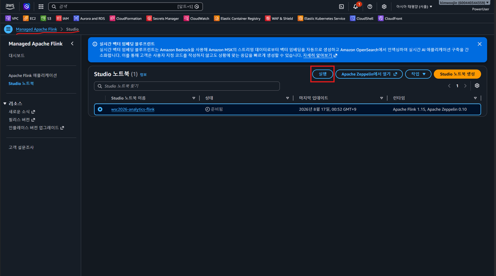
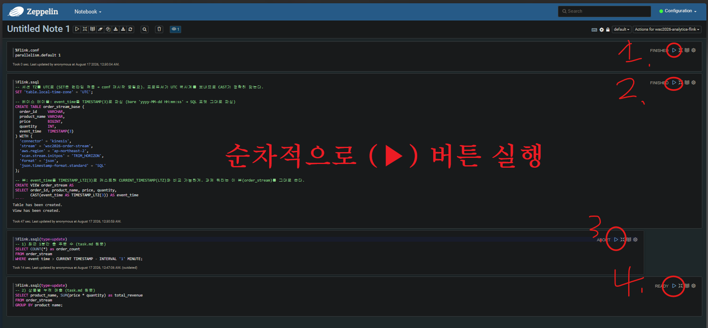
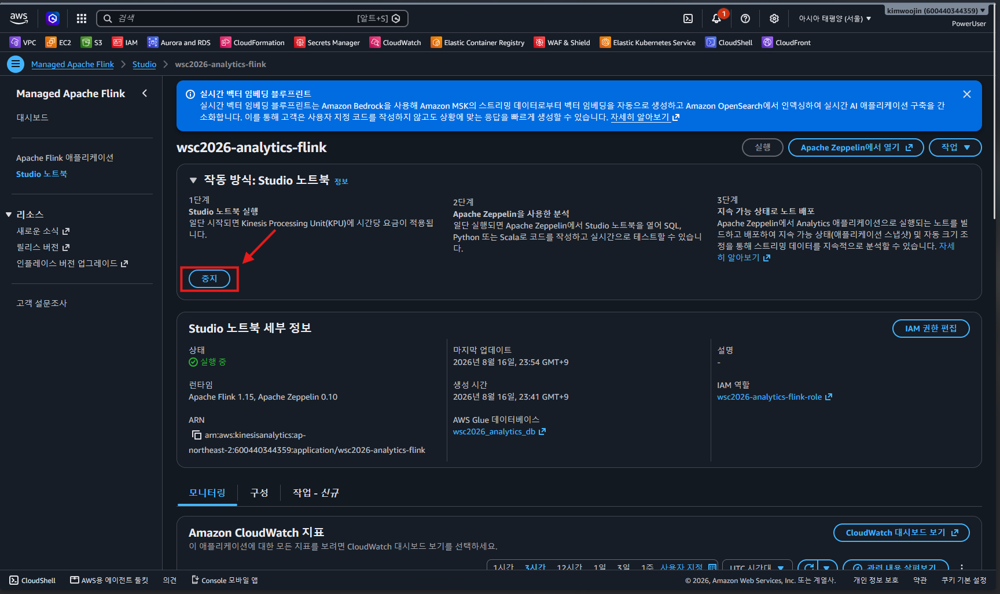

# Module 2 — 실시간 주문 로그 분석 (ap-northeast-2)

프라이빗 EC2 의 Flask 앱(gunicorn, systemd `app`)이 ALB 뒤에서 주문을 생성해 Kinesis 로 전송, Managed Flink Studio Notebook(Zeppelin)에서 SQL 로 실시간 분석. 채점은 CloudShell 에서 `mark/mark2-2.sh`, 노트북 시연은 수동.
본 PC 가 Linux 면 [README.linux.md](README.linux.md) 를 사용한다(콘솔·Zeppelin·CloudShell 단계는 공통).

## 디렉토리 구조

```
module-2-analytics/
├── terraform/
│   ├── vpc.tf security.tf iam.tf
│   ├── ec2.tf userdata.sh.tpl        # 앱 배포 + systemd 유닛 'app'
│   ├── alb.tf kinesis.tf flink.tf    # flink = Glue DB + 역할 + CFN 스택(Studio)
│   └── bastion.tf
└── images/                           # 런북 스크린샷 (무손실 WebP)

# 제공 원본: task-2/provided/module2/ (수정 금지)
# 채점: task-2/mark/mark2-2.sh (CloudShell, ap-northeast-2)
```

## 배포 순서

### 1) [본 PC·PowerShell] 배포

`terraform.tfvars` 의 `player_number` 를 본인 비번호로 바꾼 뒤:

```powershell
cd terraform
terraform init
terraform apply; terraform output -json > outputs.json
```

apply 후 EC2 user_data(pip 설치)와 TG 헬스체크까지 2~3분 대기.

### 2) [본 PC·PowerShell] 리소스 검증

```powershell
$env:AWS_DEFAULT_REGION = "ap-northeast-2"
$ALB_DNS = aws elbv2 describe-load-balancers --names wsc2026-analytics-alb --query "LoadBalancers[0].DNSName" --output text
$EC2_ID = aws ec2 describe-instances --filters "Name=tag:Name,Values=wsc2026-analytics-ec2" "Name=instance-state-name,Values=running" --query "Reservations[0].Instances[0].InstanceId" --output text

# 2-1 EC2 서브넷 (analytics-priv-a)
$SUBNET_ID = aws ec2 describe-instances --instance-ids $EC2_ID --query "Reservations[0].Instances[0].SubnetId" --output text
aws ec2 describe-subnets --subnet-ids $SUBNET_ID --query "Subnets[0].Tags[?Key=='Name'].Value|[0]" --output text
# 2-2 리스너 80 HTTP / TG wsc2026-analytics-tg 5000
$ALB_ARN = aws elbv2 describe-load-balancers --names wsc2026-analytics-alb --query "LoadBalancers[0].LoadBalancerArn" --output text
aws elbv2 describe-listeners --load-balancer-arn $ALB_ARN --query "Listeners[].[Port,Protocol]" --output text
aws elbv2 describe-target-groups --names wsc2026-analytics-tg --query "TargetGroups[].[TargetGroupName,Port]" --output text
# 2-3-A 스트림 ACTIVE ON_DEMAND
aws kinesis describe-stream-summary --stream-name wsc2026-order-stream --query "StreamDescriptionSummary.[StreamName,StreamStatus,StreamModeDetails.StreamMode]" --output text
# 2-3-B / 2-5 앱 동작
Invoke-RestMethod -Method Post -Uri "http://$ALB_DNS/order"
Invoke-RestMethod -Uri "http://$ALB_DNS/health"    # status : healthy
# 2-4 Flink READY ZEPPELIN-FLINK-3_0
aws kinesisanalyticsv2 describe-application --application-name wsc2026-analytics-flink --query "ApplicationDetail.[ApplicationName,ApplicationStatus,RuntimeEnvironment]" --output text
# 2-6 systemd (active / enabled)
$CMD_ID = aws ssm send-command --instance-ids $EC2_ID --document-name "AWS-RunShellScript" --parameters '{\"commands\":[\"systemctl is-active app && systemctl is-enabled app\"]}' --query "Command.CommandId" --output text
Start-Sleep 3
aws ssm get-command-invocation --command-id $CMD_ID --instance-id $EC2_ID --query "StandardOutputContent" --output text
```

### 3) [AWS 콘솔] Studio 노트북 실행

Managed Apache Flink → Studio → `wsc2026-analytics-flink` → **실행** (READY→RUNNING, 수 분 소요).



### 4) [본 PC·PowerShell] 데이터 주입

```powershell
1..30 | ForEach-Object { Invoke-RestMethod -Method Post -Uri "http://$ALB_DNS/orders/generate" | Out-Null }
```

bastion 에서 넣어도 된다:

```bash
for i in $(seq 1 30); do curl -s -X POST http://$ALB_DNS/orders/generate > /dev/null; done
```

### 5) [Zeppelin] 문단 순차 실행

**Apache Zeppelin에서 열기** → **노트 하나**에 아래 문단들을 만들고, **문단마다 ▶ 버튼을 위에서 아래로 하나씩** 실행한다. 노트 전체 "Run all" 을 쓰지 않는다 — 3·4번 문단은 끝나지 않는 스트리밍 쿼리라 Run all 은 거기서 멈춘 채 뒤 문단이 대기한다. 앞 문단이 `FINISHED` 가 된 뒤 다음 문단을 누른다.



노트를 여러 개로 쪼개지 않는다. Studio 는 **노트북 안 모든 노트가 인터프리터 프로세스를 공유**하므로([AWS 문서](https://docs.aws.amazon.com/managed-flink/latest/java/how-zeppelin-udf.html)) 노트를 나눠도 세션이 격리되지 않고, 아래 `%flink.conf` 는 인터프리터가 이미 떠 있으면 무시된다 — 즉 두 번째 노트에서 쓰면 조용히 안 먹는다.

**문단 1** — 인터프리터 설정. **반드시 첫 문단, Flink 시작 전에.**

```
%flink.conf
parallelism.default 1
```

병렬도 1이면 shard 수보다 서브태스크가 많을 때 나는 Kinesis `ShardConsumer RejectedExecutionException`을 원천 차단한다 (ON_DEMAND 스트림 + COUNT 쿼리엔 1로 충분). `%flink.conf`는 인터프리터 프로세스가 뜨기 전에만 먹으므로 반드시 첫 문단이어야 하고, 이미 실행된 세션이면 인터프리터를 재시작한 뒤 실행한다.

**문단 2** — 테이블·뷰 생성.

```sql
%flink.ssql
-- 세션 TZ를 UTC로 (SET은 런타임 적용 → conf 재시작 불필요). 프로듀서가 UTC 벽시계를 보내므로 CAST가 정확히 맞는다.
SET 'table.local-time-zone' = 'UTC';

-- 베이스 테이블: event_time을 TIMESTAMP(3)로 파싱 (bare 'yyyy-MM-dd HH:mm:ss' → SQL 포맷 그대로 파싱)
CREATE TABLE order_stream_base (
  order_id     VARCHAR,
  product_name VARCHAR,
  price        BIGINT,
  quantity     INT,
  event_time   TIMESTAMP(3)
) WITH (
  'connector' = 'kinesis',
  'stream' = 'wsc2026-order-stream',
  'aws.region' = 'ap-northeast-2',
  'scan.stream.initpos' = 'TRIM_HORIZON',
  'format' = 'json',
  'json.timestamp-format.standard' = 'SQL'
);

-- 뷰: event_time을 TIMESTAMP_LTZ(3)로 캐스트해 CURRENT_TIMESTAMP(LTZ)와 비교 가능하게. 과제 쿼리는 이 뷰(order_stream)를 그대로 쓴다.
CREATE VIEW order_stream AS
SELECT order_id, product_name, price, quantity,
       CAST(event_time AS TIMESTAMP_LTZ(3)) AS event_time
FROM order_stream_base;
```

프로듀서(수정 금지)는 `2026-07-13 08:10:51`처럼 `T`/`Z` 없는 bare 문자열을 보낸다. JSON SQL 포맷은 `TIMESTAMP_LTZ`에 대해선 끝에 리터럴 `Z`를 요구(`... HH:mm:ss'Z'`)해 `DateTimeParseException`이 나고, 반대로 `TIMESTAMP(3)`은 bare 문자열을 그대로 파싱하지만 Flink 1.15 플래너가 `TIMESTAMP` vs `TIMESTAMP_LTZ` 비교에서 암시적 캐스트를 안 해 `Incomparable types`가 난다. → **베이스 테이블은 `TIMESTAMP(3)`로 파싱, 뷰에서 `TIMESTAMP_LTZ`로 명시 CAST**해 둘 다 우회한다. 과제 쿼리 원문(`FROM order_stream`, `event_time > CURRENT_TIMESTAMP`)은 그대로 유지된다.

**문단 3** — 최근 1분간 총 주문 수 (task.md 원문).

```sql
%flink.ssql(type=update)
SELECT COUNT(*) as order_count
FROM order_stream
WHERE event_time > CURRENT_TIMESTAMP - INTERVAL '1' MINUTE;
```

**문단 4** — 상품별 누적 매출 (task.md 원문).

```sql
%flink.ssql(type=update)
SELECT product_name, SUM(price * quantity) as total_revenue
FROM order_stream
GROUP BY product_name;
```

**`type=update` 문단이 `RUNNING 0%` 로 멈춰 보이는 건 정상이다.** Kinesis 소스는 무한 스트림이고 Flink SQL 의 연속 쿼리는 입력이 올 때마다 결과를 갱신할 뿐 끝나지 않는다([Dynamic Tables](https://nightlies.apache.org/flink/flink-docs-stable/docs/concepts/sql-table-concepts/dynamic_tables/), [Kinesis SQL Connector](https://nightlies.apache.org/flink/flink-docs-stable/docs/connectors/table/kinesis/)). Flink 대시보드에서 소스 수신 레코드 0 · 백프레셔 0% · `No Root Exception` 이면 교착이 아니라 **입력이 없는 유휴 상태**다 — 결과 행이 안 보이는 건 갱신할 입력이 없어서다. 이때 볼 곳은 쿼리가 아니라 4단계의 주문 생성이다. 헤더만 뜨고 행이 없으면 주문을 더 넣고 소스 `Records Received` 가 오르는지 본다. 문단 3 은 `event_time > CURRENT_TIMESTAMP - INTERVAL '1' MINUTE` 라 **새로 들어오는** 레코드만 통과하므로, 주입 후 1분이 지나면 카운트가 다시 0으로 내려간다.

### 6) [AWS 콘솔] 시연 후 노트북 중지

상태가 READY 로 복귀해야 mark 2-4 통과 (**RUNNING 이면 오답**). CREATE TABLE/VIEW DDL 은 Glue DB 에 저장되므로 중지해도 유지된다. 이전에 `order_stream` 을 테이블로 만들었다면 뷰로 바꾸기 전에 `DROP TABLE order_stream;` 먼저 실행한다.



### 7) [CloudShell] 셀프 채점

```bash
sed -i 's/\r$//' mark2-2.sh
bash mark2-2.sh
```

## Teardown

### [본 PC·PowerShell]

```powershell
cd terraform
terraform destroy
```

## 요구사항 ↔ 구현 매핑

| Mark | 요구 | 구현 |
|---|---|---|
| 2-1 | EC2가 analytics-priv-a (서브넷 Name 태그) | `ec2.tf` + `vpc.tf` (서브넷 Name 태그 정확 일치) |
| 2-2 | 리스너 80 HTTP, TG wsc2026-analytics-tg 5000 | `alb.tf` |
| 2-3-A | wsc2026-order-stream ACTIVE ON_DEMAND | `kinesis.tf` |
| 2-3-B | POST /order → 주문 JSON (Kinesis 전송) | `userdata.sh.tpl` 앱 배포 + `iam.tf` kinesis:PutRecord |
| 2-4 | wsc2026-analytics-flink READY ZEPPELIN-FLINK-3_0 | `flink.tf` (CFN 스택) |
| 2-5 | /health → {"status":"healthy"} | `userdata.sh.tpl` + TG 헬스체크 /health |
| 2-6 | systemd `app` active + enabled (SSM) | `userdata.sh.tpl` 유닛 + `iam.tf` SSM 정책 |
| VPC | 표의 이름/CIDR/RTB 정확 일치 | `vpc.tf` (`variables.tf` subnets·rtb 맵) |
| IAM | 최소권한 | `iam.tf` (SSM+PutRecord), `flink.tf` (Kinesis 읽기+Glue) |

## 설계 근거 · 함정

- **EC2 역할 이름 `wsc2026-alaytics-ec2-role`은 과제지 원문 오타(alaytics)를 의도적으로 유지**한 것 — 이름 정확 일치 채점 대비. 임의로 analytics로 고치지 말 것 (`variables.tf`에도 주석 있음).
- **task.md는 "Apache Flink 1.19"라고 쓰지만 mark 2-4는 `ZEPPELIN-FLINK-3_0`을 채점** — mark 스크립트 우선. Studio Notebook(Zeppelin)이며 Flink 애플리케이션 프로그래밍 금지 조건과도 일치.
- **Studio Notebook은 terraform provider의 `aws_kinesisanalyticsv2_application`으로 생성 불가** (zeppelin 설정 블록 미지원, provider issue #41233) → `aws_cloudformation_stack`으로 래핑.
- **Kinesis SQL 커넥터는 CFN에 명시 필요.** 콘솔 위저드로 만들면 커넥터가 자동 추가되지만 bare CFN엔 Flink 코어 빌트인만 남아 `Could not find any factory for identifier 'kinesis'`가 난다 → `flink.tf`의 `CustomArtifactsConfiguration`에 `flink-sql-connector-kinesis:1.15.4`(런타임 1.15 대응)를 Maven 의존성으로 주입. 커넥터 변경 시 노트북은 **새 세션**으로 다시 열어야 jar가 로드된다.
- **Flink 역할 Glue 권한은 카탈로그 전체(`database/*`,`table/*/*`)에 부여.** Zeppelin이 SQL 플래닝 시 `hive`/`default` DB 존재도 `glue:GetDatabase`로 탐침해서, analytics DB로만 스코프하면 `database/hive`에서 AccessDenied가 난다.
- **`RejectedExecutionException: ShardConsumer ... [Shutting down]`은 세션 문제.** 한 세션에서 실패한 잡을 여러 번 던지면 Flink minicluster의 스레드풀이 망가진다 (Studio 인터랙티브는 `NoRestartBackoffTimeStrategy`라 한 번 실패=잡 사망). → 인터프리터 재시작으로 세션을 비우고 `parallelism.default 1`로 재실행.
- 노트북 상태는 채점 시 **READY** — Run 상태(RUNNING)로 두면 2-4 오답. 시연 후 중지 필수.
- **PowerShell(5.1) 주의**: JSON 인자는 `\"` 이스케이프 필수, `curl`은 Invoke-WebRequest 별칭이라 진짜 curl이 아니다 — `Invoke-RestMethod` 사용.
- EC2는 NAT 라우트에 `depends_on` — user_data의 pip 설치가 부팅 시 아웃바운드를 요구한다. 설치 실패 시: SSM 세션 접속 후 `cat /var/log/cloud-init-output.log` 확인, `sudo bash /var/lib/cloud/instance/scripts/part-001` 재실행.
- systemd 유닛 이름은 정확히 `app` — env는 [Service] 레벨 (app.py가 import 시점에 STREAM_NAME/AWS_REGION 없으면 raise).
- ALB 헬스체크 경로 `/health` — 앱이 뜨기 전 TG가 unhealthy면 2~3분 대기.
